# Android — the phone is a Zeron device

The phone is a device like any desktop: it runs its own engine (`zeron
headless` plus real agent CLIs — Claude Code, Codex, Grok, OpenCode… — inside
a user-space Linux guest), that engine owns the Zeron account, and the app is
the device's viewer. Every device signed in to the account sees the phone in
its pickers and can start sessions on it; the phone starts sessions on them.
There is no separate "phone mode".

## Topology

```
┌──────────────── Android app process ─────────────────┐
│ Compose UI ── zeron-mobile (UniFFI, JNI .so)          │
│   ├─ EngineLink ─── ws 127.0.0.1:27654 + IPC token ───┼──┐ EngineInfo, EdgeBearer,
│   └─ CoreClient: device id = the engine's,            │  │ SignIn…SelectOrg, SignOut
│      Credentials::Engine ─ ws/https → the engine's edge ─┼──► edge.zeron.sh (signed in)
│                                                       │  │   127.0.0.1:27655 (signed out)
│ RuntimeService (foreground, specialUse)               │  │
│   └─ spawns: libproot.so ─┐                           │  │
└───────────────────────────┼───────────────────────────┘  │
                            ▼  proot guest (Alpine arm64/x86_64 rootfs)
            /opt/zeron/lib/libzeron.so headless   (static musl engine)
              ├─ engine IPC   127.0.0.1:27654  (token-gated) ◄──────┘
              ├─ local edge   127.0.0.1:27655  (only while signed out:
              │                                 chat2, registry, device relay)
              └─ harness subprocesses: claude / codex / grok / git / node …
```

### One device, one account

The engine's workspace is fixed per start (ARCHITECTURE §1), so what it
syncs through depends on how it last started:

| Engine start | `WorkspaceScope` | Edge | Identity |
| --- | --- | --- | --- |
| No account ("Continue without an account") | `Development` | the embedded local edge | `local` / `local` |
| Saved, org-scoped WorkOS session | `Synced` | production (`ZERON_EDGE_URL`) | the account |
| Developer custom server | `Development` | that edge (`zeron local-edge`) | `local` / `local` |

The app asks the engine rather than knowing: `EngineInfo` (device id) and
`EdgeBearer` (edge URL, user, org) over the IPC port, then builds its
`CoreClient` with that device id, edge and identity and
`Credentials::Engine{ipc_url, ipc_token, user_id, org_id}`. A signed-out
engine still needs an edge because the viewer syncs only through one — hence
the local edge; its sessions stay on the phone (local-only data isn't moved
into an account on sign-in, as on desktop).

- **Sign-in goes through the engine**, like the desktop UI's:
  `SignInHeadless{redirectUri: "zeron://callback"}` → Custom Tab → the deep
  link hands `state`/`code` back → `CompleteSignIn("state.code")` →
  `ListOrgs`/`SelectOrg` (a picker for several, automatic for one) →
  `RuntimeController.restart()` → the engine starts synced. `zeron://callback`
  is registered for the same WorkOS client id as the engine's loopback
  redirect. While signed out, `zeron headless` answers the account methods
  from a production WorkOS `Auth` beside the local edge's dev bearer
  (`Engine::with_account`). A saved session without an organization keeps
  the local edge (no TTY can pick one) until the app finishes onboarding.
- **Sign-out**: `SignOut` (a synced engine stops itself) → restart → local.
- **One refresher.** WorkOS refresh tokens rotate, so only the engine
  refreshes. `EdgeBearer` → `{edgeUrl, userId, orgId, bearer, expiresAtMs?}`
  (or `{…, signedOut: true}`), served only on a token-gated `zeron headless`
  IPC port and never over the relay. `Credentials::Engine` caches the bearer
  until `expiresAtMs − 20 s` — inside the engine's 30 s refresh slack, so a
  re-ask gets the rotated token — and single-flights re-asks; an unreachable
  engine (restarting) keeps the last bearer; `signedOut` or a different
  identity raises `AuthExpired` and the app rebuilds from the restarted engine.
- **One device id.** The viewer uses the engine's id, so commands it stamps
  are the device's own and the phone is one row in the registry. Loro peer
  ids are random per document, so two writers sharing a device id never
  collide; the viewer publishes no presence of its own (the engine's beat is
  the device's), so the phone reads online exactly while its engine runs.
- **Execution hosts** are what an engine advertises on its device row
  (`Device::is_execution_host`: capabilities, else the platform), so the
  phone's engine is a host on every device; the desktop's pickers filter on
  it, never on the platform.

### Why the engine runs inside the guest

Android forbids `execve` of app-writable files (targetSdk ≥ 29), which is what
every harness install writes. proot's loader maps guest programs instead of
exec'ing them, so everything the engine spawns (vendor installers, `node`,
`git`, the CLIs) just works. Running the engine itself inside the guest means
**zero engine changes for process spawning**: it believes it is on a Linux VPS.

Executables the app ships live in `nativeLibraryDir` (the only exec-allowed
location) under `lib*.so` names, extracted to disk
(`useLegacyPackaging = true`):

| File | What |
| --- | --- |
| `libproot.so` | Termux proot (bionic), NEEDED patched to `libtalloc.so`, RUNPATH removed |
| `libproot-loader.so`, `libproot-loader32.so` | proot loaders (`PROOT_LOADER`, `PROOT_LOADER_32`) |
| `libtalloc.so`, `libandroid-shmem.so` | proot's shared deps (SONAME patched) |
| `libzeron.so` | `zeron` built `--no-default-features` for `*-unknown-linux-musl` (static) |
| `libzeron_mobile.so` | the UniFFI core (loaded by JNA/System.loadLibrary, not exec'd) |

`scripts/android/fetch-proot.sh` downloads + patches proot;
`scripts/android/build-engine.sh` builds the musl engine with `cargo zigbuild`.

## Runtime contract

Host paths (app-private): `filesDir/runtime/`
- `rootfs/` — Alpine minirootfs, extracted from `assets/rootfs-<abi>.tar.gz`
- `tmp/` — `PROOT_TMP_DIR`
- `state.json` — bootstrap version, generated secrets, the custom server

Guest layout:
- user `zeron` with the app's uid/gid (added to `/etc/passwd`), HOME `/home/zeron`
- `ZERON_DATA_DIR=/home/zeron/.zeron`
- projects go to `/home/zeron/projects` (`ZERON_PROJECTS_DIR`)
- `nativeLibraryDir` bound at `/opt/zeron/lib`; `/usr/local/bin/zeron` → `/opt/zeron/lib/libzeron.so`

proot invocation (engine; `Guest.kt` is the source of truth):
```
libproot.so --kill-on-exit --link2symlink -r rootfs -w /home/zeron \
  -b /dev -b /proc -b /sys -b /dev/urandom:/dev/random \
  -b <filesDir>/runtime/tmp:/dev/shm -b /proc/self/fd:/dev/fd \
  -b <nativeLibraryDir>:/opt/zeron/lib -b <filesDir>/runtime/tmp:/tmp \
  [-b <filesDir>/runtime/proc/<f>:/proc/<f> for f in stat loadavg uptime vmstat, when SELinux hides them] \
  /usr/bin/env -i HOME=/home/zeron USER=zeron LOGNAME=zeron SHELL=/bin/bash \
    LANG=C.UTF-8 TERM=xterm-256color TMPDIR=/tmp USE_BUILTIN_RIPGREP=0 \
    PATH=/home/zeron/.local/bin:/usr/local/sbin:/usr/local/bin:/usr/sbin:/usr/bin:/sbin:/bin \
    ZERON_DATA_DIR=/home/zeron/.zeron ZERON_DEVICE_NAME="<model>" \
    ZERON_DEVICE_PLATFORM=android ZERON_NO_LOGIN_SHELL=1 \
    ZERON_PROJECTS_DIR=/home/zeron/projects \
    ZERON_IPC_PORT=27654 ZERON_IPC_TOKEN=<secret2> \
    ZERON_LOCAL_EDGE_PORT=27655 ZERON_LOCAL_EDGE_TOKEN=<secret> \
    /opt/zeron/lib/libzeron.so headless
```
With a custom server the last line is `ZERON_EDGE_URL=<url>
ZERON_EDGE_TOKEN=<token> ZERON_USER_ID=local ZERON_ORG_ID=local` instead,
with `ZERON_DATA_DIR=/home/zeron/.zeron-dev` (both workspaces are
`local`/`local`; one store would re-seed each edge with the other's rows).
Android's seccomp policy rejects `fork`/`vfork` from apps on x86_64 (arm64 has
no such syscalls), which breaks every musl shell pipeline; `fetch-proot.sh`
therefore rebuilds the x86_64 proot from source with a patch that rewrites
them to `clone`. The arm64 proot is Termux's binary, patched only for loading.
Bootstrap-only package installs run with `-0` (fake root):
`apk add bash git nodejs npm curl ca-certificates ripgrep libgcc libstdc++ openssh-client procps coreutils python3 py3-pip make unzip less`.
Configuration also installs a no-op `/usr/local/bin/sudo` (every guest file belongs to the app uid, so `apk add` needs no privilege) and, when absent, global agent instructions describing the guest (`~/.claude/CLAUDE.md`, `~/.codex/AGENTS.md`, `~/.config/opencode/AGENTS.md`).
Nothing else runs as fake root — Claude Code refuses permission bypass as uid 0.

`/etc/resolv.conf` is written from the active network's DNS servers
(`ConnectivityManager.getLinkProperties`), falling back to 1.1.1.1 / 8.8.8.8.

### Engine switches (all opt-in; desktop behaviour unchanged)

| Env | Effect |
| --- | --- |
| `ZERON_LOCAL_EDGE_PORT` + `ZERON_LOCAL_EDGE_TOKEN` | with a saved, org-scoped sign-in `zeron headless` runs synced; otherwise it starts the embedded local edge on `127.0.0.1:<port>`, runs against it in `Development` scope with that bearer, and serves the account methods for sign-in |
| `ZERON_IPC_TOKEN` | the IPC server rejects upgrades without `?token=` / `Authorization: Bearer`; `zeron mcp` / `zeron sync` send it; enables `EdgeBearer` |
| `ZERON_DEVICE_PLATFORM` | overrides the platform string on this engine's device row |
| `ZERON_PROJECTS_DIR` | where `CloneRepo` / `CreateRepo` put projects (the guest: `/home/zeron/projects`) |
| `ZERON_EDGE_URL` + `ZERON_EDGE_TOKEN` + `ZERON_USER_ID` | the developer custom server: join that edge with an opaque bearer as user `ZERON_USER_ID` (with `ZERON_ORG_ID`) |

Loopback on Android is shared by **every app on the device**, so both
listeners are token-gated. The app generates both secrets on first run
(`SecureRandom`, 32 bytes hex) and keeps them in app-private storage.

Local edge details (`crates/localedge`):
- Binds `127.0.0.1` only when embedded; state is one SQLite file,
  `$ZERON_DATA_DIR/local-edge/edge.db`, so rooms survive engine/app restarts.
  `zeron local-edge --port P --token T [--bind 0.0.0.0]` serves one
  standalone (development: several devices without WorkOS).
- The token must be ≥ 16 URL-safe characters (`[A-Za-z0-9._~-]`; hex is
  fine) — the engine splices it into WebSocket URLs unencoded. `zeron headless`
  exits with an error otherwise. It is accepted as `Authorization: Bearer` or
  `?token=` and compared in constant time.
- Unauthenticated routes: `GET /health` (`{"ok":true,"auth":"local"}` — the
  engine's and client's reachability probes send no bearer; also the app's
  health check) and `GET /releases/latest.txt` (the running version, so the
  engine's updater reads "up to date"). Everything else is `401` without the
  token.
- Single tenant: the engine runs as user/org `local` (store under
  `$ZERON_DATA_DIR/orgs/local/local/`, independent of the token, so rotating
  it keeps all data); every `/registry/{org}/…` path is the one registry room.
  `/auth/*` answers `501` (no WorkOS); APNs `push-target` is accepted and
  dropped.
- The engine injects `ZERON_IPC_TOKEN` explicitly into the `zeron mcp` server
  it gives agents (harnesses filter MCP server environments).
- The engine's registry device row carries `ZERON_DEVICE_PLATFORM`. Viewers
  count a device as an execution host when its row advertises engine
  capabilities (every engine writes them at boot), falling back to the
  platform only for capability-less rows — so the phone's engine is a host and
  viewer rows stay viewers.

### Runtime API (`:runtime` module → `:app`)

```kotlin
package sh.zeron.runtime

object ZeronRuntime { fun get(context: Context): RuntimeController }

interface RuntimeController {
    val state: StateFlow<RuntimeState>
    val isSupportedAbi: Boolean
    fun start()                 // bootstrap if needed, then run RuntimeService
    fun stop()
    fun restart()               // new engine process (adopts a sign-in/out)
    var customServer: CustomServer?   // developer edge; next (re)start
    suspend fun reset()         // wipe the guest (keeps nothing)
    fun logTail(lines: Int = 200): String
    suspend fun exec(command: String, asRoot: Boolean = false,
                     timeoutMs: Long = 600_000): ExecResult   // one-off `sh -lc` in the guest
}

sealed interface RuntimeState {
    data object NotInstalled : RuntimeState
    data class Bootstrapping(val step: String, val progress: Float?) : RuntimeState
    data object Starting : RuntimeState
    data class Running(val ipcPort: Int, val ipcToken: String,
                       val deviceName: String) : RuntimeState   // IPC answers with our token
    data object Stopped : RuntimeState
    data class Failed(val reason: String, val logTail: String) : RuntimeState
}

data class CustomServer(val edgeUrl: String, val token: String)
data class ExecResult(val exitCode: Int, val output: String)
```

## Android platform constraints

- **Foreground service** (`foregroundServiceType="specialUse"`) keeps the guest
  alive; its notification shows engine state and working agents.
- **Phantom process killer** (Android 12+) caps child processes across apps.
  The engine runs as one proot tree; the app detects kills (engine exit with
  SIGKILL while foregrounded) and surfaces the developer-options switch.
- **Battery**: `REQUEST_IGNORE_BATTERY_OPTIMIZATIONS` is requested when the
  user continues without an account, and from Settings → This phone.
- **Distribution**: proot + downloaded rootfs has Play precedent (UserLAnd);
  sideload/F-Droid builds are the fallback.
- **Licences**: proot is GPL-2.0 and talloc LGPL-3.0, shipped as separate
  executables; listed in `THIRD_PARTY_NOTICES.md` with source links.

## UI

- **First run** (#609's sign-in screen): Sign in / Continue without an
  account / Explore the demo. The engine bootstraps in the background from
  the first launch (a compact status strip under the buttons shows the step
  and progress); Sign in waits for it ("Preparing this phone…") rather than
  blocking the screen. The demo is reachable only from here.
- **Launch** autostarts the engine unless the user stopped it (Settings →
  This phone → Stop); the runtime restarts it after a crash. While it isn't
  running the Sessions screen shows the same strip.
- **Settings**: the account (sign in / sign out, or the custom server),
  **This phone** (engine state → the engine page: Start/Stop, Reset, battery
  and notifications, Coding agents, the log), **Files → Transfers** (see
  [File transfers](#file-transfers)), Devices (the phone is "This device"),
  and — after seven taps on Version — Developer → Custom server
  (edge URL + token; the engine restarts against it).
- **New session**: projects grouped by machine — this phone first, then your
  computers — each with "No project" (its home folder); "New project" clones
  or creates on the chosen device through its engine (`CloneRepo` /
  `CreateRepo`; on the phone into `/home/zeron/projects`). Harnesses and
  models come from the chosen device, through the
  [compact model picker](#compact-model-picker) (the draft's working branch
  and context-usage chips sit beside it).
- **Coding agents** (any engine device, this phone first) speaks `host_call`:
  `ListHarnesses`, `InstallHarness` / `CancelInstall` (a relay timeout falls
  back to polling the catalog), `CheckHarnessUpdates` on open and
  pull-to-refresh, per-agent `ApplyHarnessUpdate` and the header's Update all
  (`ApplyAllHarnessUpdates`, progress by polling `ListHarnessUpdates`),
  `UninstallHarness` (the confirmation lists the engine's `dryRun`; accounts
  stay), `ListAgentAccounts` (plan label), `StartAgentLogin` → Custom Tab →
  `PollAgentLogin`, or paste-code `CompleteAgentLogin`, and
  `ForgetAgentAccount`. Reply parsing is in `core/Agents.kt`.
- `core/Notifier.kt` posts local notifications (finished / needs input /
  failed) for the device's sessions while the app is in the background.

JVM unit tests: `./gradlew :app:testDebugUnitTest`.

### File transfers

(docs/file-transfer.md.) The phone is a regular device, so it sends and
receives through its own engine like any computer: `core/TransferCenter.kt`
calls the file-transfer methods on this phone's engine over `host_call`
whenever the app has a client for it (signed in, local-only or on a custom
server; not the demo). It polls `ListFileTransfers` every second while the
Transfers screen or the share sheet is open or a transfer is live, every five
seconds otherwise (RuntimeService keeps the process alive while the engine
runs), so incoming notifications work whenever the engine runs. The target
device id is the engine's own (`Identity` over IPC, `AppModel.engineDeviceId`
— the id the app's client shares), so it follows a custom server's separate
data dir. Guest paths map to host paths through the rootfs (`/tmp` →
`runtime/tmp`), `Transfers.GuestPaths`.
- **Settings → Files → Transfers** (`ui/TransfersScreen.kt`): live rows with
  progress, throughput and transport (Direct/Relayed), Cancel,
  Accept/Decline, received items with Open/Show, Clear, and the
  "Ask before accepting" setting (`requireConfirmation`).
- **Notifications** (`Notifier`, channel `transfers`, always posted): progress
  per incoming transfer, an ask with Accept/Decline actions
  (`TransferActionReceiver`), and "Received …" whose tap opens the file.
- **Downloads**: a completed incoming transfer is copied once into
  `Download/Zeron` through `MediaStore.Downloads` (IS_PENDING insert, no
  storage permission; folders keep their structure under
  `Download/Zeron/<folder>/…`, symlinks skipped). Exported transfer ids and
  content URIs are remembered in the `transfers` preferences. Opening uses
  ACTION_VIEW on the content URI with MimeTypeMap's type (APKs:
  `application/vnd.android.package-archive` → the package installer; the app
  holds `REQUEST_INSTALL_PACKAGES`, the user still allows the source once).
  minSdk is 29, so there is no pre-MediaStore path.
- **Share to Zeron** (`ShareActivity`, ACTION_SEND / SEND_MULTIPLE `*/*`):
  copies the shared URIs (or shared text) into
  `/home/zeron/.zeron/outbox/<uuid>/`, lists devices whose row advertises
  `file-transfer-v1` (not this phone), calls `SendFiles`, and shows progress.
  The batch is deleted when the transfer ends, when the sheet is left before
  sending, and (as a sweep) after a day. Before the first run is finished it
  asks to open Zeron.

### Compact model picker

In an open session, a **purple wave fill** behind the model chip shows the
active account's most-used subscription limit, as on desktop. **Hold the chip**
for a long-press haptic and an account card: provider, subscription, all reported
usage windows (5 hour, weekly, etc.), and local reset times. The data comes from
the session's host device; missing limits leave the chip unfilled. Usage refreshes
while the composer is visible and pauses while the app is in the background.

The composer's model chip (New session and an open session) is the desktop's
compact picker adapted to touch: **provider mark, model and the dim effort**
("GPT-5.4  High", a small bolt when fast mode is on). Tapping it opens a card
over the chip:

- the big **effort name**, the model under it with a chevron (tap for the
  model list) and, for models with a fast tier, a square **fast** button;
- the **effort slider** (`ui/EffortSlider.kt`): a pill rail with a dot per
  level, an accent fill (a capsule tucked under the thumb) to a springy pill
  thumb you drag or tap. The thumb is exactly under the finger while it is down
  (no stickiness, no inertia) and springs to the nearest level on release
  (`EffortTuning` / `EffortDrag` in `ui/EffortScale.kt`). The top of the ladder (`xhigh`, `max`, `ultra*`) shimmers, fast
  mode adds speed streaks and a halo. One detent per level crossed, not per
  frame: position to step goes through `EffortScale.snap` with hysteresis
  (`ui/EffortScale.kt`), so jitter at a boundary does not re-fire. For
  TalkBack it is a slider (state "High, 3 of 6", set-progress and
  increase/decrease actions); hardware keys step it;
- a row per other model option ("Context Window  200K ›", opening its
  choices), and **Reset to defaults** when anything differs from the model's
  defaults. Fast mode, the effort and the option rows are driven by the model's
  real options (`ModelOptions` in `ui/ModelPickerRules.kt`, ported from the
  desktop's `fast_mode_values`, `compact_fast_choice`, `compact_option_visible`).

The **model list** is one page deeper (animated, the card's height eases):
search over model name, id, provider and description; one list with the
provider mark on each row, **starred models first** (stars are device-local,
`core/Favorites.kt`; rows keep their identity when a star re-sorts the list and
the list follows a row that leaves the screen), the current model checked,
a loading skeleton, "No models match", and a per-catalog "unavailable — Retry"
row beside the models that did load. An open session lists only its own
harness; choosing a model returns to the card to set its effort.

Feedback goes through `LocalFeedback` (`feedback/Feedback.kt`): a detent per
step (`Haptic.Tick`, `Haptic.Threshold` at the ends, with `Cue.Detent`), a
release `Select`, fast `ToggleOn/Off`, star `Pop` with `Star/Unstar`, choosing a
model or option `Select`, opening/closing `Open/Close` + `Tick`, Reset `Confirm`.

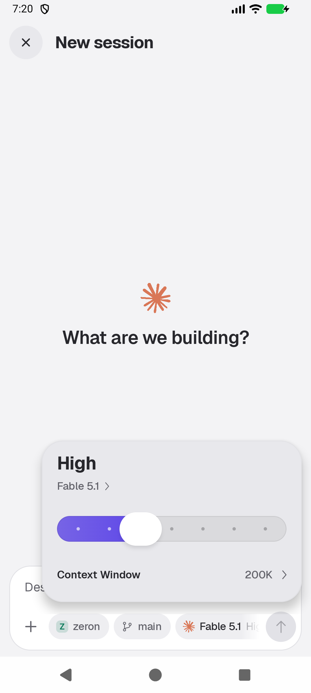
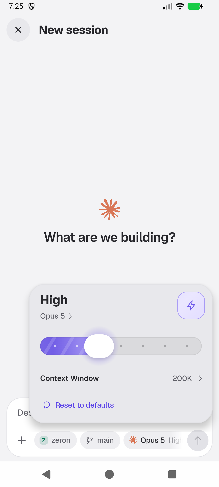
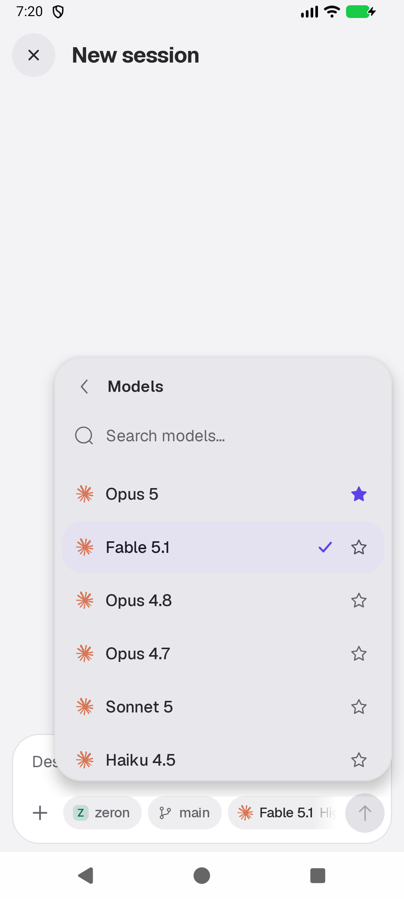
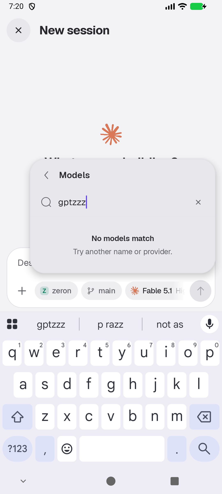
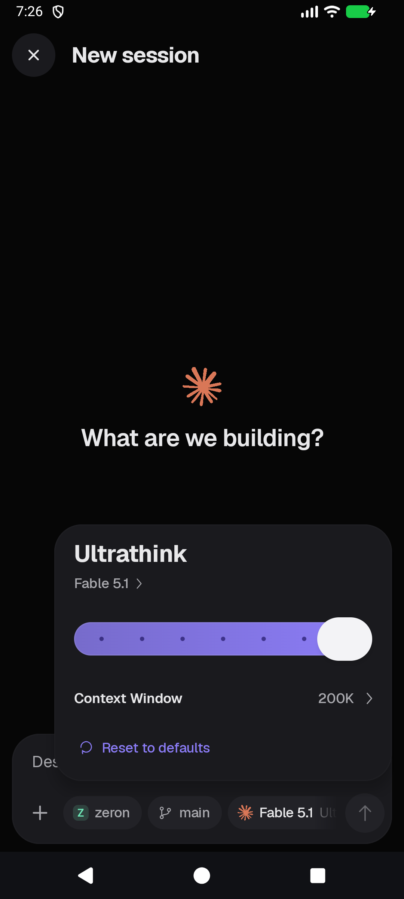
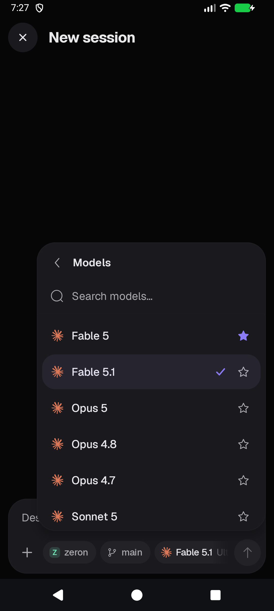

### Developer tools

The desktop's files panel, editor, terminal and browser, on the phone
(`app/…/tools/`). Every tool addresses a workspace — a chat's folder
(`chatId`) or a project's (`spaceId`) on its device, `WorkspaceRef` — and
speaks that device's engine over host RPC, so the same screens work on the
phone's own projects (IPC to its engine) and a computer's (the device relay).
They open from the session screen: the file-tree button in its header, and
Files / Terminal / Browser & previews in its menu. Launch routes
`files:<chat>`, `terminal:<chat>`, `file:<chat>|<path>` and
`browser:<chat>|<url>` open them directly.

- **Streaming host RPC** (`zeron-mobile` `CoreClient.host_watch(device,
  method, params, listener) → HostStream`): acknowledged by the host before it
  returns (an unknown method or rejected params fail the call), items as JSON
  on a client thread; `cancel()` or releasing the object cancels the host's
  stream. `zeron-client` routes this device's own id to its engine's IPC port
  (`Credentials::Engine`) and everything else through the relay
  (`Client::host_watch`). Used for `WatchWorkspaceFiles`,
  `WatchWorkspaceGitStatus`, `WatchPreviews` and `SubscribeTerminal`.
- **Files** (`FilesScreen`): the tree from `ListWorkspaceDirectory` (folders
  load when opened; the tree survives opening a file), the desktop's file and
  folder icons (`file_icon_name` / `folder_icon_name`, same manifest), git
  markers from `WatchWorkspaceGitStatus` (letters on files, the strongest
  descendant's dot on folders), live reloads from `WatchWorkspaceFiles`, fuzzy
  find (`SearchWorkspaceFiles`), show/hide ignored files. Long-press: open,
  open in the browser (HTML), save to Downloads, copy path.
- **Viewer / editor** (`FileScreen`): `ReadWorkspaceFile`; tree-sitter
  highlighting over FFI (`highlight_source`: the desktop editor's grammars,
  spans in UTF-16), line numbers, wrap or sideways scroll. Edit → Save uses
  `WriteWorkspaceFile`, whose content-hash check turns a concurrent change
  into a dialog (Overwrite / Reload / Keep editing); a change on disk reloads
  a clean buffer and flags a dirty one. Markdown previews as GFM
  (`markdown_html`) in a script-less WebView whose relative images load from
  the workspace; images decode natively with pinch zoom; PDFs render with
  `PdfRenderer` (lazy pages, pinch / double-tap layout zoom, page counter and
  jumps); anything else offers Save to Downloads and Open with… (a cached
  copy through the app's FileProvider).
- **Raw bytes**: `ReadWorkspaceBytes` (new engine method, relay-forwardable)
  reads any regular workspace file in ≤ 512 KiB chunks by offset; a
  continuation names the revision (size, mtime, inode) of the first chunk and
  fails if the file changed. PDFs, images, Open with…, workspace pages and
  Save to Downloads all stream through it.
- **Terminal** (`TerminalScreen`, `TerminalView`, `Terminals`): engine
  terminals (`OpenTerminal` in the chat's folder) rendered through the FFI
  `TerminalScreen` — the desktop's emulator (`zeron-vt`: `alacritty_terminal`
  + vte, moved out of `crates/ui` and shared) fed by `SubscribeTerminal`
  (a replay of the engine's ~1 MiB scrollback, then live output; resumed with
  `afterSeq` when the stream drops), input as ordered `WriteTerminal` calls,
  `ResizeTerminal` debounced as the view resizes (rotation, keyboard). Kotlin
  paints the styled runs on a Canvas in Geist Mono. Soft keyboard through a
  raw `InputConnection` (visible-password, no suggestions) plus hardware keys;
  an extra-keys row (Esc, Tab, sticky Ctrl / Alt, arrows with repeat,
  `| ~ / -`, Home/End, PgUp/PgDn, paste); drag to scroll back, long-press to
  select a word and drag, Copy / Copy all / Paste. Tabs per workspace survive
  navigation; shells keep running on the engine (reattaching replays them),
  Close kills one. *Why not Termux's terminal-view:* its emulator is tied to
  a local subprocess (`TerminalSession` owns the PTY over JNI) while ours are
  remote PTYs on any device, and `alacritty_terminal` is what the desktop
  already runs — escape handling, selection and colours match it exactly and
  are unit-tested in Rust.
- **Browser** (`BrowserScreen`): a WebView with an address bar (a port →
  `localhost:<port>`, loopback over http, hosts over https, anything else a
  search), back / forward / reload-stop, open in another app, print or save
  as PDF (`PrintManager`). *Workspace pages*:
  `https://<token>.workspace.zeron.invalid/<path>` is served by
  `shouldInterceptRequest` from `ReadWorkspaceBytes`, so an agent's
  `index.html` loads its CSS, scripts and images from whichever device owns
  it (the token is stable per workspace, and so is its origin). *Previews*:
  the session's dev servers from `WatchPreviews` (asked of the phone's
  engine, which also knows remote devices' services) open as
  `http://<device>.<project>.localhost:7331` through the phone engine's
  preview proxy — Chromium resolves `*.localhost` to loopback, and the proxy
  carries a computer's preview over its peer connection. On the phone's own
  projects a `localhost` shortcut goes straight to the port (the guest shares
  the app's network). A PDF a page opens (WebView can't show PDFs) renders
  in the native viewer. Cleartext HTTP is allowed app-wide
  (`network_security_config.xml`) for dev servers on the LAN.
- **Preview discovery on Android**: the sandbox denies `/proc/net/tcp`, so the
  engine attributes a guest process's listener from the ports its command
  line names (`--port 3000`, `http.server 8000`, `host:port`) or its
  framework's default (Vite 5173, Next 3000, Astro 4321), confirmed by a
  loopback connect (`zeron-preview` `inferred_ports`). A server on a port no
  argument names still opens in the browser by its port.
- **Save to Downloads** (`Downloads`): a file as itself; a folder or the whole
  project as `<name>.zip` (git-ignored files left out unless shown), written
  by `ZipOutputStream` straight into a `MediaStore.Downloads` stream in
  `Download/Zeron` as `ReadWorkspaceBytes` chunks arrive — never whole in
  memory — with progress on screen and in a notification. An engine without
  `ReadWorkspaceBytes` (an older computer) falls back to `SendFiles` to this
  phone, which lands in `Download/Zeron` through file transfer.
- **Transcript**: links and file paths open in the app — http(s) and
  localhost in the browser, workspace files in the viewer (absolute paths
  under the chat's folder, relative ones, `file://`, editor `:line` suffixes).
  Inline-code paths (`out/report.pdf`) are links too (underlined chips). A
  tool line's file badge (Read / Write / Edit) opens its file on tap and
  offers Open / Open in browser / Save to Downloads / Copy path on long-press.

### Subagents

The desktop's Subagents view (#638, #647), on the phone:

- **Where the data comes from.** Two sources, both shared with the desktop.
  The session row carries `running_subagents` (the engine publishes it as
  confirmed child starts open sinks and completions settle them; it clears
  when the run ends. Silent starts count too, and stale rows
  count zero, like the working indicator), so the sessions list can badge a
  chat that is not open. The list itself is read from the open chat's
  transcript: every spawn chip with a stamped doc ref is one subagent
  (`zeron_client::subagents`, exposed as `CoreClient.subagents(chat)`). Order
  and grouping are the desktop's and live in Rust so iOS can reuse them:
  running first, longest-running on top, then unstamped; finished ones split
  into Completed and Failed, newest first.
- **Sessions list**: the activity badge is a pure overlay on the harness
  tile (`ui/ActivityBadge.kt`). The tile is exactly what it was before badges
  existed (a 48 dp square at the row's 16 dp content padding) and stays put
  whether or not subagents run: `CornerBadge` lays out as the tile alone and
  places the badge's centre 4 dp inside the tile's top-right corner, so it
  overhangs the tile by 8 dp up and right (a third of its size) without
  moving, resizing or reserving anything. The row's own padding leaves room
  for the overhang, so the card's clip never cuts it. Every count has the same
  24 dp square footprint, fixed in dp; the Material shape is scaled
  uniformly into it, never stretched. Shape mapping: Pill (1), Arch (2),
  Triangle (3), Diamond (4), Pentagon (5), Gem (6), 7-sided Cookie (7),
  8-leaf Clover (8), Puffy Diamond (9), Clam Shell (10-20), Puffy (21-99),
  Heart with the rounded `AllInclusive` icon above 99 (TalkBack still reads
  the real count: "3 subagents running"). Hidden at zero.
  **Label placement** is computed from each polygon, not from its bounding
  box (`ui/BadgeGeometry.kt`, JVM-tested): the polygon is sampled, and the
  label (one digit height per digit count, 44 % of the footprint for one
  digit and 34 % for two, in every shape) goes where the largest margin
  around it fits inside the outline, ties broken towards the area centroid.
  So the triangle's number sits in its wide lower body, the heart's icon
  below the lobes, and a symmetric shape's on its axis. The digits are drawn
  from the face's real outline (Geist Bold glyph paths, `LabelInk`): the
  digit box (baseline to cap height) is centred vertically on the anchor and
  the label's ink centred horizontally, not a text line box. The badge is a
  canvas in dp, so **it ignores the system font size**: at 200 % text it is
  pixel-identical to 100 %. Colours: white on purple (`#5B43E8` light,
  `#7C61DB` dark: 6.2:1 and 4.6:1); the chat header's button wears the
  subagent yellow with dark digits (5.5:1 light, 11.7:1 dark).
  Debug builds have the contact sheet as a real route:
  `--es route badges` (every count on the real tile) and `--es route
  badges:rows` (real session rows and header buttons). The rotating Material
  activity shape is purple while the main thread runs, yellow when the main
  thread is idle with running subagents, and blue
  when an idle main thread has a confirmed background callback. Input and
  Failed labels remain visible when the main thread needs attention.
  Chats with active subagents or callbacks count toward **Working**, including
  the filter, its count, and the bottom summary. Each activity shape runs its
  own Material animation; starts are staggered by a frame rather than phase
  locked. The count shapes themselves stay still so the number stays readable.
- **One count rule** (`SessionActivity.mergedSubagents`). Two things know how
  many subagents a chat has running, and they used to disagree. The hosting
  engine publishes a count on the chat's status row, but only once a subagent
  has streamed (a chip that is still starting counts nothing), older engines
  publish nothing at all, and the phone zeroes a row nobody has refreshed in
  45 s. The open chat's own subagent chips (`CoreClient.subagents`) know about
  every running child. The badge shows the **larger of the two**, everywhere:
  the session rows' tile badge, the **Working** filter and its count, the
  bottom summary, the activity shape (`SessionActivity.shape` still lets an
  attention state hide the shape), and the chat header. `SessionScreen`
  reports the chips' count to `AppModel.liveSubagents` while the chat is open
  (`core/LiveSubagents.kt`); a chat that closes keeps its count 20 s, and a
  transient zero read 3 s, so nothing flickers and the Sessions list the user
  lands on says what the thread did. Underneath, the **Rust client does the
  same for every warm chat** (`SessionCore::chip_subagents`, merged into
  `SessionRow.running_subagents` as the larger of published and chips): the
  client keeps up to `WARM_SESSION_CAP` chats' docs and rooms live, and
  `preload_sessions` (at start, whenever the synced registry changes, and on every
  return to the foreground) warms the live and recently active chats first. A
  warm chat's chips only count while its transcript is hydrated, its room is
  connected and its host is online, so a replica restored from disk or a host
  that went away cannot badge. **Hosts that publish no count** (every released
  desktop engine as of 0.2.100: the field is not in the binary) are exactly
  this case: their rows say 0, so the list is right only for warm chats
  (the 4 most active at start, up to 6 kept warm), and only a host running
  this branch's engine badges every chat. Beyond that the 20 s grace above is
  all that is left.
- **Lifecycle identity**: Claude task IDs and Codex child thread IDs retain
  their original spawn identity across resumes. Completion and interruption
  settle that original child even without a fresh transcript sink; engine
  restart recovery clears abandoned local running chips. For remote chats,
  the hosting engine must also contain these lifecycle fixes.
- **Background callbacks**: the host engine reports Claude's main-thread
  background shell tasks and monitors, and successful `ScheduleWakeup` timers.
  Completion, cancellation, expiry, and runtime shutdown clear them; nested
  subagent tasks do not count as main callbacks. Other providers and opaque
  callback mechanisms remain idle until they expose a reliable signal. Older
  host engines omit the field and show no blue state. Callback rows use the
  same heartbeat staleness check as subagent counts.
- **Session header**: a subagents button (the bot glyph) appears once the
  chat has any; while some run its face breathes in the activity colour and
  the same Material count badge (yellow, dark digits, the same 24 dp
  footprint and geometry) is pinned over its corner as an overlay that leaves
  the button where it was. Beside it the header draws the same activity shape
  as the list row: purple while the turn runs, yellow when only subagents
  run, blue for a confirmed callback.  It opens the **Subagents** sheet: the running
  count beside the title, running rows on top, then **Finished (N)** — closed
  by default — holding **Completed (n)** and **Failed (n)**, each collapsible
  and paging at ten with "Show more". Empty lists are not drawn. The panel
  state and slot plan are `ui/SubagentsModel.kt` (JVM-tested).
- **Opening one**: a row, or a spawn card in the transcript (each card is one
  `zeron-subagent:{doc}` link), opens `SubagentScreen`: the subagent's own
  transcript, read-only, above a card with what the spawn chip records (type,
  model, harness, start / age, and its report to the parent). The transcript
  is the subagent's doc (`{chat}--sub--{id}`) opened with
  `CoreClient.open_subagent`: the engine keeps every subagent doc on its own
  chat2 room (the local edge too), so it streams while the subagent runs and
  stays readable after it settles. The desktop reads a settled subagent from
  its uploaded blob first; the phone always joins the room. Subagents are
  steered through the parent chat; the screen has no composer.
- **Demo**: "Audit every sync path" (3 running, 13 completed, 2 failed) and
  "Background test sweep" (turn done, 2 still running). Launch straight into
  them with `--es route subagents:chat-fanout` or
  `--es route 'subagent:chat-fanout|chat-fanout--sub--fo-soak'`.
- Not recorded on the chip, so not shown: when a finished subagent ended
  (the list shows its last update instead).

Tab-switch and screen-open performance (the Sessions/Settings pages stay composed, hidden pages hold still, wireframes, measuring): [`android-perf.md`](android-perf.md).


**Badge alignment, measured** (`scripts/android/measure-badges.py`, on 1080x2400 emulator
screenshots at 420 dpi where the footprint is 63 px, so one pixel is 1.6 %;
the fits come from `BadgeGeometryTest`). The numbers are identical in light
and dark and at font scale 1.0 and 2.0 (the badge does not scale):

| Count | Shape | Shape box (px) | Label centre vs optical centre (dx / dy, % of footprint) | vs box centre (dx / dy) | Digit height (% of footprint) | Ink box / shape area |
|---|---|---|---|---|---|---|
| 1 | Pill | 63x63 | +0.0 / +0.0 | +0.0 / +0.0 | 42.9 | 10.1% |
| 2 | Arch | 63x63 | +0.0 / -0.0 | +0.0 / +7.1 | 44.4 | 16.9% |
| 3 | Triangle | 63x57 | +0.0 / +0.0 | +0.0 / +14.3 | 46.0 | 26.4% |
| 4 | Diamond | 51x63 | +0.0 / +0.0 | +0.0 / +0.0 | 42.9 | 30.3% |
| 5 | Pentagon | 63x59 | +0.0 / +0.9 | +0.0 / +7.1 | 44.4 | 21.3% |
| 6 | Gem | 61x63 | +0.0 / -0.2 | +0.0 / +1.6 | 46.0 | 21.3% |
| 7 | Cookie7Sided | 63x61 | +0.0 / -0.2 | +0.0 / +1.6 | 42.9 | 19.6% |
| 8 | Clover8Leaf | 63x63 | +0.0 / +0.0 | +0.0 / +0.0 | 46.0 | 21.3% |
| 9 | PuffyDiamond | 63x63 | +0.0 / +0.0 | +0.0 / +0.0 | 46.0 | 27.8% |
| 10 | ClamShell | 63x43 | +0.0 / +0.0 | +0.0 / +0.0 | 36.5 | 31.6% |
| 11 | ClamShell | 63x43 | +0.0 / +0.0 | +0.0 / +0.0 | 33.3 | 19.6% |
| 12 | ClamShell | 63x43 | +0.0 / -0.8 | +0.0 / -0.8 | 34.9 | 28.3% |
| 20 | ClamShell | 63x43 | +0.0 / +0.0 | +0.0 / +0.0 | 36.5 | 37.7% |
| 21 | Puffy | 63x49 | +0.0 / -0.8 | +0.0 / -0.8 | 34.9 | 26.0% |
| 67 | Puffy | 63x49 | +0.0 / +0.0 | +0.0 / +0.0 | 36.5 | 33.3% |
| 99 | Puffy | 63x49 | +0.0 / +0.0 | +0.0 / +0.0 | 36.5 | 35.3% |
| 100 | Heart | 63x55 | -0.8 / +0.9 | -0.8 / -7.1 | 22.2 (icon) | 21.6% |
| max | Heart | 63x55 | -0.8 / +0.9 | -0.8 / -7.1 | 22.2 (icon) | 21.6% |

- Label centre vs the polygon's optical centre: |dx| at most 0.8 %, |dy| at most 0.9 % (one pixel is 1.6 %), against a +/-3 % budget.
- Symmetric shapes (Pill, Diamond, Clover, Puffy Diamond, Clam Shell, Puffy) sit within 0.8 % of the box centre; the arch, pentagon, gem, triangle and heart are deliberately off their box centre by their optical offset.
- One digit height per digit count: 42.9-46.0 % of the footprint for one digit, 33.3-36.5 % for two (pixel rounding).
- The glyph ink box takes 10.1-37.7 % of the shape's area (min "1", max "20"). That spread is the glyphs' own width ("1" is a third as wide as "20") and the shapes' areas (0.53-0.88 of their footprint): with a fixed digit height per digit count it can only be narrowed by shrinking the digits.
- Tile boxes, measured on the rows route (`--tiles`): rows with 0, 1, 2, 3, 99, 100 and infinity subagents all have a 126 x 126 px (48 x 48 dp) tile at x = 84 px (32 dp), centred on the mark, with a constant 183 px row pitch at 100 % text and 266 px at 200 %.

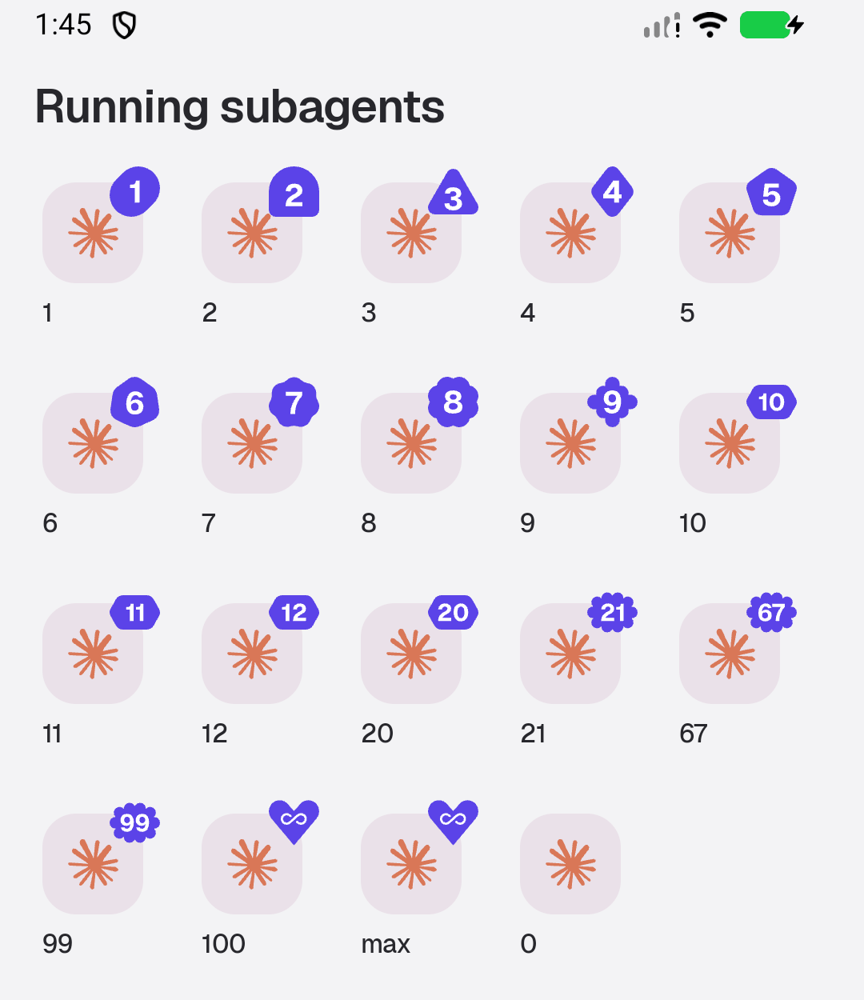
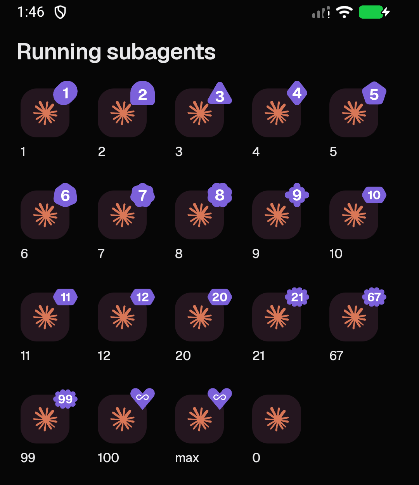
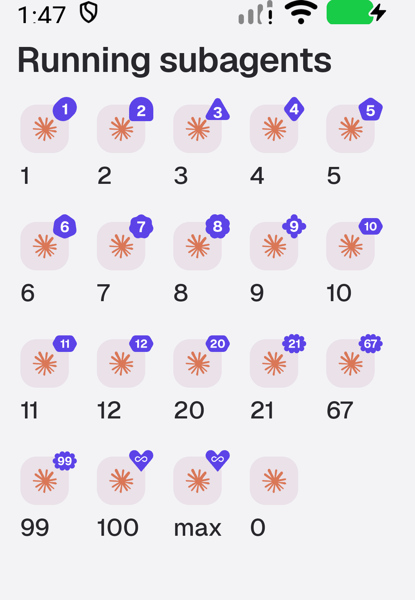
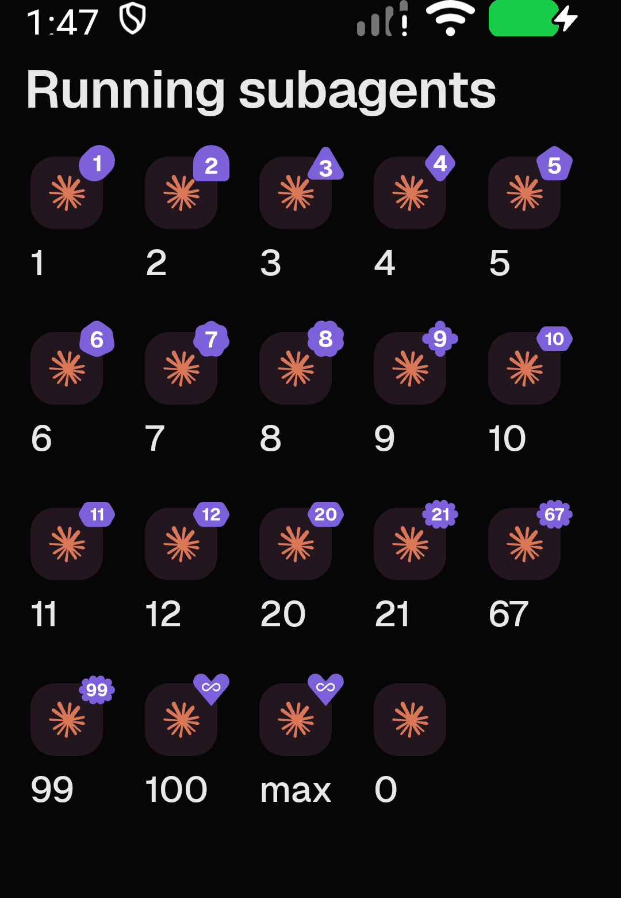
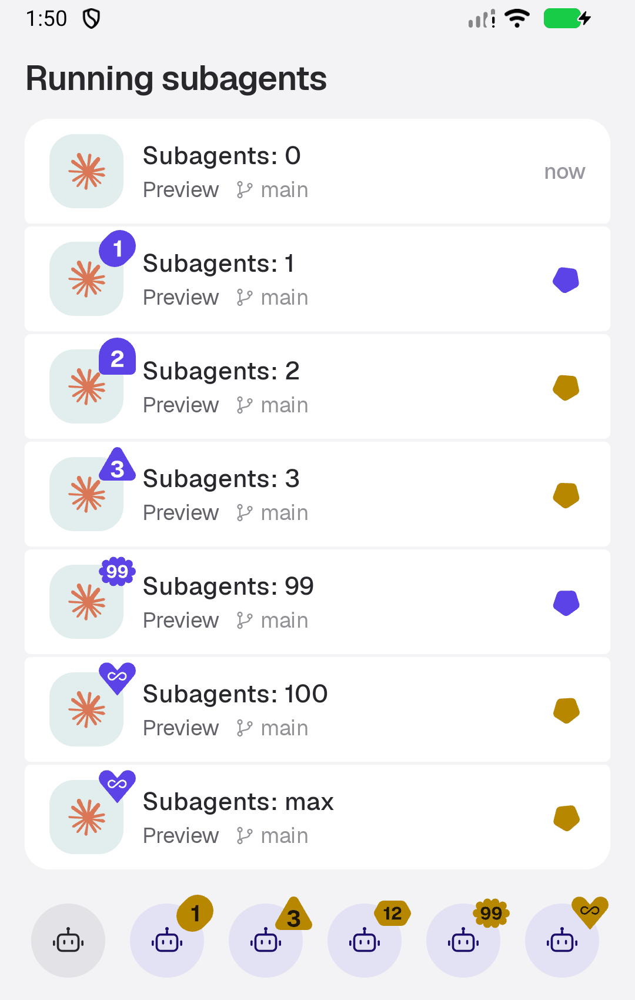
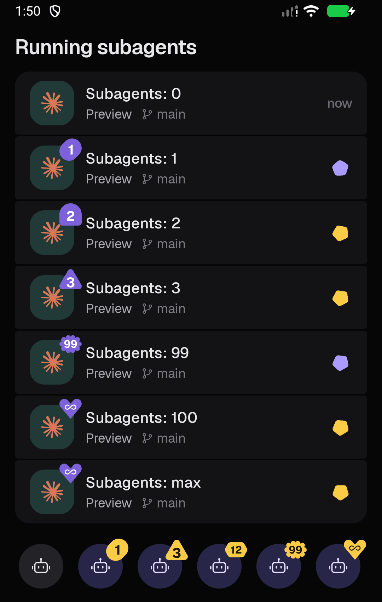
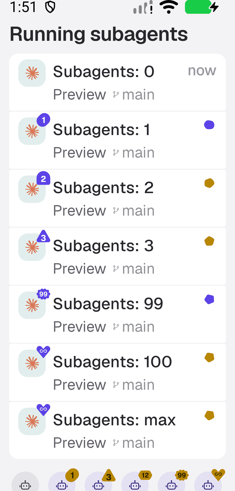
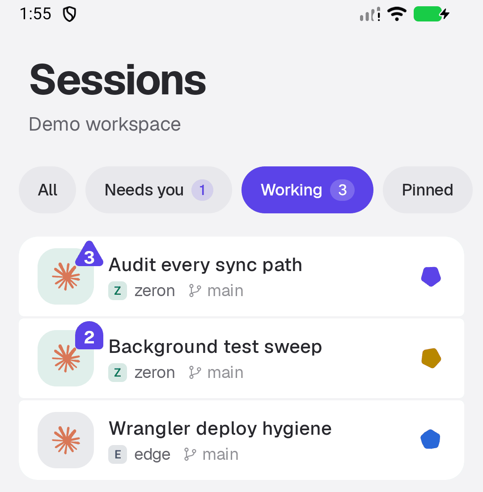
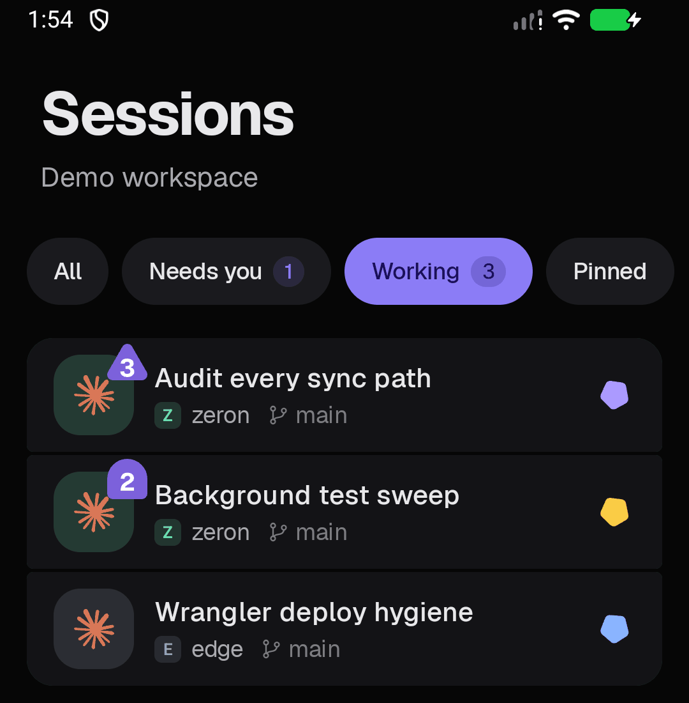
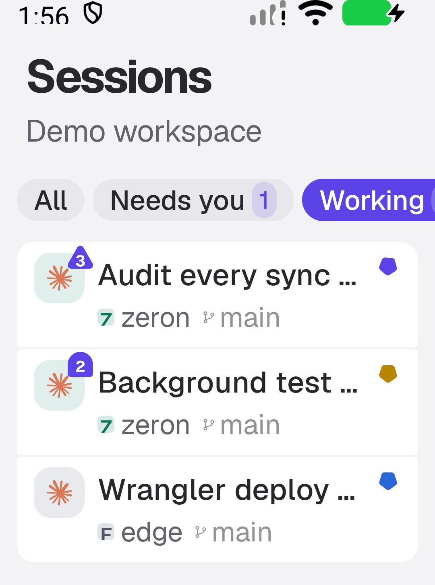
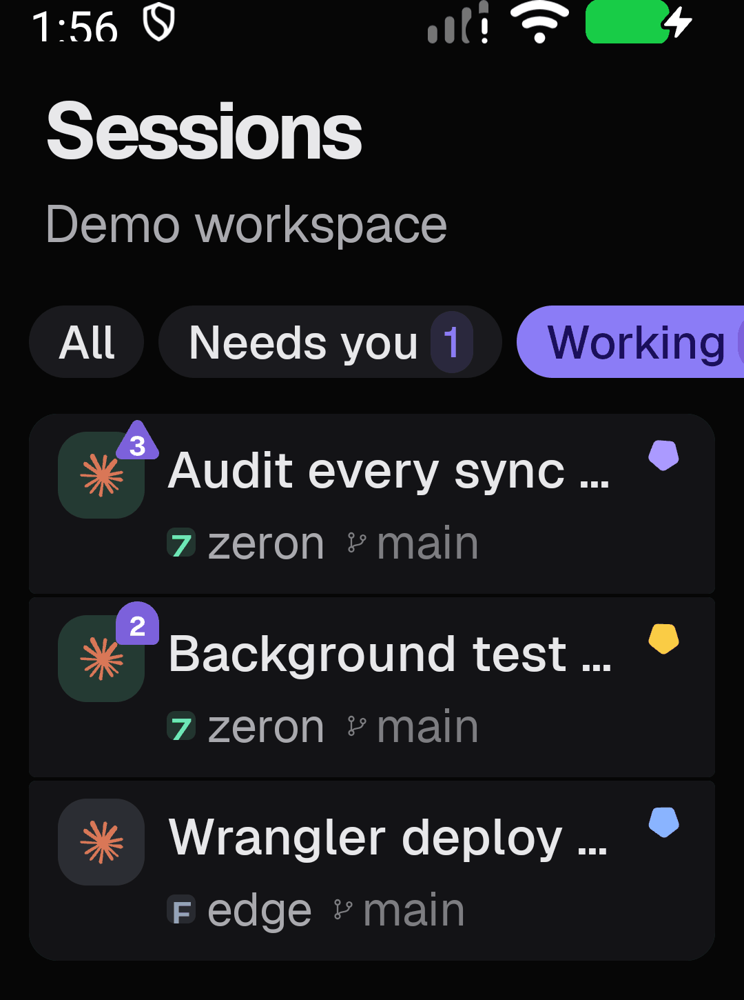
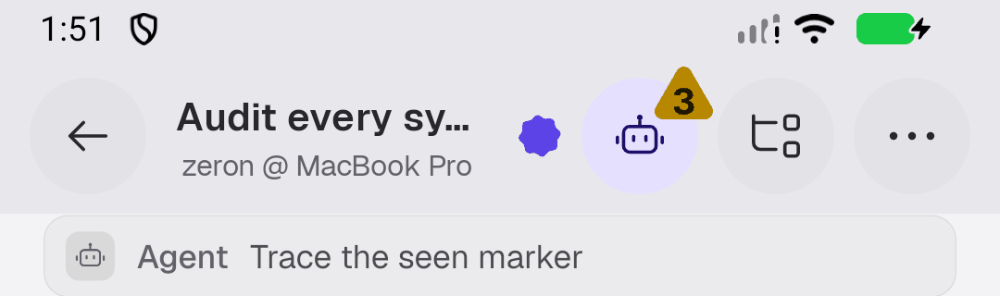

## Sounds and haptics

Every tap, toggle, sheet, swipe and session event has a considered haptic and a
soft sound, played only while the app is open and in your control: Settings,
**Sounds & haptics** has one master switch (off silences every sound and vibration,
on lets the switches below decide, whatever the phone's own touch-sound, ringer or
Do Not Disturb settings say), interface and session sounds
(completion, input required, errors, like the desktop), volume (default 50%; 100%
is twice as loud), haptic strength (Subtle / Standard / Strong) and a Try them list.
The desktop's done / request /
attention chimes are reused (mastered louder and trimmed, in the app and for
notifications); the interface cues are generated in the same family. When the app is in the background, session events arrive as
notifications with the same sounds and matching vibration. Design, the cue and
haptic tables and the policy: [`sound-design/android.md`](sound-design/android.md).

The layer covers the on-device screens too: first run (Continue without an account,
Explore the demo), the engine (Start / Stop, Reset, setup finished, failures),
Settings, the Custom server dialog, Transfers and the Share to Zeron sheet. Device
events are one-shots from state transitions: an offer waiting for you
(`Attention` + `Request`), files arrived or your send completed (`Success` +
`UploadReady`), a transfer that failed or was declined (`Error` + `Attention`);
behind the app, transfer notifications use versioned channels with the same
request / done / attention chimes (silent while the app is in front, which plays
the cue itself). The full matrix is in `sound-design/android.md`
(§ On-device screens).

## Development: several devices without WorkOS

```
zeron local-edge --port 27700 --token <≥16 url-safe chars> --bind 0.0.0.0
ZERON_EDGE_URL=http://127.0.0.1:27700 ZERON_EDGE_TOKEN=<token> \
  ZERON_USER_ID=local ZERON_ORG_ID=local ZERON_IPC_TOKEN=<secret> zeron headless
```

On the phone: Settings → About → tap Version seven times → Developer →
Custom server `http://10.0.2.2:27700` (the emulator's host) + the token, or
`adb shell am start -n sh.zeron.android/.MainActivity --ez local true
--es server http://10.0.2.2:27700 --es server-token <token>`.

## Known issues and gaps

- Developer tools: in full-screen terminal programs (vim, less, htop) a drag
  scrolls the client's scrollback rather than sending wheel/arrow input;
  `WriteWorkspaceFile` can't create files, so the editor edits existing ones
  only; preview discovery on the phone is the command-line heuristic above.

- `opencode upgrade` on an **npm** OpenCode leaves a dangling
  `bin/opencode.exe` in the guest — proot's `--link2symlink` emulates npm's
  hard link with a hidden `.l2s.*` file the upgrade does not carry over — so
  the engine reports "post-update verification failed" (shown inline).
  OpenCode from its vendor installer (the default) updates fine.
- Not yet verified: arm64 hardware for this build; WorkOS sign-in and agent
  browser sign-in end to end (the emulator's `system_server` aborts whenever a
  Custom Tab opens, which also leaves background notifications unverified); a
  real phantom-process kill (simulated SIGKILL only); release builds (per-ABI
  splits, Play's 16 KB alignment for `libproot-loader32.so`).
- Sensory layer on the on-device screens, verified on the Android 16 x86_64
  emulator (2026-09-30, `ZeronFeedback` log + `dumpsys vibrator_manager` +
  `dumpsys notification`): engine setup finished once (first run and after a
  reset), Continue / Settings / Engine page / Reset (`Heavy` + `Delete`) /
  Custom server (refusal `Error`, save `Confirm`), a free OpenCode session
  (`Send`, then `Done` once), computer to phone and phone to computer
  transfers (ask, accept, decline, received, sent) with the
  `transfer-ask-v1-sv` / `transfer-received-v1-sv` channels created and the
  notifications posted silent in front. Not verified: how it feels and sounds
  (needs a phone), transfer notifications sounding from the background (the
  emulator's task-switch abort), the effort slider's detents on a model with
  effort levels (OpenCode's free models have none).
- Verified on the Android 16 x86_64 emulator (2026-09-29, combined build),
  with a computer's `zeron local-edge` + a `zeron headless` joined in
  Development scope and the phone on Custom server: first run without a
  mode choice, This phone + the computer in Settings, OpenCode install /
  Update all / uninstall / reinstall, the Run-on and model pickers, a thread
  on the computer from the phone and one on the phone from the computer
  (MCP), and file transfer both ways over P2P — computer → phone (folder +
  60 MB, notification, `Download/Zeron`, sha256 equal), Ask before accepting
  → Accept from the notification, Share to Zeron phone → computer (60 MB,
  sha256 equal; ShareActivity started with a Download item — the Files
  app's chooser reaches it too, but dismissing the chooser hit the abort
  below), and an OpenCode agent on the computer calling `send_files`.
  Not verified there: a notification's route into an already-running
  process (the emulator's `system_server` aborts on the task switch, below).

Emulator note: boot with `-feature -ReadColorBufferDma -feature -GLDMA2`
(swiftshader); otherwise `system_server` aborts on
`hasReadColorBufferDma`. `adb exec-out screencap` still hits the assertion in
its own process; use `adb emu screenrecord screenshot <file>`. Emulator
36.2.12 rejects `ReadColorBufferDma` as a feature name, and with any flags
`system_server` aborts in `TaskSnapshotConvertUtil` whenever a task is hidden
(an app backgrounding, another app's activity closing): drive such flows from
a freshly restarted system, and switch to three-button navigation
(`cmd overlay enable-exclusive --category
com.android.internal.systemui.navbar.threebutton`) so SurfaceFlinger's region
sampling doesn't hit the same assertion.

## Build

```
cd apps/android && ./gradlew :app:assembleDebug
```

`:app`'s `preBuild` runs, when their outputs are missing,
`scripts/android/fetch-proot.sh`, `fetch-rootfs.sh` and `build-engine.sh`
(→ `target/android-runtime/{jniLibs,assets}`) and always
`build-core.sh` (→ `target/android-core`). Rerun a script by hand to refresh
its output; `-PzeronSkipRuntime` / `-PzeronSkipCore` skip them. `:app`
packages both directories, `useLegacyPackaging = true` (the runtime's
executables must be extracted to `nativeLibraryDir`), and keeps `libzeron.so`,
`libproot*.so`, `libtalloc.so` and `libandroid-shmem.so` unstripped — the
strip pass corrupts the patchelf'd libs.

Toolchain: JDK 21, Android SDK platform 37 + NDK 29.0.14206865, rustup
targets `aarch64-linux-android x86_64-linux-android
aarch64-unknown-linux-musl x86_64-unknown-linux-musl`, `cargo-ndk`,
`cargo-zigbuild` + zig, `patchelf`.
