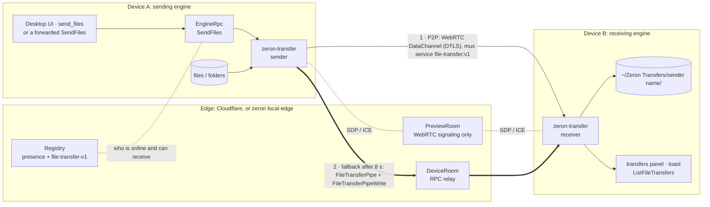
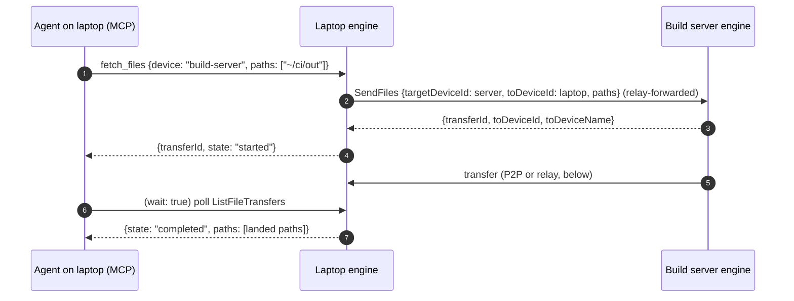
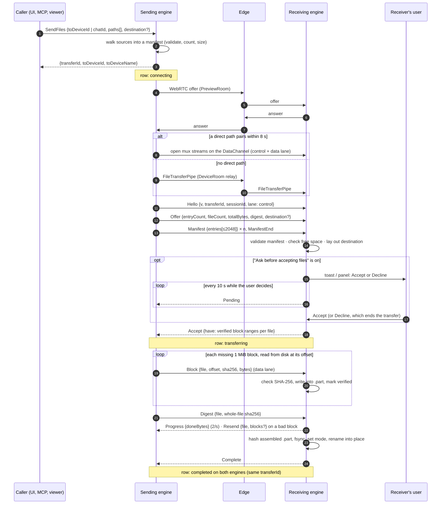
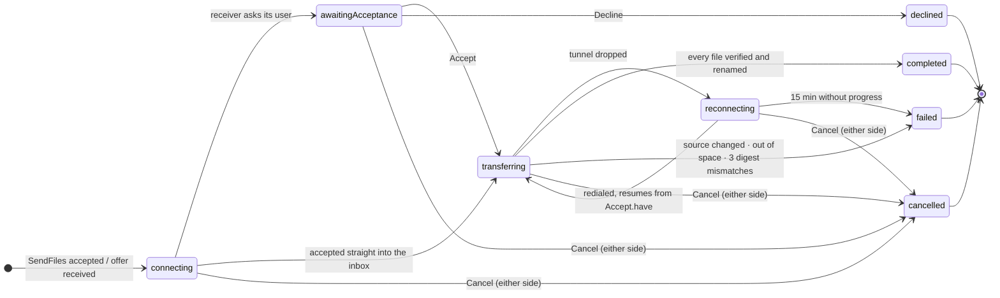
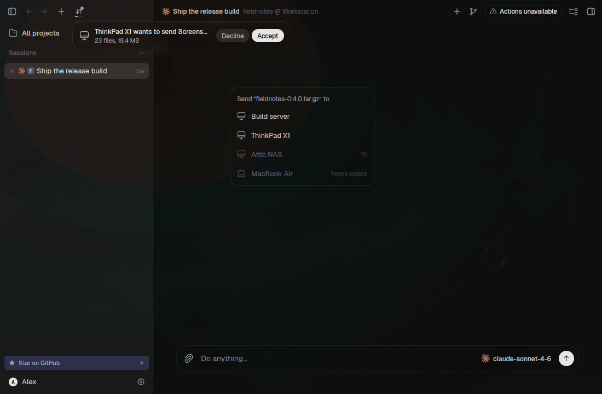
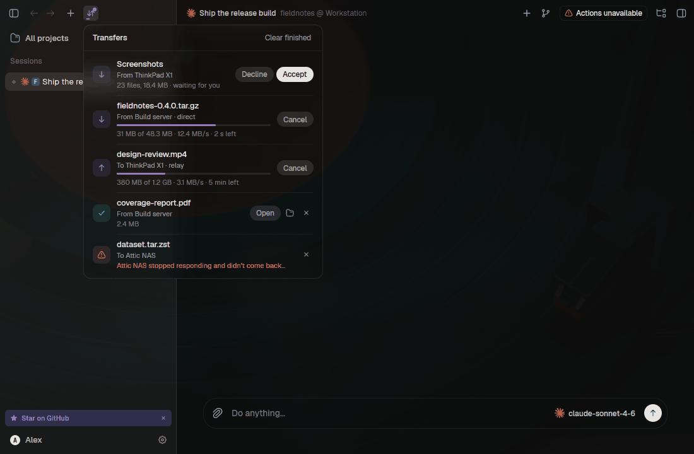
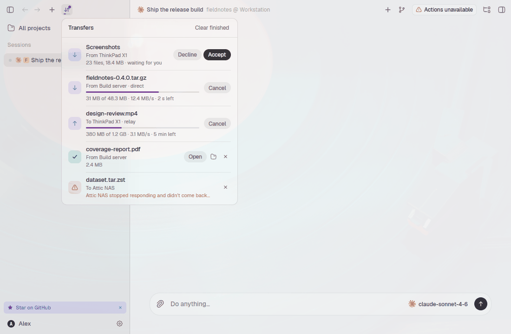
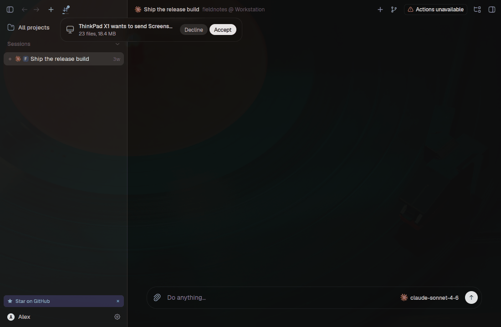
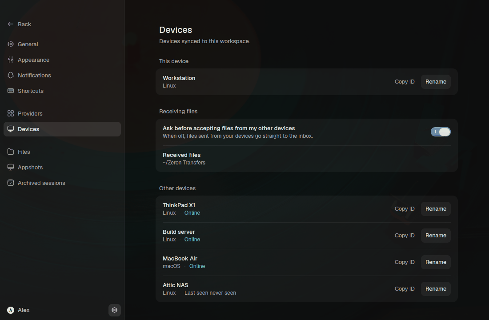

# Device file transfer

Send files and folders straight from one of your engines to another, such as
a VPS to your desktop or a build server to your laptop, over a temporary
tunnel with no size limit. An agent on a remote machine can hand you what it
built ("send me the build"), and an agent can pull what it needs from
another of your devices ("fetch the logs from the build server").

Every engine sends and receives: desktop Linux, macOS and Windows, and
`zeron headless` servers. The code lives in `crates/transfer` (protocol,
sender, receiver, relay pipe), `crates/engine/src/file_transfers.rs`
(tunnels, recipient lookup), `crates/ui/src/file_transfers.rs` +
`crates/ui/src/shell/file_transfers.rs` (desktop) and the `send_files` /
`fetch_files` MCP tools (`docs/mcp.md`).

## Architecture

The edge only introduces the two engines to each other. It carries presence
and capabilities (registry), WebRTC signaling (PreviewRoom: SDP and ICE, never
file bytes) and, when no direct path pairs, the DeviceRoom relay. The bytes
travel engine to engine.



A pull (`fetch_files`, or any client calling `SendFiles` with
`targetDeviceId`) is the same transfer started from the other end: the
asking engine forwards `SendFiles` over the DeviceRoom relay to the source,
naming itself as `toDeviceId`, and the source sends as usual.



## A transfer, end to end



If the tunnel drops mid-transfer, both rows go to `reconnecting`. The sender
redials (P2P first again, then the relay) and the new session's
`Accept.have` lists what the receiver already verified, so only missing
blocks travel.

## States

`zeron_proto::FileTransferState`, the same row shape on both engines:



`preparing` and `verifying` are part of the wire enum and rendered by the
desktop, but today's engines never emit them. The manifest is built before
`SendFiles` replies, and each file's whole-file check runs while the other
files are still transferring.

## Trust and acceptance

Peers are the account's own authenticated devices, the remote-workspace
trust boundary of ARCHITECTURE.md §1. A transfer from one of them is accepted
into the inbox unless the receiving device turned on **Ask before accepting
files from my other devices** (`FileTransferSettings.requireConfirmation`).
In that case it waits in `awaitingAcceptance` until that device's user
accepts or declines. The receiver trusts nothing in the sender's manifest
(see below).
Over P2P the sender's device id is the one the signaling coordinator
stamped. Over the relay the DeviceRoom admits only the account's devices and
the claimed `fromDeviceId` must be one of them.

A pull does not ask the source's user. Any device of the account can already
read the source's workspaces remotely, and a forwarded `SendFiles` is the same
power. The receiver's confirmation setting still applies.

Received items land in `{home}/Zeron Transfers/<sender device name>/`. The
inbox root is a per-device setting. An item whose name is taken gets a
` (2)` suffix, and nothing is ever overwritten. A sender may name an explicit
`destination`. The receiver accepts it only if it is an existing folder
inside its home folder, its inbox, or one of its projects, and not inside a
`.git` folder.

## Transport

1. **P2P first.** The sender opens mux streams to service `file-transfer:v1`
   through the preview networking stack (`docs/preview-networking.md`). The
   edge's PreviewRoom relays only SDP, and the bytes travel over one ordered,
   reliable WebRTC DataChannel between the two engines. The channel is
   DTLS-authenticated by the fingerprints exchanged over the authenticated
   signaling socket, and the peer id the receiver sees is the one the
   coordinator stamped. The mux's per-stream 64 KiB credit window is the
   backpressure. A transfer uses one control lane and one data lane on the
   same connection, because parallel mux streams share one SCTP association
   and measured slower. One block of read-ahead lets disk reads and hashing
   overlap the send.
2. **Relay fallback.** If no direct path pairs within 8 s, or P2P is
   unavailable, the lanes run over the DeviceRoom relay instead. Each lane
   is a byte pipe made of RPCs on the existing device link: a
   `FileTransferPipe` stream carries receiver → sender bytes, and ordered
   `FileTransferPipeWrite` calls (≤ 48 KiB raw, base64, sequence-numbered,
   12 in flight) carry sender → receiver bytes. A write is acknowledged only
   once the receiver has taken its bytes, which is the relay's backpressure.
   Every message stays within the relay's message limits.
3. **Teardown.** A tunnel paired for a transfer is closed once its streams
   are idle. A preview connection that already existed is left alone.

The protocol below is identical over both, because a lane is just an ordered
byte stream.

## Protocol

Frames are `u32 BE length ‖ u8 kind ‖ body`: kind 1 is a JSON control
message, kind 2 a data block `u32 file ‖ u64 offset ‖ sha256[32] ‖ bytes`.

- **Manifest.** A flat pre-order list of `{path, kind: file|dir|symlink,
  size, mode, target?}` with `/`-separated relative paths. The receiver
  refuses empty names, `.`/`..`, absolute paths, backslashes, NUL or control
  characters (plus names invalid on Windows when it runs there), duplicates,
  and any entry whose parent is not a directory listed before it. Nothing
  can land outside the destination or be written through a symlink or file.
  Symlinks travel as symlinks (target verbatim, created last, never followed
  while writing). Sockets, FIFOs and devices are skipped and counted
  (`skipped`). Top-level symlinks the user picks are followed. Unix
  permission bits are kept, and folders stay owner-writable. macOS and
  Windows receivers refuse names that differ only in letter case.
- **Blocks.** Files move in 1 MiB blocks read from disk at their offset.
  Nothing is buffered beyond one block per lane. The receiver checks each
  block's SHA-256, writes it at its offset into a hidden
  `.<name>.zeron-<id>.part` (opened `O_NOFOLLOW`), and records the block as
  verified. A bad block is requested again.
- **Whole-file check and atomic finalize.** When every block of a file is
  verified and the sender's whole-file `Digest` has arrived, the receiver
  hashes the assembled part, sets its mode, fsyncs it and renames it into
  place. A mismatch requests the whole file again (at most 3 times).
- **Resume.** Every 2 s the receiver fsyncs the parts it wrote and persists
  the verified block set (`{profile}/file-transfers/incoming/<id>/`). When a
  tunnel drops, the sender redials with backoff (1 s … 30 s, P2P first each
  time), and a new session's `Accept.have` lists what is already verified,
  so only missing blocks travel. That also covers a receiver restart. A
  sender gives up after 15 minutes without progress. A receiver drops an
  interrupted transfer's partial data after 7 days.
- **Cancel.** Either side can cancel: over the control lane when one is up,
  otherwise through a relay `CancelFileTransfer {fromPeer: true}`. The
  receiver removes unfinished parts, and completed files stay.
- **Free space.** A receiver refuses a transfer larger than its free space
  (minus a 64 MiB margin).

## RPC surface

All are forwardable with `targetDeviceId` naming the engine that sends or
holds the transfer, so a viewer can drive any engine and an engine can ask
another to send to it. The recipient of `SendFiles` is `toDeviceId`. Not to
be confused with `WatchTransfers`, the chat-attachment upload feed.

| Method | Params → reply |
| --- | --- |
| `SendFiles` | `{toDeviceId?, chatId?, paths[], destination?}` → `{transferId, toDeviceId, toDeviceName}`. Without `toDeviceId`, the device that typed the chat's latest (non-agent) message, if it runs an engine. Otherwise it fails with an error naming the devices that can receive. Forward deadline 120 s (the sender walks the sources before replying). |
| `WatchFileTransfers` | stream of `FileTransfer[]` (newest first; progress ≤ 4 frames/s) |
| `ListFileTransfers` | unary snapshot of the same |
| `CancelFileTransfer` / `AcceptFileTransfer` / `DeclineFileTransfer` | `{transferId}` |
| `ClearFileTransfers` | `{transferId?}`: drop finished rows |
| `Get/SetFileTransferSettings` | `{requireConfirmation, inboxDir?}` |
| `FileTransferPipe` / `FileTransferPipeWrite` | engine ⇄ engine relay pipe (internal) |

Rows (`zeron_proto::FileTransfer`) carry direction, peer, state, transport,
top-level items with their local paths, byte counts and throughput. The
history keeps the last 200 finished transfers per profile. Engines that
speak the protocol advertise the `file-transfer-v1` capability on their
device row.

Paths and a `destination` may start with `~/`. The sending engine expands
sources against its home, and the receiving engine expands the destination
against its own, since a viewer or an agent whose chat runs in `~` can't know
either.

## Clients

### Desktop

"Send to device…" in the file tree's context menu (and "Send current file to
device…" in the command palette) opens a picker of the account's engines.
Devices that are offline or run an engine without `file-transfer-v1` are
listed but disabled. The project's host engine sends, and when that host is
remote its transfer feed is watched too.



A titlebar indicator appears while transfers are live or recently finished.
Its panel shows progress, throughput, peer and transport, and has cancel,
accept/decline, open / show in folder and "Clear finished":

| Dark | Light |
| --- | --- |
|  |  |

An incoming transfer raises a toast under the indicator (with Accept/Decline
when confirmation is required) and a desktop notification per the
notification settings. Settings → Devices → **Receiving files** holds the
confirmation switch and the inbox folder.

| Incoming toast | Settings → Devices |
| --- | --- |
|  |  |

The screenshots come from `crates/ui/examples/file-transfer-fixture.rs`
(fake rows, no engine, nothing is sent):
`cargo run -p zeron-ui --features project-palette-fixture --example
file-transfer-fixture` with `ZERON_TRANSFER_SHOT=panel|toast|send|settings`
and optionally `ZERON_PALETTE_LIGHT=1`.

### Agents

`send_files` pushes from the chat's host, and `fetch_files` pulls onto it
(`docs/mcp.md`, including how agents on different devices hand files to each
other). Both return once the transfer starts. With `wait: true` they poll
until it ends and report where the files landed.

## Limits

- One manifest holds at most 1,000,000 entries. File sizes are unbounded.
- The sender must keep its files unchanged while sending. A file that
  shrinks or changes fails that transfer with a clear error.
- Symlinks are not recreated on Windows receivers.
- macOS and Windows receivers refuse a transfer holding two names that
  differ only in letter case, because their file systems can't keep them
  apart.
- Both engines need an edge (a signed-in account, or a development or local
  edge). Local-only profiles can't transfer.

## Development

`zeron local-edge` serves a standalone single-tenant edge (`crates/localedge`,
the Rust port of `edge/` with one shared-secret bearer and no WorkOS). Engines
join it in `Development` scope:

```sh
zeron local-edge --port 27655 --token "$(openssl rand -hex 24)" [--bind 0.0.0.0] [--data-dir DIR]

ZERON_EDGE_URL=http://HOST:27655 ZERON_EDGE_TOKEN=<token> \
ZERON_USER_ID=local ZERON_ORG_ID=local \
ZERON_DATA_DIR=/tmp/zeron-a ZERON_IPC_PORT=27701 zeron headless
```

Two engines on one machine need their own `ZERON_DATA_DIR` and
`ZERON_IPC_PORT`. `--bind 0.0.0.0` lets engines on other machines join. The
local edge speaks plain HTTP and WebSocket, so the token and all traffic
(relayed file bytes included) are unencrypted on the wire: bind beyond
loopback only on a network you trust. Joining through `ZERON_USER_ID` is a
`zeron headless` feature; to watch such an engine from the desktop app, start
the app with the engine's `ZERON_IPC_PORT` and it attaches to the running
engine instead of starting its own.

Tests:

- `cargo test -p zeron-transfer`: manifest validation and traversal
  refusal, chunking, block and whole-file verification, resume, cancel
  (including a cancel racing the confirmation prompt), confirmation, `~`
  expansion, a hostile sender.
- `cargo test -p zeron-localedge --test file_transfer`: two real engine
  runtimes on one local edge. It sends a folder and a 1 GiB file over P2P and
  over the forced relay, cuts each mid-file and resumes, then pulls a folder
  through a forwarded `SendFiles`. `ZERON_TRANSFER_TEST_MIB` shrinks the
  file, and `ZERON_TRANSFER_TEST_THROUGHPUT=1` adds uncut runs that print
  throughput. Use `--release` for representative numbers.
- `cargo test -p zeron-mcp`: `send_files` and `fetch_files` against a fake
  engine.

Measured on one Linux workstation (16 cores, loopback, release builds):

| Run | Transport | Payload | Throughput |
| --- | --- | --- | --- |
| e2e test, clean | P2P | 1 GiB + folder | 102.7 MiB/s |
| e2e test, cut at ~25 % and resumed | P2P | 1 GiB + folder | 77.3 MiB/s |
| e2e test, clean | relay | 1 GiB + folder | 191.1 MiB/s |
| e2e test, cut at ~25 % and resumed | relay | 1 GiB + folder | 144.2 MiB/s |
| `zeron local-edge` + two `zeron headless` | P2P | 1 GiB + 200-file folder | 123.5 MiB/s |
| same | relay (forced) | 1 GiB | 198.6 MiB/s |
| same, receiver killed with SIGKILL at 327 MiB and restarted 4 s later | P2P | 1 GiB | completed in 18.7 s, byte-identical |

Both engines and the edge ran on one machine, so these numbers show the
protocol's own overhead rather than a network. The relay is faster here
because the local edge adds no network hop. Across real networks P2P skips
the edge entirely, while relayed bytes pay for the round trip through it.
