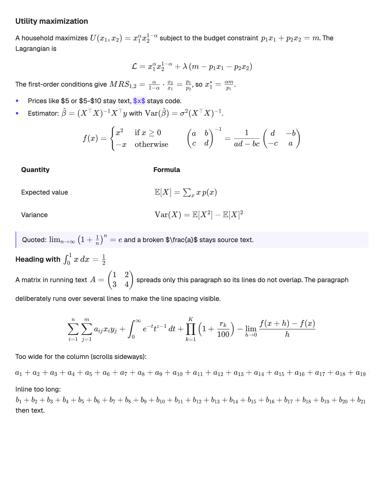
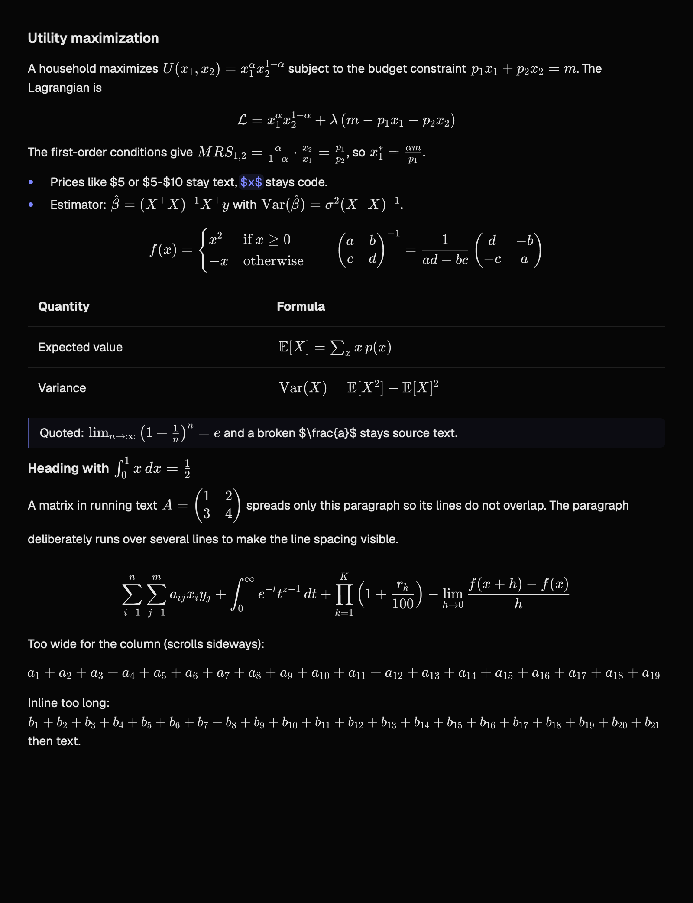

# LaTeX math in Markdown

Agent replies and Markdown file previews render TeX math. Four delimiter forms are recognized:

| Form | Style |
| --- | --- |
| `$…$` and `\(…\)` | inline, in the text flow |
| `$$…$$` and `\[…\]` | display, centered on a line of its own |

Display math may span lines, inside quotes and list items too, but not a blank line. `\(…\)` closes on its own line. Code spans, code blocks and raw HTML blocks stay literal. A closing `$` directly before a digit ends a price rather than a formula (Pandoc's rule), so `$5-$10` and `US$5/US$6` stay text; `$` followed by a space never opens math. Unpaired delimiters keep their CommonMark meaning. TeX that does not parse, or is longer than 8 KiB, is shown as its source.

## Rendering

`markdown/math.rs` typesets with [RaTeX](https://github.com/erweixin/RaTeX) 0.1.14 (MIT), a pure-Rust port of KaTeX's parser and layout, pinned like `mermaid-rs-renderer`. Only `ratex-parser`, `ratex-layout`, `ratex-types` and `ratex-font` are used: the display list becomes a self-contained SVG whose glyph outlines are read with `ttf-parser` from the KaTeX fonts bundled under `assets/fonts/katex` (SIL OFL 1.1, see `assets/fonts/licenses`). RaTeX's own font-embedding crate needs a newer `rust-embed` than the one this crate pins, and its rasterizer is not needed. GPUI paints the SVG with `paint_svg` as a monochrome sprite tinted with the theme's text color, so formulas follow light and dark themes and the sprite atlas caches each raster per size. As in KaTeX, math is set at 1.21× the surrounding text size.

Inline formulas sit in the text flow through a placeholder: the flattened text carries a run of transparent letters as wide as the formula plus 0.1 em of lead-in room, and the text element paints the formula over the end of that run on the text baseline. The letters' widths are measured once per face by shaping runs of them, not read from the font's advances: the text system tracks the interface face about 0.02 em per glyph tighter than its advances, which would add up to a visible overlap on long formulas. The letters are word characters to GPUI's line breaker, so wrapping moves a formula as one unit. Selection washes, link hit-testing and the streaming veil keep working on ordinary shaped text; the original-text offset map (shared with link truncation) resolves a selection back to the TeX source, so copying yields `$…$` exactly as written. A paragraph whose inline formula would overflow its line box (a matrix in a sentence) gets a larger line height; GPUI shapes one line height per text element.

An inline formula wider than the column shrinks until it fits, with room left for the space after it. This happens in the same width-dependent presentation pass that shortens in-app link labels (`ResponsiveText`); text with inline math goes through that pass even without links, and link labels are only cut where they were before.

Display formulas split their paragraph: the text before and after renders as usual, and the formula becomes its own centered text element whose line box fits the formula. A formula wider than the column scrolls sideways instead of wrapping; auto margins center it only while it fits, so its start stays reachable.

`\(…\)` and `\[…\]` reach pulldown-cmark's math extension through a byte-for-byte rewrite to `$$…$$` before parsing. Source ranges therefore stay valid for incremental reparsing and task toggles, and the original delimiter at an event's range restores inline versus display style. The streaming mender skips closed formulas, so `$a*b$` never gains a synthetic emphasis closer; a formula still streaming shows its source until its closing delimiter arrives.

## Limits

Typesetting runs on first render and is memoized per formula and style, bounded by 16 MiB of SVG. A RaTeX panic is caught and degrades to source text. `\color` and similar commands render in the text color, since sprites are monochrome. Characters outside the KaTeX fonts in `\text{…}` fall back to the bundled Geist face; scripts it does not cover are omitted. User messages are plain text and do not render math.

## Validation

```sh
cargo test --release -p zeron-ui --lib -- markdown::
cargo run --release -p zeron-ui --example math-fixture --features math-fixture -- /tmp/zeron-math
```

Unit tests cover the delimiter rewrite (code, escapes, unpaired and multi-line forms), streaming parity of the incremental parser on math corpora, prices and escapes staying text, SVG output parsing with `usvg`, placeholder widths, copy mapping to TeX including composition with truncated links and with shrunk formulas, display-paragraph splitting, and the mender. The fixture renders a representative document (inline, display, bracket forms, tables, quotes, headings, a tall inline matrix, a display formula wider than the column, an inline formula wider than the column, parse failures) through the transcript renderer in light and dark themes and writes `math-light.png` and `math-dark.png`; it was checked visually on macOS. Streaming and scrolling were not covered by the fixture.

| Light | Dark |
| --- | --- |
|  |  |
