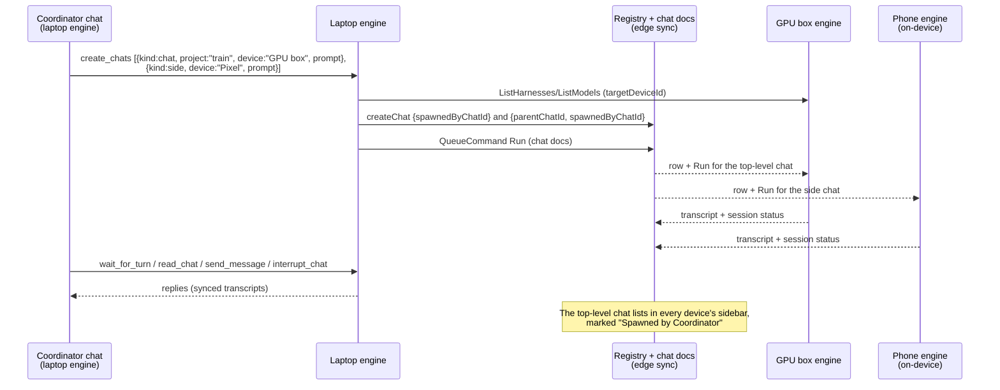

# Zeron MCP server

`zeron mcp` serves the Model Context Protocol on stdin/stdout and proxies every
tool into the running engine's localhost IPC (`ws://127.0.0.1:$ZERON_IPC_PORT`,
default 27654) — the same `zeron_rpc` surface the headed app and `zeron sync`
dial. It is a subcommand of the one `zeron` binary: no Node runtime, no extra
install, a few MB resident.

Crate: `crates/mcp` (`zeron-mcp`). The protocol layer is hand-rolled
(`initialize`, `ping`, `tools/list`, `tools/call`; newline-delimited JSON-RPC
2.0) — the repo already owns JSON-RPC framing for the Codex and ACP drivers and
the stdio tool-server subset is tiny, so no SDK dependency was taken.

## Identity

The engine can inject this server into a harness's MCP config with the
originating chat in the environment:

| Variable          | Meaning                                                       |
| ----------------- | ------------------------------------------------------------- |
| `ZERON_IPC_PORT`  | Engine to proxy (default 27654).                              |
| `ZERON_CHAT_ID`   | The chat whose agent spawned this server.                     |
| `ZERON_DEVICE_ID` | That chat's host device.                                      |

When `ZERON_CHAT_ID` is set, every `send_message` is prefixed with a
`[Message from Zeron chat <title> (<id8>) …]` line so the receiving agent and the
human reading that transcript can tell an agent-to-agent message from a typed
one, and the server refuses to message its own chat. The transcript renders
this routing header as “Message from **chat name**”, keeping the full routing
instructions in the stored prompt for agents.

### Chat kinds, parent links and provenance

`create_chat` (and each `create_chats` request) takes a `kind`:

| `kind` | Placement | Sidebar | `parentChatId` | `spawnedByChatId` |
| ------ | --------- | ------- | -------------- | ----------------- |
| `side` | Under its parent chat (the right-hand side chats / explorer **Chats**) | Hidden | parent (default: the calling chat) | calling chat |
| `chat` | Top level, exactly like a chat the user created | Shown in Sessions on every device, with a "spawned by" mark | — | calling chat |

When `kind` is omitted it is `side` whenever there is a parent (the calling
chat, or an explicit `parent`), and `chat` otherwise (a human running
`zeron mcp` from a terminal). Existing callers therefore keep today's side-chat
behaviour; asking for a real chat is explicit. `parent` only applies to
`side`: combining it with `kind: "chat"` is an error, and `kind: "side"` with
no parent to hang it under is an error.

Two independent fields carry the links:

- **Placement** — `Chat.parent_chat_id` (proto) ⇄ `parentChatId` on the
  registry/workspace chat row. A chat with a parent is a side chat:
  `AppState::visible_chats` (Sessions list, project tabs, jump slots), the
  Archived section and the mobile front page all require
  `parent_chat_id == None`. Side chats stay addressable by id, deep link and
  every MCP tool; `list_chats { parent }` lists them.
- **Provenance** — `Chat.spawned_by_chat_id` ⇄ `spawnedByChatId`: whose agent
  created the chat, for both kinds. It never hides anything. The desktop
  sidebar marks such rows ("Spawned by <chat>", click opens the spawner), the
  spawner's transcript links the chats it created, and mobile session rows
  carry `spawnedByChatId`/`spawnedByTitle`.
- **Created ids on the call** — tool outputs never enter the session doc, so
  the fold keeps only the chat ids a successful Zeron `create_chat` /
  `create_chats` result named, on that tool part (`createdChatIds`,
  additive; detection and parsing live in `zeron_proto::created_chats` and
  tolerate every harness's naming: `mcp__zeron__create_chat`,
  `zeron_create_chat`, `Mcp { server: "zeron" }`, ACP titles). The desktop
  card links exactly those chats (older transcripts fall back to matching
  `spawnedByChatId` by creation time), and `read_chat` prints them as
  `mcp: zeron/create_chats [created: <id>, …]`. `list_chats { spawned_by }` returns
  every chat a chat spawned, side or top-level.

`Mutate createChat { parentChatId?, spawnedByChatId? }` →
`WorkspaceHost::create_chat_linked`. Both fields are additive and
serde-defaulted: rows written by older engines read as user-created
top-level chats, an older engine receiving `spawnedByChatId` ignores it (the
chat simply shows as user-made there), and a dangling id (spawner deleted) is
tolerated rather than cascaded. Chats created before this field existed keep
only `parentChatId`, so `spawned_by` does not list them. A fork
(`ForkSideChat`) is the user's own side chat and never inherits provenance.

Every chat summary carries `kind`, `parentChatId` and `spawnedByChatId`.

### Who may create chats

- A **side chat** cannot create chats (one level of side chats), and cannot be
  chosen as a `parent`.
- A **top-level** chat may create chats of either kind — including one an
  agent spawned. Unbounded recursion is prevented by provenance depth: a
  user-created chat is depth 0, a chat it spawns depth 1, and a chat at
  `MAX_SPAWN_DEPTH` (3) can run and message other chats but not create more.
  The MCP server checks this before writing, and the engine re-checks the
  `spawnedByChatId` chain on `createChat` as a backstop (a looping chain counts
  as over the limit).
- **Fan-out**: a chat may have at most `MAX_LIVE_SPAWNS` (32) unarchived chats
  it spawned at once; `archive_chat` finished workers to free slots. The count
  and the row write happen under one lock, so a `create_chats` batch cannot
  overshoot.
- **Rate**: one MCP server (one agent run) may create at most 32 chats per
  60 s, so a create/archive loop cannot flood the registry.

`whoami` reports the calling chat's `spawnDepth`, `liveSpawns`,
`canCreateChats` and the limits.

### Running chats on any device

A chat runs on its **host device**: the project's device, or `device` for a
project-less chat (cwd `~` on that host). `create_chat` targets any execution
host in the workspace, not just the local one:

- `project` — id, path, name, or unique path suffix. A name shared by several
  devices (the same repo cloned on each) resolves to this device's copy; pass
  `device` to pick another.
- `device` — id or name. Alone: a project-less chat there. With `project`:
  the project is looked up among that device's projects (and must live
  there).
- `cwd` — an existing directory on the host; `branch` — the ref label (the
  base for `worktree`); `worktree: true` — the host creates a fresh isolated
  `zeron/<name>` worktree off `branch` (default `HEAD`) when the first turn
  starts (`RunRequest.worktree`, the composer's "New worktree"). It needs a git
  project and a `prompt`.

The target is validated before anything is written. It must be an
**execution host** — a device whose engine stamped `capabilities` on its row
(desktop, headless and on-device Android engines), or, for rows from older
engines, a non-phone OS; iOS/iPadOS viewers are refused — and **online**: this
device, or a heartbeat within 70 s (the Devices page window). Errors name the
valid choices (`online execution hosts: GPU box (dev-gpu), …`, or the
device's projects). The harness and model are checked against the **host's**
catalog: `ListHarnesses`/`ListModels` go out with `targetDeviceId`, which the
local engine forwards over the device relay; the default harness is the
host's. The `mock` test rig is never a default and is hidden from pickers,
but an explicit `harness: "mock"` is honoured when the host has it (e2e). `list_harnesses { device }` and `list_models { harness, device }` expose
the same catalogs, and `list_devices` reports each device's `online`,
`executionHost` and `projects`.

Everything after creation is device-agnostic, exactly as for the desktop
composer: the row is a registry write that syncs everywhere; `send_message`,
the first `prompt`, `interrupt_chat` and `respond_to_input` queue durable
commands into the chat doc, which the local engine syncs to the host (and
nudges a cold host's device room); `read_chat` reads the synced transcript and
`wait_for_turn` the synced session row. The session row and the chat doc
sync separately, so a completed wait keeps re-reading the transcript for up
to 20 s until the new reply has reached this engine's replica. The host engine injects its own Zeron
MCP server into the run, so a top-level chat spawned on another device can
itself orchestrate from there (within the depth limit).

### Injection

The host engine stamps this server onto every run it drives
(`RunRequest.mcp`, additive): the same `zeron` binary with `args: ["mcp"]`
and the three variables above, pointed at the port the engine itself serves
(never a port it lost the bind race for). Each driver spells it in its own
dialect and leaves the user's configured servers alone:

| Harness | Where |
| ------- | ----- |
| Claude  | `--mcp-config <inline json>` (no `--strict-mcp-config`)             |
| ACP (Devin, Grok, Hermes, Antigravity) | `session/new` and `session/load` → `mcpServers: [{name, command, args, env}]` |
| Pi | Per-run `--extension` bridges stdio MCP into Pi tools in the native RPC process |
| OpenCode | Child-only `OPENCODE_CONFIG_CONTENT`: `mcp.zeron` on 1.x, `mcp.servers.zeron` on 2.x |
| Codex   | `thread/start` config overrides `mcp_servers.zeron.{command,args,env}` |
| Cursor  | SDK `Agent.create` / `Agent.resume` → inline `mcpServers.zeron`, plus `local.settingSources: ["user", "team", "mdm", "plugins"]` so `~/.cursor/mcp.json` and plugin servers load (not `project`: the SDK skips MCP approvals, so repo-defined servers would run unprompted) |

OpenCode preserves inherited inline configuration and other servers. Its config
shape follows the installed binary's major version. Cursor uses the SDK's
[inline MCP configuration](https://cursor.com/docs/sdk/typescript); OpenCode's
[1.x config layer](https://opencode.ai/docs/config/) and
[2.x MCP format](https://opencode.ai/v2/docs/mcp-servers) differ.
Pi's temporary extension lives only for the native RPC process lifetime;
user settings, extensions, and session arguments remain intact. The bridge
registers `zeron_<tool>` tools, propagates cancellation and errors, and closes
the MCP child when the Pi session shuts down.

Title runs never carry it. A run with no served port (embedded engine that
lost the bind) gets no Zeron tools rather than a dead server.

### Forks and the explorer

`ForkSideChat { chatId, sourceChatId, parentChatId? }` copies a chat's
history through its latest completed response into a new chat and appends
a `fork` part (a system entry: `sourceChatId`, `sourceTitle`) as the seam;
the transcript draws it as "This chat was forked from <title>". `parentChatId`
defaults to the source; a side chat's own fork button passes its parent so
the copy lists as a sibling. The file explorer's footer lists a chat's
**Subagents** (its spawn chips) and **Chats** (its side chats — forks and
`kind: side` spawns — plus the top-level chats it spawned) and opens either
in the right pane.

## Tools

Chats are referenced by full id, a unique id prefix, or an exact title.
Projects by id, path, display name, or unique path suffix. Devices by id or
name (default: the local engine's device).

| Tool               | Engine calls                                              |
| ------------------ | --------------------------------------------------------- |
| `whoami`           | `LocalDevice`, `EngineInfo`, origin chat summary          |
| `list_devices`     | `WatchDevices` snapshot                                   |
| `list_projects`    | `WatchSpaces` snapshot                                    |
| `list_harnesses`   | `ListHarnesses`                                           |
| `list_models`      | `ListModels {harness}`                                    |
| `list_chats`       | `WatchChats` + `WatchSessions` snapshots (status merged)  |
| `get_chat`         | above + `WatchDocMessages` opening frame (pending input)  |
| `create_chat`      | `ListHarnesses`/`ListModels` on the host, `Mutate createChat` (+ `renameChat`; optional first send) |
| `create_chats`     | Concurrent `create_chat` requests with per-request results |
| `send_messages`    | Concurrent `send_message` requests with per-request results |
| `read_chat`        | `WatchDocMessages` opening `reset` frame, rendered        |
| `send_message`     | `QueueCommand` Run / Steer, or `QueueMessage`             |
| `wait_for_turn`    | `WatchSessions` until the chat settles                    |
| `interrupt_chat`   | `QueueCommand` Interrupt                                  |
| `respond_to_input` | `QueueCommand` RespondInput                               |
| `archive_chat`     | `Mutate setChatArchived`                                  |

Watch streams are the engine's only read surface (there is no one-shot "get
transcript" RPC); a snapshot is "subscribe, take the first item, drop" — drop
cancels server-side, exactly what the sidebar does on attach.

`send_message` mode `auto` starts idle chats and steers working chats through
their live mailbox without interrupting tools or child processes. Providers
consume it at their next supported input boundary. Only explicit `queue` mode
creates a held queue row. `awaitingInput` refuses and points at
`respond_to_input`. Quiet, long-running turns still receive steering; the host
falls back to starting a turn if the live runtime has already exited.

Claude uses `priority: "next"` and confirms consumption through replayed user
messages. Cursor uses the SDK's native `Run.steer`, waits for active tools to
finish, and retains input until its delivery acknowledgment. New injections do
not wait for earlier delivery acknowledgments; that wait serializes responses
even when the SDK reports a single active turn. These are mid-turn
paths; they do not terminate the harness process. Adapters that only accept input
between turns are labeled **Send next** in the composer.

The opt-in `steering_live` engine test checks a rapid burst, foreground and
background process survival, retained context, exactly-once effects, and ordered
normal queue delivery. For Claude, Cursor and Codex it additionally requires the
burst to finish within the original turn. Set `ZERON_TEST_BURST=6` to reproduce a
six-message burst; select an inexpensive model with `ZERON_TEST_MODEL` and the
harness with `ZERON_TEST_HARNESS`. Codex is checked for child survival during
the active tool: its runtime cleans up background jobs on normal tool completion
even without steering. Other providers also check a job that outlives that tool.

For conversational redirection, run `cargo run -p zeron-harness --example
cursor_steering_probe -- gemini-3-flash`. It sends six bare digits during streamed
prose and requires only the latest requested answer. Counting turn completions
alone cannot distinguish real steering from serial responses inside one run.

`wait_for_turn` after a send is edge-triggered on the `Session` row captured
before the send: it returns on a new `last_completed_turn`, an
`awaitingInput`/`errored` stamp newer than the baseline, or a working→idle
edge. A brand-new chat has no session row until the host picks the run up, so
the wait keeps waiting in that case rather than reporting the unstarted run as
done (this was the one bug the first live run found).

## Orchestration examples

A coordinator chat on the laptop fans work out to other devices: long training
runs as real top-level chats on a GPU box (the user can open, read and steer
them from any device like any other chat), and a quick review as a side chat
that stays under the coordinator.



Start both workers in one call (per-request `kind`, `device`, `project`):

```json
{
  "requests": [
    {"kind": "chat", "device": "GPU box", "project": "train", "title": "Sweep lr",
     "harness": "codex", "prompt": "Run the lr sweep in scripts/sweep.sh and report the best config"},
    {"kind": "side", "device": "Pixel", "title": "Check the phone build",
     "prompt": "Build the Android app and report any warnings"}
  ]
}
```

Then `wait_for_turn` each returned `chatId` (or `send_message ... wait: true`
for follow-ups), `read_chat` for detail, `interrupt_chat` to stop one, and
`archive_chat` when done. `list_chats { spawned_by: "<your id>" }` finds them
again later, from any device. A top-level worker on the GPU box may split its
own work the same way (it is depth 1; its workers are depth 2).

## Parallel side chats

Use `create_chats` with a `requests` array to launch independent workers in
one tool call, including when the harness executes its tool calls sequentially:

```json
{
  "requests": [
    {"project": "/repo", "title": "Review tests", "prompt": "Review test coverage"},
    {"project": "/repo", "title": "Review API", "prompt": "Review API compatibility"}
  ]
}
```

Use `send_messages` with the same envelope for existing chats; each item uses
`send_message` arguments. Both accept 1–32 requests, run them concurrently,
and return `results` in input order with `index`, `isError`, and either `result`
or `error`. A failed request does not cancel or roll back successful requests.
Each request defaults to `wait: false`; explicit waits also run concurrently.
Only batch independent work, not ordered messages to the same chat.

When using individual tools, launch **all** chats/messages with `wait: false`
first, then collect replies with `wait_for_turn`. Waiting on each individual
launch before issuing the next serializes work at the caller, even though
both the MCP transport and engine support concurrent chat runs.

## Smoke recipe

```sh
BIN=target/debug/zeron
{ echo '{"jsonrpc":"2.0","id":1,"method":"initialize","params":{"protocolVersion":"2025-06-18"}}'
  echo '{"jsonrpc":"2.0","id":2,"method":"tools/call","params":{"name":"list_chats","arguments":{"limit":5}}}'
  sleep 5; } | ZERON_IPC_PORT=27655 $BIN mcp
```

`scripts/e2e-agent-chats.sh` is the two-device version: a `wrangler dev` edge
(AUTH_MODE=dev), two headless engines, and the `zeron-mcp` example
`agent_chats_e2e` driving real `zeron mcp` servers. The coordinator's agent
on engine A spawns a top-level chat and a side chat on engine B (mock
harness), both engines agree through `list_chats { spawned_by }` and
`read_chat`, and follow-ups, interrupts, target validation and the depth
guard are checked across the devices. With
`ZERON_E2E_AGENT_MODEL=opencode/big-pickle` (a free OpenCode Zen model) a real
agent on A makes the `create_chat` call itself through the engine-injected
server.

`create_chat` with `"prompt": "Reply with exactly the word pong", "wait": true`
against a live daemon returns the assistant's `pong` in a few seconds; archive
the chat afterwards with `archive_chat`. Unit tests (`cargo test -p zeron-mcp`)
drive the whole tool set against an in-memory stub `RpcService`.
