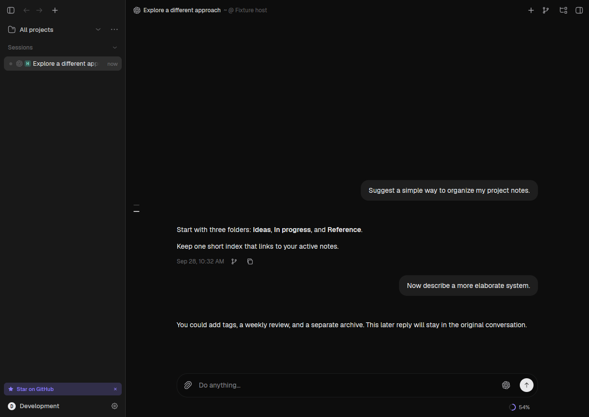
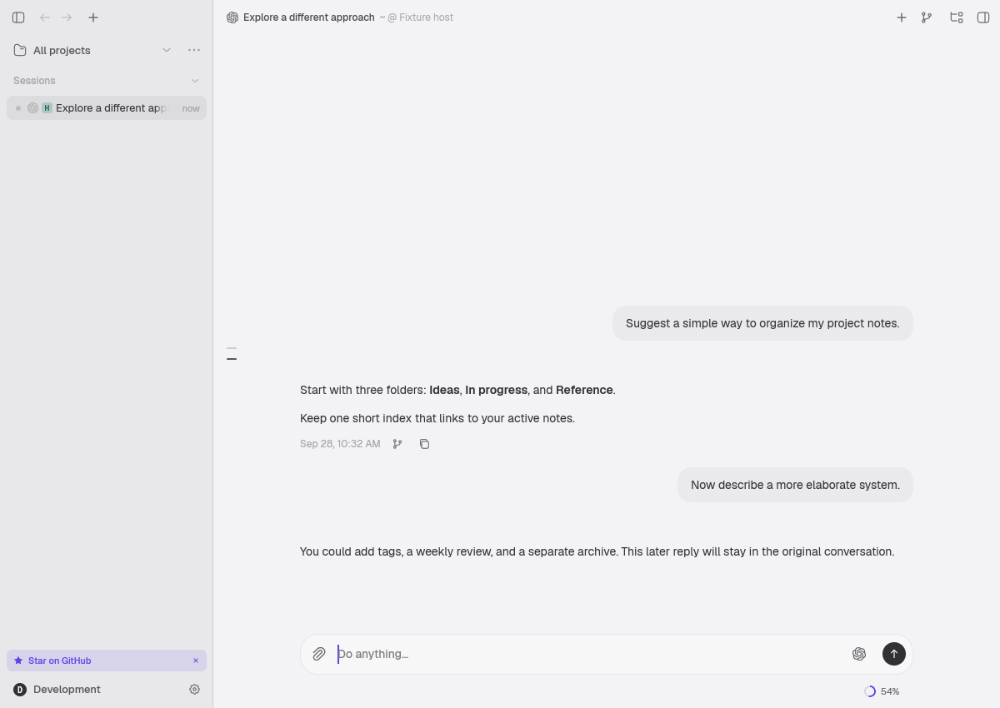
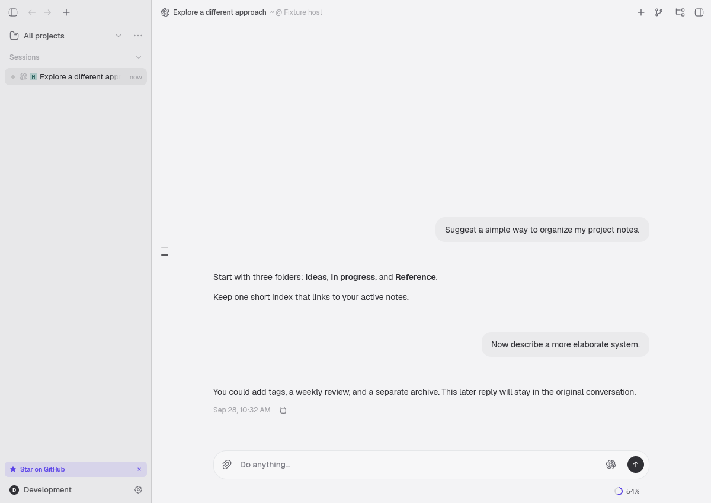
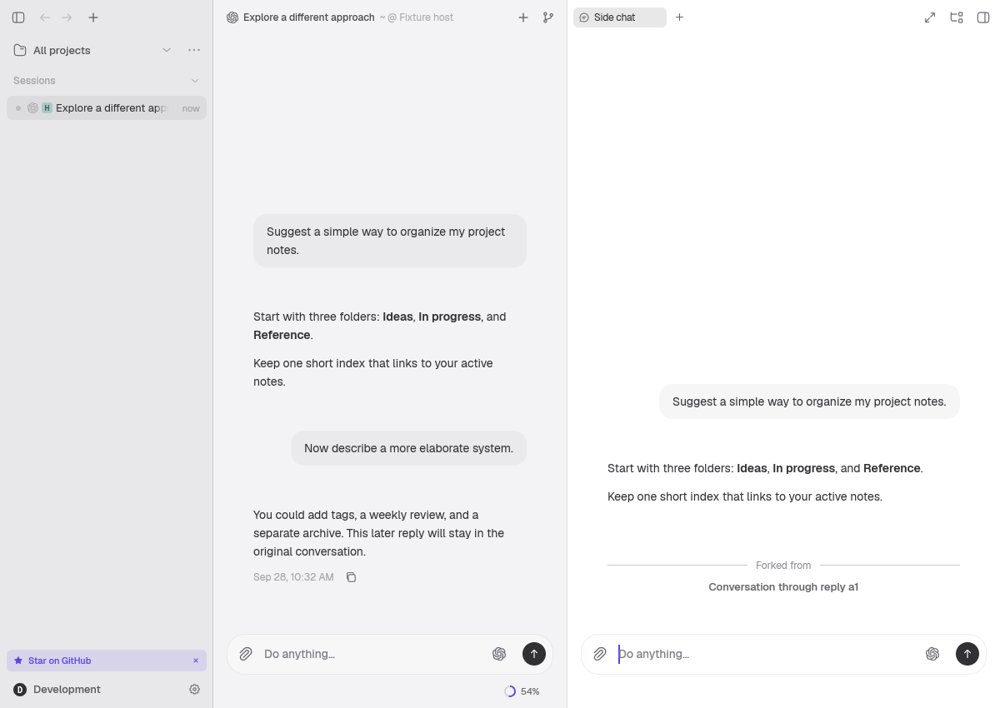
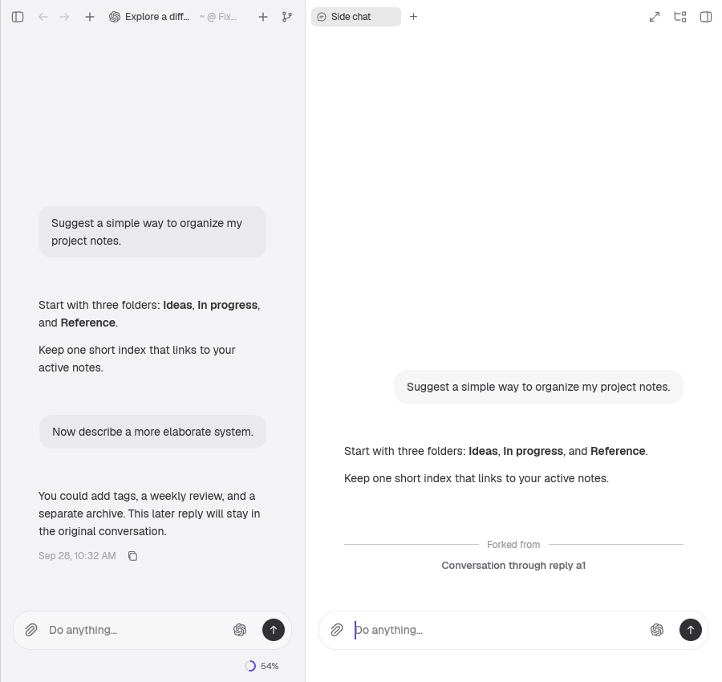

# Native message forks

Implemented on the `8f62632a` baseline. The new `ForkMessageSideChat` RPC is native-only and advertised as `native-message-fork-v1` by hosts with the orchestration installed. `GetNativeForkAvailability` resolves message IDs in batches on the execution host. Clients never supply provider session IDs or native boundaries.

## Contracts and persistence

A versioned, typed `NativeForkPoint` binds a Zeron response to a provider boundary. The host stamps its execution-device identity. Points are persisted in Loro, snapshots, and continuation joins before the terminal `Done` event. Old documents remain valid with no point. There is no timestamp, index, or text-similarity migration.

The document stores `NativeFork` history strategy, operation and visual source IDs, canonical point, and native child identity. Copied points retain their original provider session. The first and subsequent sends use `RequireExisting`, do not add `<conversation>` history, and receive the child's Zeron MCP configuration. A rejected resume cannot fall back to fresh session creation.

Local operation records use atomic replacement and fsync. `Prepared` freezes the visual prefix and destination. `ProviderCreated` durably records the provider result before the child document and workspace row are published. Recovery from `ProviderCreated` completes publication without another provider fork. A confirmed operation returns the same chat; changed payloads and reused destination IDs are rejected.

A definite pre-creation rejection is `Failed` and can be retried with the same frozen operation. An ambiguous provider result or a process restart with only `Prepared` is `Indeterminate`: creation is never repeated automatically. There is no exactly-once promise across the provider and local filesystem, and no orphan-session retention or cleanup service.

Copied approvals are resolved, inherited patch attribution is removed, tool sidecar keys keep their source owner, and subagent links resolve their source through the explicit fork markers. Only new work enters the child's change/review state. The filesystem is not rewound.

## Provider support

| Provider | Validated contract | Runtime preparation |
| --- | --- | --- |
| Codex 0.158.0 | App-server schema exposes `thread/fork.lastTurnId`; source and child `thread/read` verify the inclusive completed-turn prefix. | Read-only schema probe cached by executable identity. Unknown contracts are disabled. |
| Claude Code 2.1.284 | Official Agent SDK `forkSession` with `upToMessageId`; `getSessionMessages` verifies the inclusive prefix despite remapped transcript UUIDs. | Managed `@anthropic-ai/claude-agent-sdk@0.3.284`; Node >=18. Verified with Node 22.23.1. |
| OpenCode 1.18.33 | HTTP v1 `/session/{id}/fork`, exclusive next-message boundary, followed by child transcript verification. | Existing native HTTP/SSE driver. |
| Pi 0.85.1 | Official `SessionManager.createBranchedSession(entryId)` copies the inclusive root-to-assistant path into an independent session. Native entry identity and reconstructed context are verified. | Managed `@earendil-works/pi-coding-agent@0.85.1`; Node >=22.19.0; npm for first preparation. |
| OpenCode 2.0.11 | HTTP v2 `/api/session/{id}/fork` with the executable’s `before` field, envelopes and cursor pagination; ordering is specified only on the first page. | Pinned `@opencode/cli@2.0.11` used for additional validation. |

The 2.0.11 executable’s `/openapi.json` specifies `before`, despite the current website describing `messageID`. A real probe detected that sending the latter over-copied history; child verification rejected it before publication. The pinned v2 wire and fixtures therefore use `before`.

These are checked contracts, not assumed minimum versions. OpenCode currently enables only the listed versions. Cursor, Devin, Grok, Hermes, and Antigravity do not advertise or render this action. The mock harness implements the contract only in tests.

The Claude helper is embedded with `include_str!` and materialized as an immutable, content-addressed file beside its pinned managed SDK installation. It is shipped with the harness on all platforms; no global SDK or `npx latest` is used. npm is needed for first preparation, Node for execution. The helper inherits `CLAUDE_CONFIG_DIR`, runs in the source project directory, uses official storage APIs only, and never calls `query()`. Installation cancellation/deadlines reap the npm process before releasing the provider execution lease. Native process tests here ran on Linux; macOS and Windows packaging/runtime verification remains a release-platform check.

OpenCode serializes native prompt admission with boundary preparation per provider session. Historical fixed boundaries can be copied while a later turn runs. Whole-session copying requires both host idle and native idle, held stable against new Zeron prompt admissions. Synthetic usage events never replace the native assistant ID. Unknown IDs and successful HTTP responses containing extra history fail verification.

Pi uses an embedded extension to associate `turn_end.message` with the same message object in the authoritative native session entry. Only `stopReason: stop` produces a point; partial/tool-use, aborted and errored iterations do not. Internal metadata notifications are consumed by the harness and never rendered. The fork helper imports only the pinned official storage module: it does not instantiate an agent, load extensions or invoke a model. It checks source UUID, format and canonical cwd before opening, rejects old formats rather than migrating the parent, verifies the selected branch and effective context, and syncs the child file and lookup mapping before returning. Later parent entries are excluded even when the parent is running. Canonical inherited points keep their source session.

Pi forks require their native child on every cold resume. Missing files, incompatible formats/projects and unexpected session changes produce an error; Pi's ordinary fresh-session recovery is unavailable for these chats. Both the helper and the per-run extension are embedded with `include_str!`, so no separately packaged assets or global SDK are required. Unknown Pi fork contracts remain disabled; ordinary Pi RPC conversations still support their existing version range.

Validation on 2026-10-01 used Pi 0.85.1 and Node 22.23.1 on Linux. Real CLI tests use an isolated local mock provider, with no model API requests. Historical and final forks, an active parent with a later turn, unchanged parent bytes, child continuation after process restart, missing-child rejection, extension-driven session-switch rejection, tool loops and native-point IDs during steering bursts were checked. Storage tests also exercise labels, compaction, custom entries and two generations of forks. Administrative process tests cancel/time out after a simulated provider creation, verify an indeterminate result and require process reaping before releasing the update lease. A cross-platform mapping test covers the writable flush handle required by Windows. macOS/Windows native process verification remains a release-platform check.

## Reproduction

Offline checks:

```sh
cargo test -p zeron-proto
cargo test -p zeron-doc
cargo test -p zeron-harness --test codex
cargo test -p zeron-harness --test claude
cargo test -p zeron-harness --lib opencode::
cargo test -p zeron-harness --lib native_fork
cargo test -p zeron-harness --lib adapter_install
cargo test -p zeron-harness --features native-fixture --test pi_rpc
cargo test -p zeron-harness --lib pi::fork::tests
cargo test -p zeron-engine --test native_side_chats --test native_points --test side_chats
cargo test -p zeron-engine --lib native_fork
cargo test -p zeron-ui --lib native_fork
cargo check -p zeron-ui
node --test crates/harness/src/claude/fork.test.mjs
node --test crates/harness/src/pi/fork.test.mjs
CLAUDE_FORK_TEST_SDK=/absolute/path/to/claude-agent-sdk-0.3.284/sdk.mjs \
  node --test crates/harness/src/claude/fork.storage.test.mjs
cargo fmt --all -- --check
git diff --check
```

The storage test writes valid temporary transcripts and uses the actual pinned SDK without inference. The Rust fixtures assert observable provider calls, exact native prefixes, ID remapping, no inference during fork, strict resume rejection, invalid boundaries, old messages, continuation durability, late finalization, terminal journal ordering, duplicate requests, changed request payloads, a destination created by another action during provider I/O, update blocking, recovery with a missing workspace row, indeterminate restart, and first sends after restart. GPUI tests exercise mouse double-click deduplication and Enter key down/up through the real action; existing Copy, metadata-strip, and side-chat tests also run.

Pi's real-process tests use an installed 0.85.1 CLI with a local mock provider,
without model API requests. The SDK storage tests accept the pinned module path:

```sh
cargo test -p zeron-harness --test pi_live -- --ignored --nocapture
PI_FORK_SDK_MODULE=/absolute/path/to/pi-coding-agent-0.85.1/dist/core/session-manager.js \
  node --test crates/harness/src/pi/fork.test.mjs
```

CI runs Pi's offline unit/RPC/helper contracts and the host fork suites. The actual
SDK storage tests skip without the explicit module path, and the real Pi tests
remain ignored unless selected. Windows runs the index durability test in the
existing harness unit suite.

Live probes consume inference in an isolated temporary project:

```sh
cargo run -p zeron-harness --example native_fork_smoke -- codex
cargo run -p zeron-harness --example native_fork_smoke -- claude
cargo run -p zeron-harness --example native_fork_smoke -- \
  opencode opencode/muse-spark-1.3-contributor-free
OPENCODE_EXECUTABLE=/absolute/path/to/opencode-2.0.11 \
  cargo run -p zeron-harness --example native_fork_smoke -- \
  opencode opencode/mimo-v2.6-flash-free
```

The probe requires an explicit `free` model for OpenCode. It creates two turns with distinct public fictional labels, forks the first reply, checks that only the first label is remembered, checks the child's new native point, and repeats the question after constructing a fresh driver. This supplements the engine restart tests. Optional `NATIVE_FORK_SMOKE_POINT` writes only the synthetic probe's typed boundary for diagnosis.

Visual fixture, with a synthetic provider and an isolated engine (no inference):

```sh
cargo build -p zeron-ui --example native-forks-fixture --features native-forks-fixture
env -u WAYLAND_DISPLAY xvfb-run -a -s '-screen 0 1400x1000x24' \
  sh -c 'openbox >/tmp/native-forks-openbox.log 2>&1 & fixture_wm_pid=$!; trap "kill $fixture_wm_pid" EXIT; target/debug/examples/native-forks-fixture /tmp/native-forks-visual'
```

Openbox supplies resize and focus events on Xvfb. Captures exclude its window decorations; the compact view hides the sidebar and uses a 900 px window.

## Validation notes

Validation was performed on Linux on 2026-09-28–29 (America/Santiago). Codex 0.158.0, Claude Code 2.1.284, and OpenCode 1.18.33 passed the live historical-prefix and restart probe. OpenCode v1 passed with `opencode/muse-spark-1.3-contributor-free`; v2 2.0.11 passed with `opencode/mimo-v2.6-flash-free`, including first send, child-native point, and restart. The probe uses explicitly public fictional labels to avoid model refusals about disclosing “private tokens.” An initial v2 attempt using the account default failed for insufficient funds; subsequent OpenCode probes use only the explicit free model.

The directed proto, document, three provider, engine, UI, and Node suites passed, as did `cargo check -p zeron-ui`. The document suite passed 130 tests; the native engine suite passed 10, with 1 durable-point test and 6 existing side-chat tests. The Node suite passed 4 tests including actual SDK storage. The Codex/Claude integration suites retained their 4/2 ignored opt-in tests; the explicit live probes above ran separately. UI tests passed mouse, keyboard, disabled action, Copy, metadata, and side-chat checks.

The workspace-wide formatting check reports pre-existing differences: the original `8f62632a` archive has 210 formatting hunks across 24 files; the final tree has 197 across 21 files, all of which already failed on the baseline. The 93 touched non-mobile Rust files pass a separate `rustfmt --check --edition 2024 --config skip_children=true` check. The two mobile files retain their original formatting and only add the required `native_fork_point: None` initializers. `git diff --check` also passes. Unrelated desktop/mobile formatting is not included in this feature.

The visual fixture successfully rendered native GPUI windows on Xvfb and exited cleanly. Physical remote-device execution and macOS/Windows distribution were not exercised; remote routing is covered by the RPC tests. No iOS UI is added.

## Visual evidence

These captures use the real shell, transcript, composer, and fork RPC with an isolated synthetic provider. The historical child contains the first question and reply, followed by the fork marker and an empty composer; later parent turns remain outside it.





Replies without a recorded native point and hosts without the native message fork capability do not render the action. GPUI regression coverage verifies that the button stays hidden, stale availability replies cannot restore it, and it reappears when the point or host capability arrives.







Official contracts: [Codex App Server](https://learn.chatgpt.com/docs/app-server), [Claude session browser](https://platform.claude.com/cookbook/claude-agent-sdk-05-building-a-session-browser), [Claude TypeScript SDK](https://code.claude.com/docs/en/agent-sdk/typescript), [pinned SDK](https://www.npmjs.com/package/@anthropic-ai/claude-agent-sdk/v/0.3.284), [OpenCode v1 server](https://dev.opencode.ai/docs/server/), [OpenCode v2 fork](https://dev.opencode.ai/v2/docs/api/session/v2-session-fork/), [OpenCode v2 message pagination](https://dev.opencode.ai/v2/docs/api/session/v2-message-list/).
