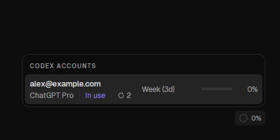
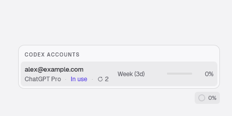
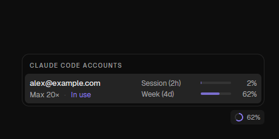
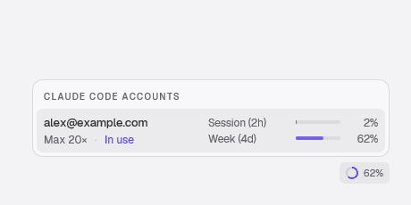
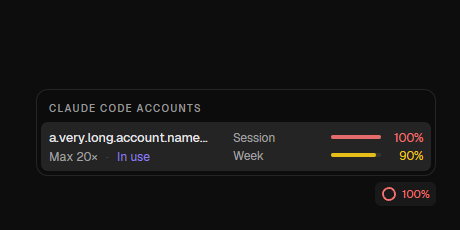
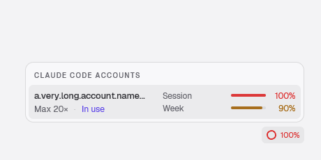

# Account usage popover

The offline fixture renders the production `AccountUsage` card with synthetic
accounts. It never connects to an engine or reads provider credentials.

On Windows, from the repository root:

```powershell
$previousComposition = $env:GPUI_DISABLE_DIRECT_COMPOSITION
try {
    $env:GPUI_DISABLE_DIRECT_COMPOSITION = '1'
    cargo run -p zeron-ui --release --features account-usage-fixture --example account-usage-fixture -- "$PWD/target/account-usage-captures" "$PWD/scripts/capture-account-usage-fixture.ps1"
} finally {
    $env:GPUI_DISABLE_DIRECT_COMPOSITION = $previousComposition
}
```

The fixture captures Codex's weekly window and banked resets, Claude's two
countdowns, and missing/expired reset times with a long account identity, in both
dark and light themes. Each PNG has a JSON sidecar with physical client dimensions
and DPI. `result.txt` is written only after all six captures succeed.

Countdowns stay inline (`Week (3d)`, `Session (2h)`) and use the largest whole
unit rounded down: days, hours, then minutes; less than a minute reads `<1m`.
The popover keeps its original width and two-line account rows. Banked resets
appear as a small reset icon and count beside the account metadata, with an
explanatory tooltip. Exact reset times remain available on each meter's tooltip;
expired or missing timestamps leave the label plain.

The helper checks the window's process owner and captures its client area;
screenshots do not include the desktop or unrelated applications.
The helper keeps the fixture offscreen without activating it and rejects blank
GPU captures. Disabling DirectComposition is confined to this fixture run.

Checked captures (synthetic data, 96 DPI):

| | Dark | Light |
|---|---|---|
| Codex |  |  |
| Claude |  |  |
| Expired / missing reset |  |  |
