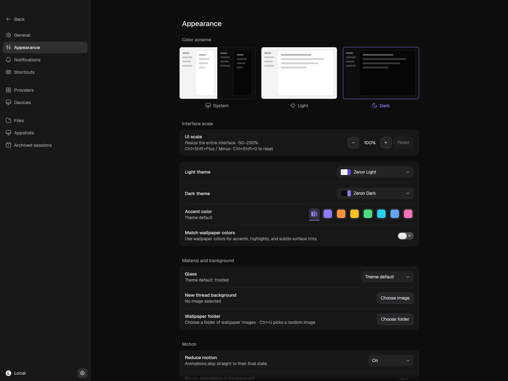
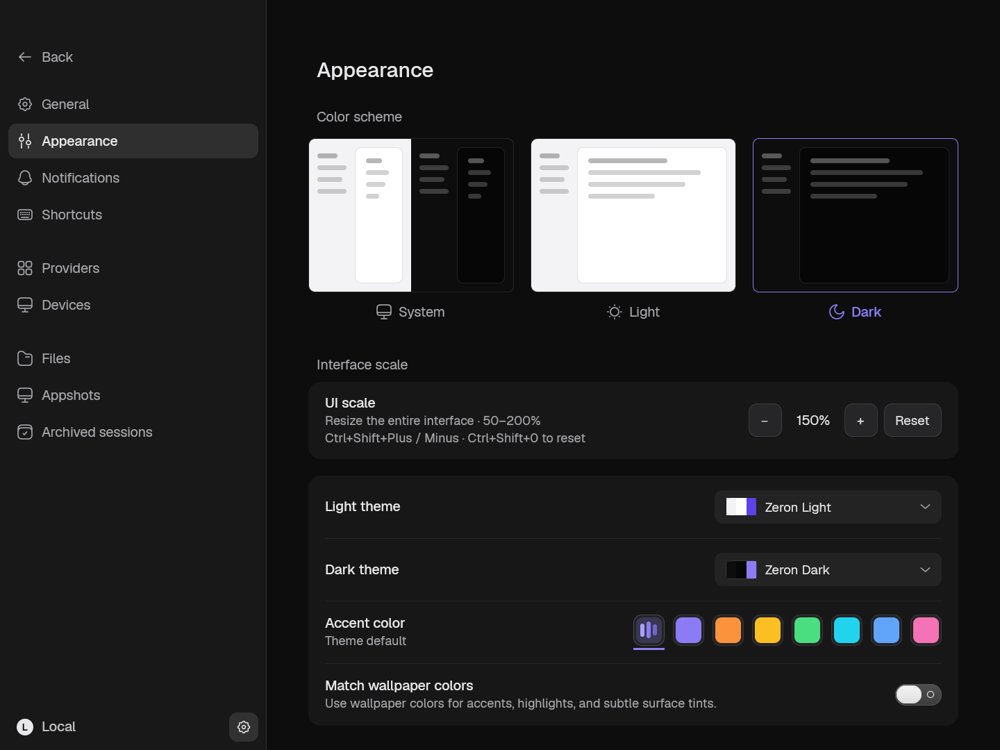
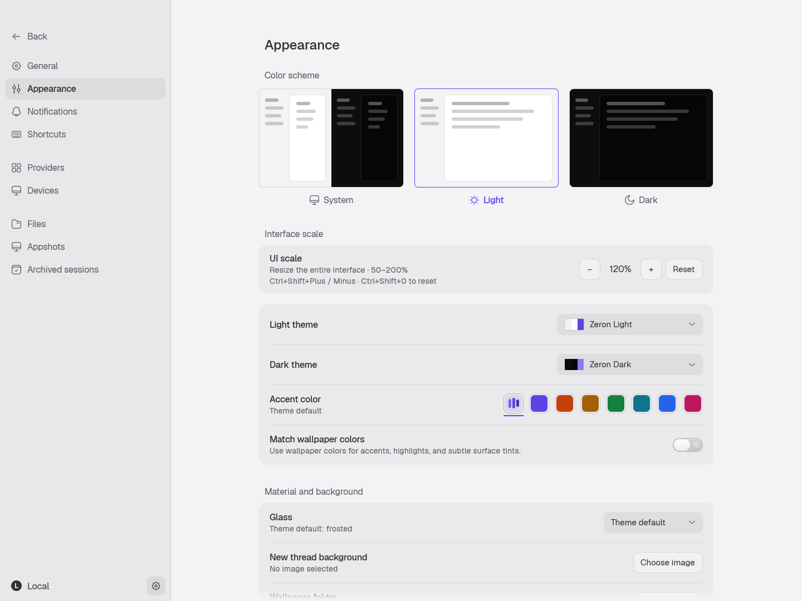

# Desktop UI scale

Settings → Appearance → Interface scale resizes text, icons, spacing, and panes together. Use the minus and plus buttons to change the scale in 10 percentage point steps between 50% and 200%, or Reset to return to 100%.

Keyboard shortcuts work from conversations and settings:

- `Ctrl+Shift+Plus` increases the scale.
- `Ctrl+Shift+Minus` decreases the scale.
- `Ctrl+Shift+0` resets to 100%.

macOS also accepts the corresponding Command shortcuts. Both shifted punctuation and physical key spellings are bound. These shortcuts are reserved; existing conflicting shortcut preferences revert to their defaults, while unrelated customizations remain intact.

The scale is device-local and saved immediately in `ui-settings.json` as `uiScalePercent`. Missing preferences default to 100%. Font preferences and native window geometry remain independent. Startup and reopened windows restore the saved scale; native resize and display changes preserve it.

The [supporting ZUI PR](https://github.com/zeronsh/zui/pull/14) adds `Window::set_ui_scale`. It multiplies the display density for layout/painting, divides the logical viewport and native input coordinates, and converts IME and native child-view bounds back to platform coordinates. A Cargo patch makes the app and `gpui-base` use the same GPUI implementation. Return that dependency to upstream after the supporting ZUI change is merged.

## Native screenshots

The images come from the production shell with an isolated temporary profile and no engine or model calls. The native window remains 1440 × 1080 logical pixels in each capture.

| Dark, 100% | Dark, 150% |
| --- | --- |
|  |  |



Reproduce the captures:

```sh
ZERON_OPEN_ROUTE=settings/appearance cargo run -p zeron-ui \
  --example ui-scale-fixture --features ui-scale-fixture -- /tmp/zeron-ui-scale-shots
```

On Linux, run in an isolated X11 display (Xvfb and ImageMagick are required):

```sh
Xvfb :97 -screen 0 1600x1200x24 -nolisten tcp &
env -u WAYLAND_DISPLAY DISPLAY=:97 LP_NUM_THREADS=4 \
  ZERON_OPEN_ROUTE=settings/appearance cargo run -p zeron-ui \
  --example ui-scale-fixture --features ui-scale-fixture -- /tmp/zeron-ui-scale-shots
```

The fixture asserts shortcut changes, immediate persistence, scale retention after native bounds updates, and reset behavior before saving its images. Linux captures the actual X11 app window; macOS uses the native rendered frame.

## Checks

```sh
cargo test --locked -p zeron-ui --lib -- --test-threads=1
cargo check --locked -p zeron
```

The supporting ZUI checkout runs `cargo test -p gpui --lib ui_scale -- --test-threads=1` separately.

Regression coverage includes old settings, persistence/clamping, shifted-key aliases, reserved shortcuts, settings-button hit testing after zoom, pixel-scroll conversion, and retaining zoom through later pane saves. Native screenshots are exercised on Linux; macOS and Windows still need live platform verification.
