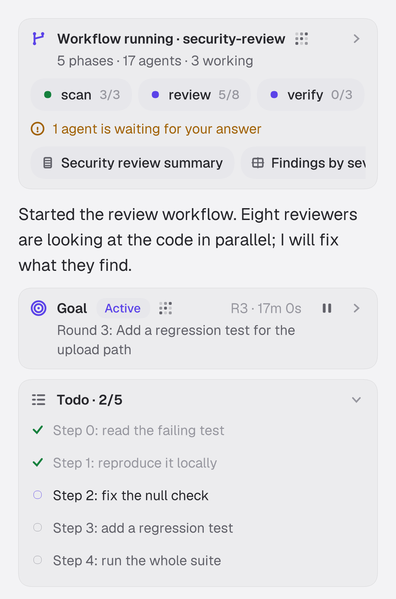
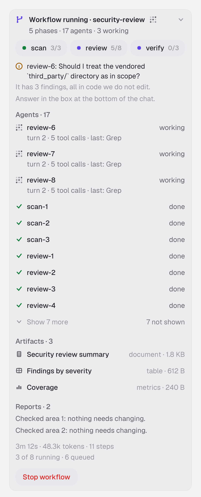
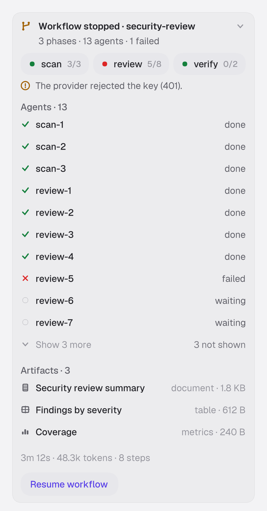
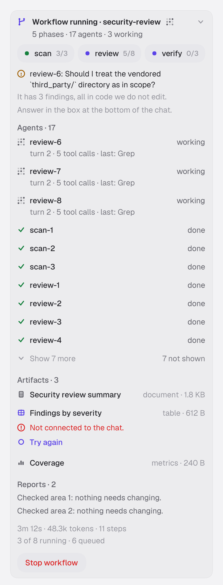
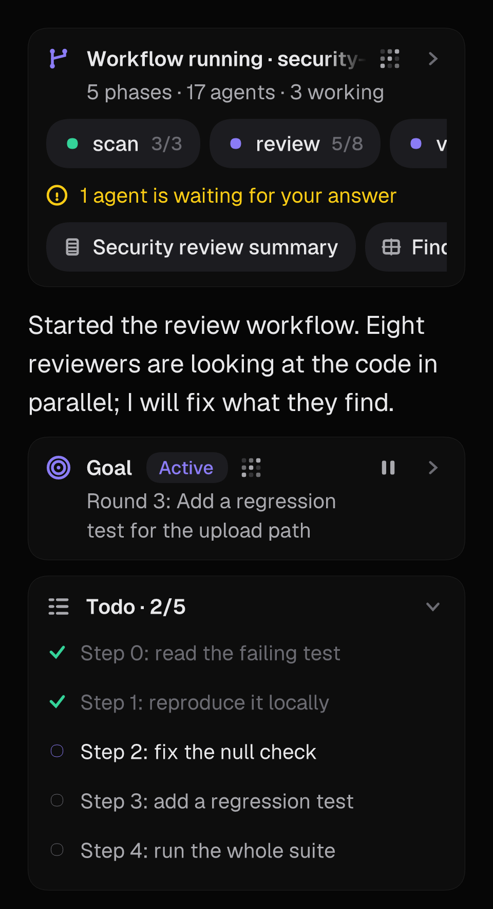
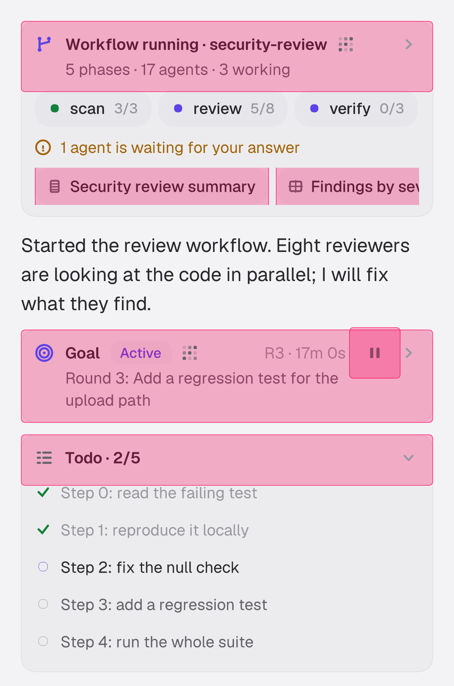

# Todo, goal and workflows on the phone

Mobile parity for the three features of the desktop stack
([`todo-panel.md`](todo-panel.md), [`goal-mode.md`](goal-mode.md),
[`workflows.md`](workflows.md) / [`workflows-ui.md`](workflows-ui.md)): on the iOS app a person sees the
agent's checklist, sees and steers a goal, and sees, steers and reads workflow runs.

The mobile rule holds ([`mobile-rewrite.md`](mobile-rewrite.md)): **Rust decides what to paint and what a tap
means; Swift paints and forwards taps.** Everything below is built in the Rust core
(`crates/client`, `crates/mobile`), so Android gets it with a thin painter change (see "Android").

## What the phone shows

All of it lives *in the transcript*, as rows. There is no new screen and no sheet.



* **Todo strip** (after the transcript, like the desktop tray above the composer). `Todo · 2/5`, the list open
  while work remains (the current item first-class: a spinner while a turn is live, a still ring when idle),
  compact (`Todo · 5/5 · All done`, dismissable) once finished. More than 6 items fold to a window of 3 around
  the current item with `N earlier` / `N later` rows, the same fold function as the desktop. The transcript's
  `Todo` tool chip now names the item in progress (`1/3 done · Fix the handler`) and its detail marks it `[~]`.
* **Goal strip** (above the todo strip, as on the desktop). Title, status capsule
  (Active / Verifying / Paused / Complete / Budget reached), `R3 · 17m 0s`, the round title or the stop reason,
  and a pause / resume icon button; tap to open: the objective, `Round 3 of 25 · 51.3k tokens (verifier 3.1k) ·
  17m 0s`, the last verdict, **Pause / Resume** and **Clear**. Goal markers in the transcript are one-line
  rows instead of bubbles: a round prompt (`Goal · round 2: …`, never a user bubble), set / pause / resume /
  clear, and verdicts with their reason.
* **Workflow card**, in place of the run's "started" marker (so it stays where the conversation asked for it);
  the run's end marker folds into it. Folded (the default, a run is a screenful): `Workflow running · name`,
  `5 phases · 17 agents · 3 working`, a horizontally scrolling **phase rail** (lamp, name, `settled/observed`,
  `∥` for parallel phases), a line when an agent waits for an answer, stop / provider / trim notices, and
  artifact capsules. Tap the header to open it:



  *Agents* (working first, with turn / tool-call / last-tool activity, 10 a page, `Show N more`), *Artifacts*,
  *Result*, *Reports*, usage and concurrency, and **Stop workflow** / **Resume workflow**. Tapping an agent opens
  its chat. A result message and a workflow agent's question are one-line rows.





Artifacts preview **inside the card** through the transcript's own markdown pipeline: a document as is, a table
as a pipe table (first 60 rows), metrics as a label / value table, a text file as a fenced block (first 120
lines). States: loading, an error with **Try again**, "showing the first part" for a clipped document. A table
or metrics page too large to parse says so instead of failing oddly.

## Answering and commanding

| Action | How |
| --- | --- |
| Approve / deny a workflow | The stock question panel (`Run workflow` / `Deny` are the contract). No change. |
| Answer a workflow agent | The run state lists pending questions; the client synthesises one `InputRequest` (request id `workflow:<run>:<qid>`, one free-text question, header `agent · workflow`) so the **stock question panel** shows it; `respond_input` sees the prefix and sends `WorkflowCommand::Answer`. No Swift. An empty answer is refused. |
| Pause / resume / clear a goal | The strip's buttons, or `/goal pause\|resume\|clear` typed in the composer. |
| Set a goal | `/goal <objective>` or `/goal replace <objective>` in the composer. Same parser as the desktop (`zeron_proto::goal_view::parse_goal_input`): only a line that *starts* with `/goal`; a plain objective cannot replace a running or paused goal; control words must be the whole argument. `SessionHandle::send` consumes it (`SendOutcome::Command`), nothing reaches the agent. Bare `/goal` reports the goal. |
| Stop / resume a run | The open card's buttons. |
| Open an agent's chat | Tap its row. The child chat is in the registry (hidden chats are listed), so the existing session screen opens it. **Not read-only on the phone** (see limits). |

Commands are `SessionCommandPayload::{Goal, Workflow}` written to the chat doc's command ledger, the same
plane as the desktop and MCP, executed by the chat's host wherever it runs. A command the core cannot send
shows on the card (red line) until the next success. Hosts without `goal-mode-v1` skip `/goal` commands, so
the client refuses them with "the host is too old" (`HostCapabilities.goal_mode` / `.workflows` are exposed).

## Data flow

```
host engine ──writes──► chat doc: meta.goal, meta.workflowRuns (+workflowRev), marker entries, Todo tool parts
                              │  chat2 room (already how the phone syncs)
zeron-client  SessionCore::refresh ─ on meta change: goal (one JSON value), runs (only when workflowRev moved)
              ─ on entry change: latest Todo part (walks back, stops at the first hit)
              ▼  SessionSnapshot { goal, workflows, todo }  (Arc-shared, pointer-equal while unchanged)
zeron-mobile  TranscriptView.attach → TranscriptInput { entries, goal, todo, workflows, now_ms }
              RowBuilder: marker rows · overlay_workflows (card ⟵ start marker, end marker folded) · push_trays
              ▼  Content::Card → cards::place_card  →  RowDisplay { runs, boxes, widgets, scrollers }
Swift         paints it; WidgetKind.action taps → TranscriptView.act(payload) → ActionOutcome
```

Unlike the desktop, the phone does not use the engine's transcript watch: it syncs the doc itself, and
`meta.goal` / `meta.workflowRuns` ride that doc. The run state is rebuilt only when its revision moved; a card
row is rebuilt only when its fingerprint (model + open state + what it draws) changed, so streaming tokens do
not touch it; the 200-agent test checks the folded card has the height of a 3-agent one.

### Shared view logic

Moved to `zeron-proto` (the desktop modules re-export them; behaviour and tests intact, the pure tests moved
with the code): `todo_view` (fold window, summary, `TodoPanelState`), `goal_view` (`/goal` parsing, chip,
headline, meta line, markers), `workflow_view` (the whole card / pane / result / sidebar model, formerly
`ui/src/workflow/model.rs`), `artifact_view` (table and metrics parsing, markdown rendering), plus
`view::{one_line, format_elapsed, format_tokens}`. `cargo tree -p zeron-mobile` shows no `zeron-ui`,
`zeron-engine`, `gpui` or `starlark`.

## FFI surface (additive)

* `TranscriptView.act(payload) -> ActionOutcome { Done, OpenChat { chat_id } }`: what a tap means. The payload
  vocabulary is in `layout/act.rs` (`goal.toggle|pause|resume|clear`, `todo.toggle|earlier|later|dismiss`,
  `wf.toggle|actors|reports|result:<run>`, `wf.stop|resume:<run>`, `wf.artifact|artifact-retry:<run>:<id>`,
  `chat:<id>`).
* `WidgetKind.action(label)` (payload on the widget), `RowKind.card`.
* `SendOutcome.command(notice)`, `HostCapabilities.{goal_mode, workflows}`, `DemoFixture.workflows`.

Nothing else crosses the FFI: goal, runs and checklist go Rust to Rust.

## Swift changes (UNVERIFIED: no Xcode here)

The new enum cases force exhaustive-switch edits; that is all.

| File | Change |
| --- | --- |
| `apps/ios/Zeron/Transcript/RowView.swift` | `RowViewDelegate.rowView(_:action:)`; `case .card: "row-card"` in the accessibility identifier switch; `case let .action(label)` in `layoutWidgets` (a `UIControl` like `.toolToggle`) |
| `apps/ios/Zeron/Transcript/TranscriptListView.swift` | `rowView(_:action:)`: feedback, `pendingFold` (so card height changes tween like folds), `engine.act(payload:)`, and `AppRouter.openSession` for `.openChat` |
| `apps/ios/Zeron/App/AppModel.swift` | `-workflows` launch argument selects `DemoFixture.workflows` |
| `apps/ios/Zeron/Core/Generated/zeron_core.swift` | regenerated (below) |

Nothing builds the iOS app on this machine; the Swift was written by mimicking the neighbouring cases and the
generated names were read back from the regenerated file (`act(payload:)`, `.openChat(chatId:)`, `.action(label:)`,
`.card`).

### Regenerating the bindings

`scripts/ios/build-core.sh` does it on a Mac (and CI fails if `apps/ios/Zeron/Core/Generated` drifts). The
generator is platform-independent, so it also runs on Linux from the host library, which is how this PR's file was
produced (regenerating the unchanged base this way is byte-identical):

```sh
export CARGO_TARGET_DIR=...
cargo build -p zeron-mobile --lib
cargo build -p zeron-mobile --bin uniffi-bindgen --features bindgen
$CARGO_TARGET_DIR/debug/uniffi-bindgen generate --library $CARGO_TARGET_DIR/debug/libzeron_mobile.so \
    --language swift --out-dir /tmp/gen && cp /tmp/gen/zeron_core.swift apps/ios/Zeron/Core/Generated/
```

## Android (not in this repo's main yet)

`apps/android` lives in separate unmerged PRs and is untouched. After it lands it needs only a painter change:
draw `RowKind.card` like any row, implement `WidgetKind.action` as a button that calls `TranscriptView.act(payload)`
and navigates on `ActionOutcome.OpenChat`, handle the new `SendOutcome.Command` / `DemoFixture.Workflows` variants in
its Kotlin `when`s. The question panel path needs nothing.

## Seeing it without a phone



There is no iOS simulator on the machine that built this, so **no iOS screenshots exist for this PR.** The images
here are from `crates/mobile/examples/render_rows.rs`, a **reference rasterizer**: it runs the real pipeline
(`TranscriptView`, so exact wrapping, truncation, row heights and tap rects) and paints the resulting display lists
with the bundled Geist faces and the app palette (`Palette.swift`). It is not the iOS renderer: glyphs are scaled to
the Rust-measured run widths (no kerning / ligatures), **SF Symbols are small stand-in drawings**, spinners are frozen,
rail scrollers are clipped without the edge fade. Use it to check layout, not pixels.

```sh
cargo run -p zeron-mobile --example render_rows -- --scenario workflows --width 390 --out /tmp/x.png \
    [--dark] [--act wf.toggle:run-live,goal.toggle] [--rows 8..12] [--hits]   # scenarios: todo workflows stopped big
```

`--hits` shades every tap rect (44 pt minimum height, see below):



Textual layout dumps (the snapshot tests compare them; `ZERON_UPDATE_SNAPSHOTS=1` rewrites) are in
`crates/mobile/src/layout/snapshots/`. An excerpt of the folded run card at 390 pt:

```
[8] Card y=650 h=186
      x=   56 Workflow running · security-review
      x=   56 5 phases · 17 agents · 3 working
      x=   52 1 agent is waiting for your answer
      scroller 330x32 (content 534): scan | 3/3 | review | 5/8 | verify | 0/3 | fix | 0/2 | report | 0/1
      scroller 330x32 (content 482): Security review summary | Findings by severity | Coverage
      action "Expand the workflow" -> wf.toggle:run-live @(18,18 354x61)
```

On a device or simulator: `-workflows` selects the demo chat **Security review** (a checklist, an active goal, one
running and one finished run, a waiting agent). The simulated host applies `/goal`, the strip's buttons, Stop / Resume /
answers and serves artifact reads, so every control works offline.

## Limits and follow-ups

* **Not verified on iOS** (compile, run, VoiceOver, Dynamic Type, rotation, scrolling feel). The core is covered by Rust
  tests; the Swift is a dozen lines.
* An agent's chat opens in the normal session screen, **composer included**: the phone has no read-only session mode,
  so a message typed there would go to the (archived) workflow child. A read-only banner / hidden composer is a
  follow-up (needs a flag on `ComposerState`).
* Chips are 32 pt tall (a 44 pt tap rect is clipped to the rail); every other control has a 44 pt rect.
* The goal's elapsed time is as of the last snapshot (not ticking). It moves with every state change.
* The strips close the transcript, they do not float above the composer; scrolled up in history they are out of
  view. A pinned native tray would be a Swift change on top of the same Rust model.
* Steps by phase, the graph, details ids and an approval's script excerpt are not on the phone (the approval uses the
  stock question text). Markdown previews use the 16.5 pt body size.
* MCP `read_chat` still renders `[x] / [ ]` without in-progress (it belongs to the MCP crate; not touched here).
* Per-chat card state is in memory for the app run, like the desktop's.

## Testing

```sh
cargo test -p zeron-proto                       # goal_view, todo_view, workflow_view, artifact_view
cargo test -p zeron-client                      # + tests/workflows.rs: the demo host end to end
cargo test -p zeron-mobile --lib                # layout, tests_cards.rs (strips, cards, taps, widths, snapshots)
cargo test -p zeron-ui --lib -- goal_panel todo_panel workflow::   # the desktop modules after the move
```
