# Workflows in the desktop UI

The face of `docs/workflows.md`: a live **card** in the transcript, a **run pane** in the right
pane, an **approval block** where the question panel is, **run lines** in the sidebar, and a
compact **result row** where the result reaches the agent. Everything reads state the engine
already replicates (`WorkflowRunsState` on the chat's transcript watch) plus one small feed for
chats that are not open (below); no new sync schema.

Screenshots are from the live app with the mock harness (`ZERON_MOCK_WORKFLOW=1`, see "Demo"):
[`docs/screenshots/workflows-card/`](screenshots/workflows-card/).

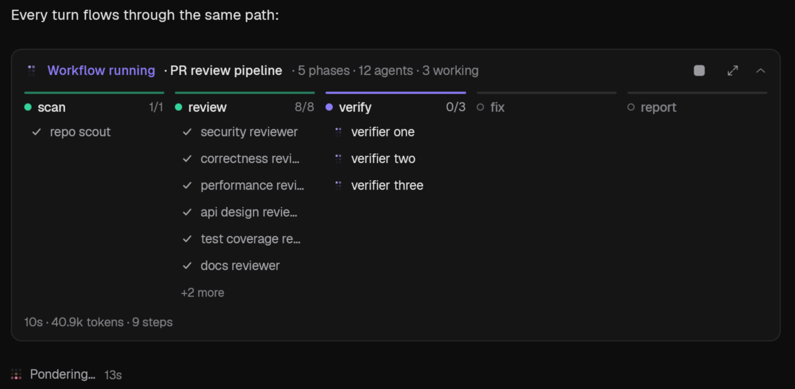
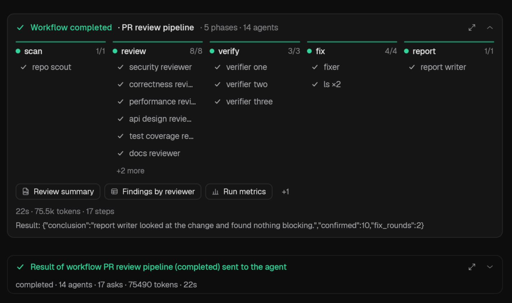
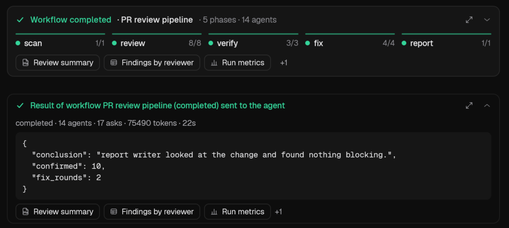

## Where the pieces live

```
crates/ui/src/workflow/
  model.rs      PURE view-model: stations, pills, fractions, header text, chips, caps, run pane,
                sidebar lines + selection, result-message parsing, acknowledgement list (23 tests)
  card.rs       the transcript card and the result row (functions of a model + an ActionSink)
  pane.rs       WorkflowRunPane: the run pane (right-pane surface)
  artifact.rs   artifact parsing (table, metrics, values) and the viewer entity
  approval.rs   the approval block: model from `question.meta`, rendering, excerpt highlighting
  sidebar.rs    the run lines under a chat row
  widgets.rs    lamps, status marks, icon buttons (theme tokens only)
```

Surfaces never act: a click becomes a `WorkflowAction` (`ToggleCard`, `OpenRun`, `OpenActor`,
`OpenArtifact`, `Stop`, `Resume`, …) handed to a sink; the transcript, the shell and `AppState`
carry it out. Stop / Resume / Answer go over the command plane
(`AppState::send_workflow_command` → `QueueCommand` with `WorkflowCommand`), so they run on the
chat's host wherever that is; a refusal shows on the run's card.

## The card

*Placement.* The card **is** the run's "started" marker row: it sits where the run began and
stays live there (a card at the tail would drift away from the conversation that asked for it, and
would reorder when the agent keeps talking). The run's completed / failed / stopped marker folds
into it; if the run is not in the synced state (older than the 8 runs it keeps, or the state has
not arrived) the plain markers stay, so nothing is ever lost. A denied run (never launched) keeps
its marker. A resumed run is a new run with its own card.

*Header.* `Workflow running · <name> · 5 phases · 14 agents · 3 working` (status word and tone,
agents = actors, "k working" only while live); a warning chip with the number of waiting questions
(opens the pane); **Stop** while running / **Resume** when the run can be resumed; the maximize
button opens the run pane; the whole card is a button that expands and collapses it (click any
blank area, or Enter / Space when focused).

*Phase columns.* One column per phase from the static graph, lit by live state: a lamp (hollow =
not reached, accent = running, green = done, red = failed, grey = stopped by the user), the name,
`settled/observed`, and a segment of the rail above. Parallel phases share a `∥` marker. Under each
phase the **agent pills**: a state mark (a spinner only while working and only when motion is
allowed, a question bubble when the agent asks, a check, a cross, a pause for cancelled), the name,
and a tooltip with its model and step count. A pill with a child chat is a button that opens that
agent's chat read-only. Shell gates of a phase share one pill (`cargo ×2`).

*Folding.* More than 6 pills in a phase fold to "+n more · k working"; the ones drawn are the
working and failed ones first, then what is up next, in creation order (so a 200-step run never
hides what is happening). The collapsed card keeps the rail and drops the pills. Runs the state
had to trim (`truncated`, `nodes_unlisted`) say so under the rail: "150 finished steps not listed".

*Chips.* Up to 3 artifact chips and "+N", titles cut at 24 characters (the tooltip has the whole
title and the version); the one `report(…, artifact_id)` last named leads, then documents, tables,
metrics, files. Expanded, the card also shows elapsed · tokens · steps and the result preview, and
under the card any stall notice, provider stop reason or script error.

*Default open state.* The newest run of a chat starts open, older ones collapsed; a click is
remembered for the app run (render-local state, like the tool folds). The card is a transcript row
whose version is the fingerprint of its model, so it is re-measured exactly when it changes — and
a state change alone (no transcript change) re-renders it (`workflows_revision` is part of the
transcript's sync key).

## The run pane

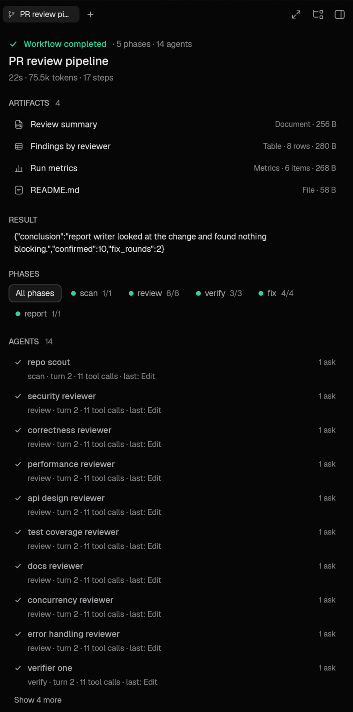

*Host.* A right-pane surface (`RightSurface::Workflow`), next to the subagent transcripts and side
chats, opened by the card's maximize button, an artifact chip, a "+n more" row, a question chip or
a sidebar run line. The right pane is the app's existing place for "a second view of this chat"
(browser, diffs, terminals, subagents); a run is exactly that, it keeps the transcript visible
beside it, it is keyboard-reachable like any tab, and the tab shows a spinner while the run is
live. One tab per run; opening the run again focuses it (and a "+n more" lands on that phase).

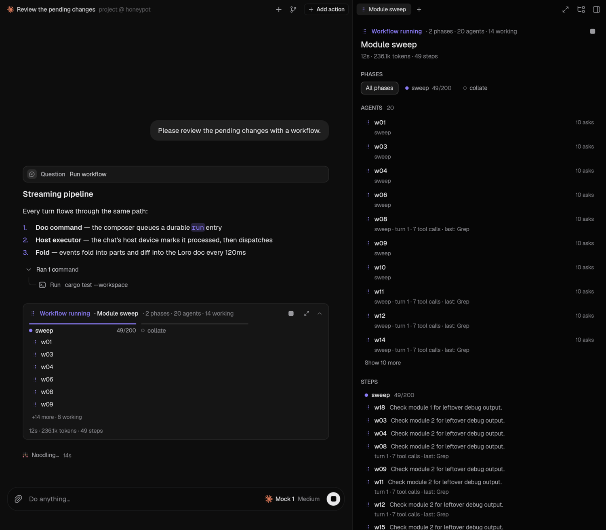

*Contents, top to bottom:* status, name, usage (elapsed · tokens · steps), Stop / Resume; notices
(error, stop reason, stall, trimmed view); **Waiting for you** — each pending question with the
asking agent, the question, its context and an inline answer box (Enter or the button sends
`WorkflowCommand::Answer`; the box locks as "Sent" until the host removes the question);
**Artifacts**; **Result** (clamped, expandable); the **phase rail** as filter chips; **Agents** (name,
state, model, phases, asks / failures, current or last activity — turn · tool calls · last tool —
working ones first, 10 at a time); **Steps** by phase (state, agent, instruction head, tokens,
`cached` badge, failure text or result preview, 25 per phase at a time, working ones first);
**Reports**; **Details** (concurrency "3 of 8 running · 2 queued · throttled", token split, run id,
`resumed from`, script hash). A run that fell out of the live state is read once with
`WorkflowGet`.

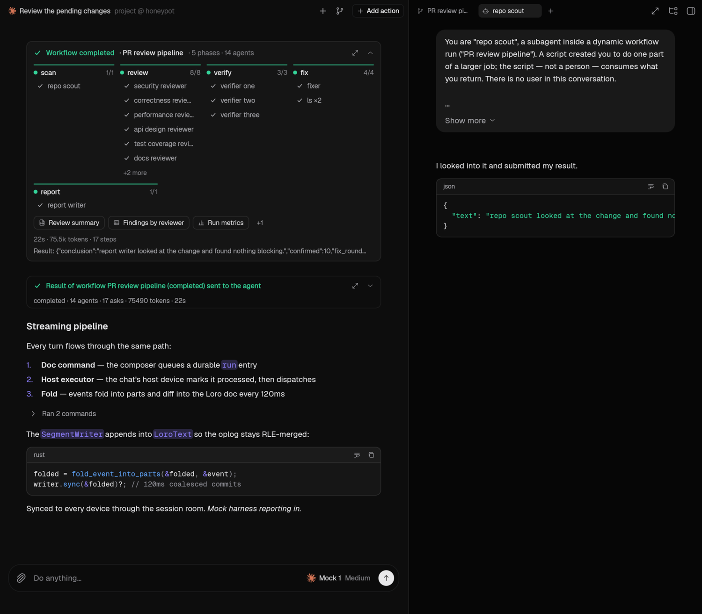

*Open an agent.* An agent row, a step row or a card pill emits `OpenActor`; the shell opens the
child chat through the existing subagent surface (`add_subagent_surface`: a read-only transcript
pinned to that doc, watched live). The engine already stamps the child with `meta.workflowActor`
and creates it archived, readable by id; **no engine or client change was needed**.

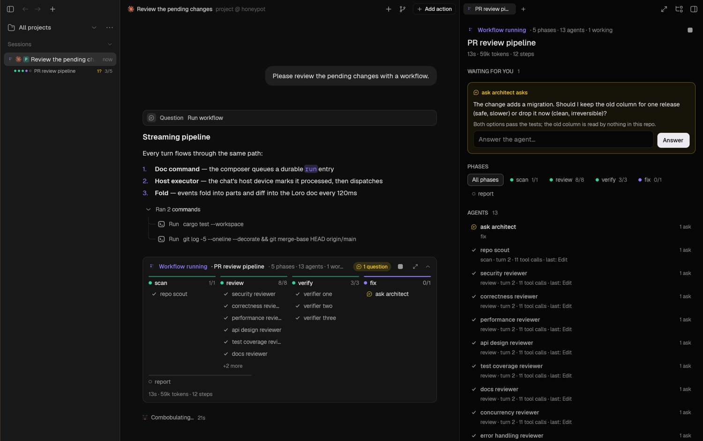
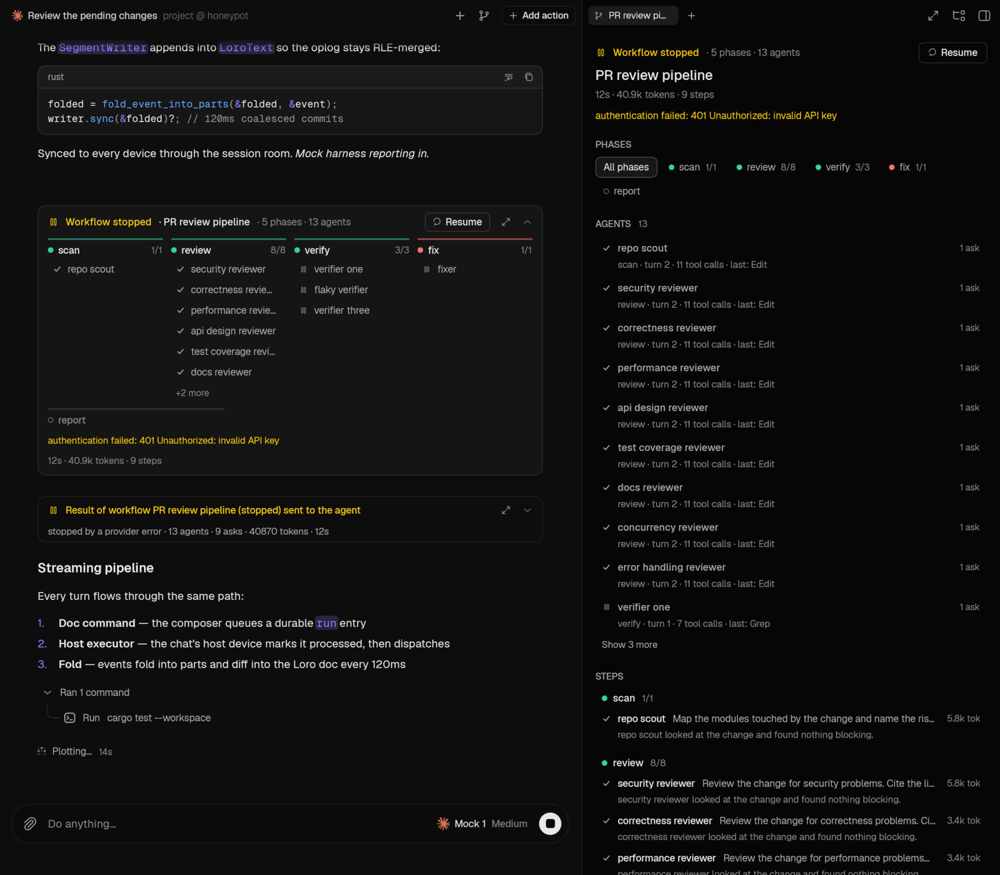

## Artifacts

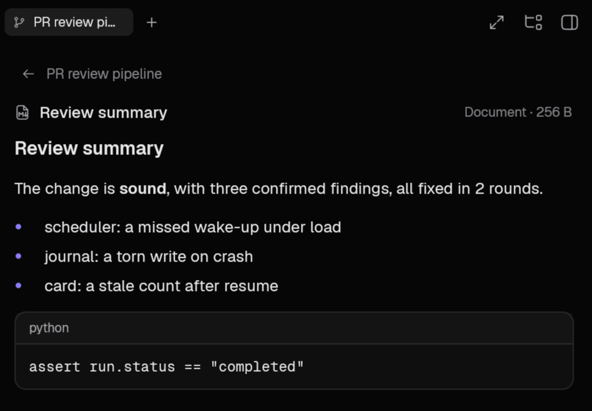
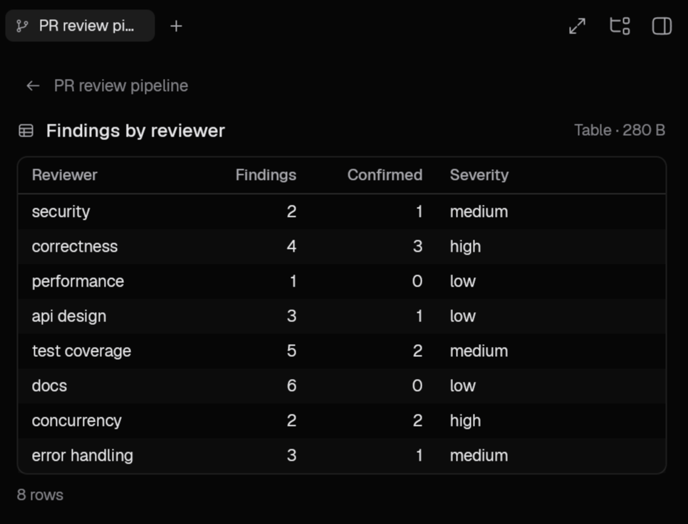
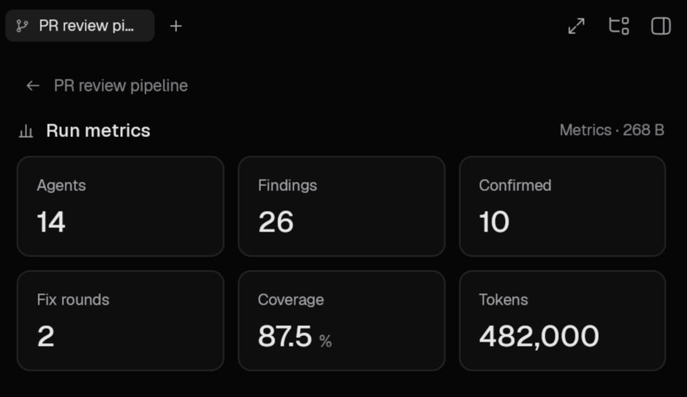

A chip (or an artifact row) opens the viewer inside the run pane with a back arrow. Content comes
from `WorkflowArtifactData` (versions) and `WorkflowArtifactRead` (one page, ≤ 1 MB). Markdown goes
through the transcript's markdown renderer; a table is a header + paged grid (200 rows a page,
numeric columns right-aligned and grouped, widths from the content, the last column takes any slack so the table spans the pane, horizontal scroll when wider); metrics are
tiles with units; a file is a numbered monospace block (2000 lines) — a binary file says so. States:
loading, an error with **Try again**, a `v1 v2 v3` picker when there are versions, and the view
follows a newer version of the artifact on screen while the run publishes it.

## The approval block

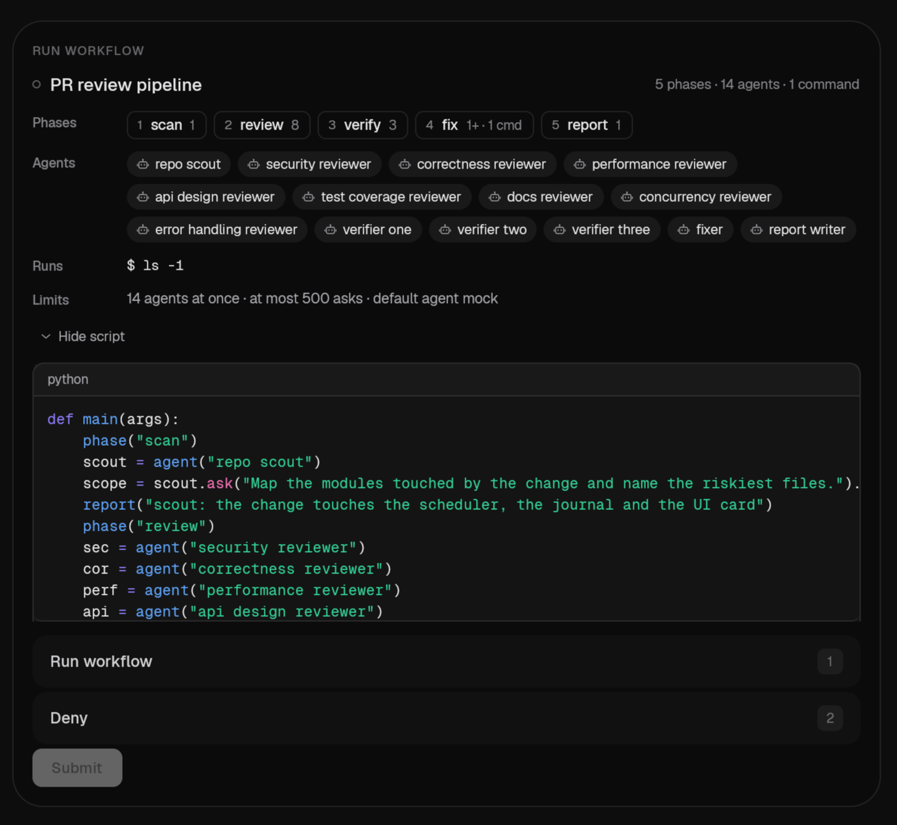

The approval is still an ordinary input question (`Run workflow` / `Deny`, text for clients that
know nothing about workflows). Where the question's `meta.kind == "workflowApproval"` and parses,
the composer draws the structured block *instead of the question text*: name and a one-line
summary, the phases as numbered chips (`4 fix 1+ · 1 cmd`, the `+` = it loops), the agents with
their model when the script picks one (`×n` for loops), every literal command (`$ cargo test --all`,
`sh …` when its arguments are computed), the limits ("14 agents at once · at most 500 asks · …"),
and the script's excerpt behind **Show script**, syntax-highlighted as Python (Starlark is a Python
dialect; the excerpt is the engine's 28 lines, not the whole script). The options, their number
keys, Enter and Submit are the stock ones; the free-text field is hidden (a typed reply would
match neither label). The option **labels are the contract**: other clients that render the stock
question approve exactly the same way.

## Sidebar run lines

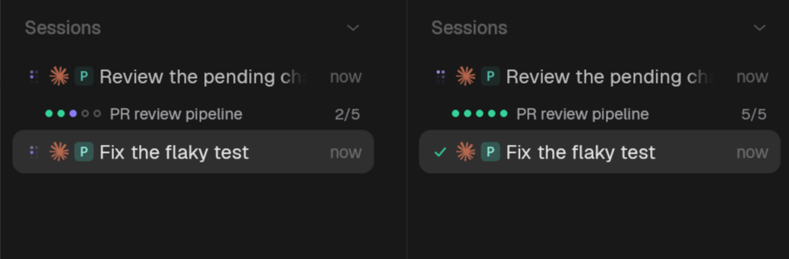

Under a chat's row: for each live run (and each run that ended since the user last opened the chat)
a line with a mini rail of lights (a window of five with "+n" when a run has more than six phases),
the name, `2/5` phases done, `1?` waiting questions and `failed` / `stopped`; at most two lines, the
rest counted on the last one ("+2 more"). A click opens the chat and the run.

*Feed.* A chat that is not open has no workflow state on the client, so the engine pushes one:
`WatchWorkflowActivity` streams `WorkflowActivity { chats: { chatId: [WorkflowRunBrief] } }`
(a `WorkflowRunBrief` is the run header plus the waiting-question count — a few hundred bytes a
run, no entries), recomputed only when a brief changes and at most as often as the doc projection
(≤ 4 a second). It covers the chats the local engine hosts; chats on another device show their runs
in their own card and pane when opened. Capability: `workflows-v1`. Runs that ended before this
engine process started are not listed (the projection is loaded lazily).

*Acknowledgement.* Opening a chat marks the ended runs in it as seen
(`UiSettings.workflow_seen_runs`, device-local, newest 256, saved debounced like the other sidebar
state). Live runs are never hidden; an ended one stays until seen. A denied run has no line.

## The result row

The machine message that delivers a result to the agent (`MessageOrigin::Workflow`) renders as a
bordered row — status, `Result of workflow X (completed) sent to the agent`, the summary line —
that opens to the result (monospace, 1600 characters), the reason and the artifact chips, with a
maximize button into the run. The row is built from the message text, and from the live run when
the state has it; without the run the chips name artifacts but do not open. The question an agent
raised keeps the one-line marker.

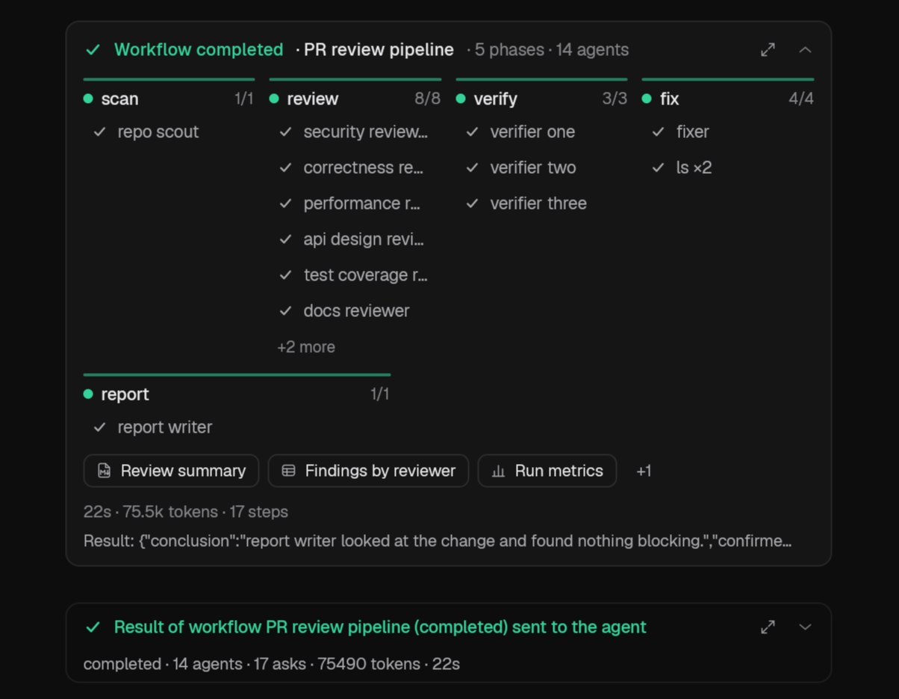

## Motion, accessibility, cost

* Motion: the only animation is the shared mini spinner, which already follows the reduce-motion
  flag and the pause-in-background setting (and is static then); there are no timers. Elapsed time
  refreshes with state changes. An idle app with a running workflow repaints only the spinners.
* Every control is a button with a role, an `aria_label`, a tab stop, a focus ring and Enter / Space;
  icon-only buttons have tooltips; colours are theme tokens (`ink` / `hairline` washes, `accent`,
  `success`, `warning`, `danger`); text sizes follow the UI font scale.
* A 1024-node run draws ≤ 6 pills per phase on the card; the pane lists 10 agents and 25 steps per
  phase until asked for more.

## Demo and screenshots

`ZERON_HARNESS=mock ZERON_MOCK_WORKFLOW=1` scripts the agents (see `docs/workflows.md` → Demo),
now with **real hidden child chats** (so "open this agent" works) and deterministic pacing:

| env / name | effect |
| --- | --- |
| `ZERON_MOCK_WORKFLOW_PACE_MS` (1000) | base time of one ask, stretched a few percent by the agent's name; progress (turn, tool calls, last tool) ticks along |
| agent name contains `flaky` | authentication error: the run stops `stopped(provider)`, resumable |
| `fail` | the ask ends without a result (a failed node the script goes on from) |
| starts with `ask` | escalates a question and waits for the answer (pending-question state) |
| `slow` / `quick` | 6× / a third of the time |

Capture knobs (read once, for screenshots): `ZERON_OPEN_WORKFLOW=run[:artifact=<id>|phase=<name>|actor]`
opens the newest run's pane (`actor` also opens the first agent's chat beside it); `ZERON_WORKFLOW_CARD=expanded|collapsed` and
`ZERON_WORKFLOW_RESULT=expanded` set the default open state; `ZERON_WORKFLOW_APPROVAL=script`
unfolds the script in the approval block. Keep the parent's mock turn alive while the question is
raised (`ZERON_MOCK_REPEAT=1 ZERON_MOCK_DELAY_MS=2500`). The screenshots show a 5-phase, 14-agent
run (a parallel fan-out of 8 reviewers, three verifiers, a fixer loop with a shell gate, a writer
with markdown / table / metrics / file artifacts) and a 200-ask sweep.

## Testing

```sh
cargo test -p zeron-ui --lib workflow::          # model, artifacts, approval, sidebar, pane (draw + answer)
cargo test -p zeron-ui --lib transcript::tests   # card rows, folding end markers, toggles, events, result row
cargo test -p zeron-ui --lib -- workflow_run_opens state::tests::workflow state::tests::the_sidebar
cargo test -p zeron-engine --lib workflow::demo  # scripted agents
```

## Limits and deviations

* Run lines cover chats the local engine hosts; the engine does not list ended runs from before it
  started.
* The pane's lists are paged, not virtualized; the transcript list itself is the virtualized part.
* Markdown artifacts render without syntax highlighting in code blocks.
* The approval block shows the engine's excerpt of the script, not the whole file (the draft path is
  in the question text for people who want it in their editor).
* Interactions (clicking a pill, pressing Stop / Answer) are covered by gpui tests that simulate the
  events and by the engine's own tests; they were **not** clicked by hand on the screenshot machine
  (an input injector aimed at a desktop session shared with other windows is not safe), so the
  screenshots show states driven by the engine and by the capture knobs above.

## Mobile

The phone shows the same card, run detail, markers and result row through the Rust layout core; see
[`workflows-mobile.md`](workflows-mobile.md). The view model is shared (`zeron_proto::workflow_view`).
