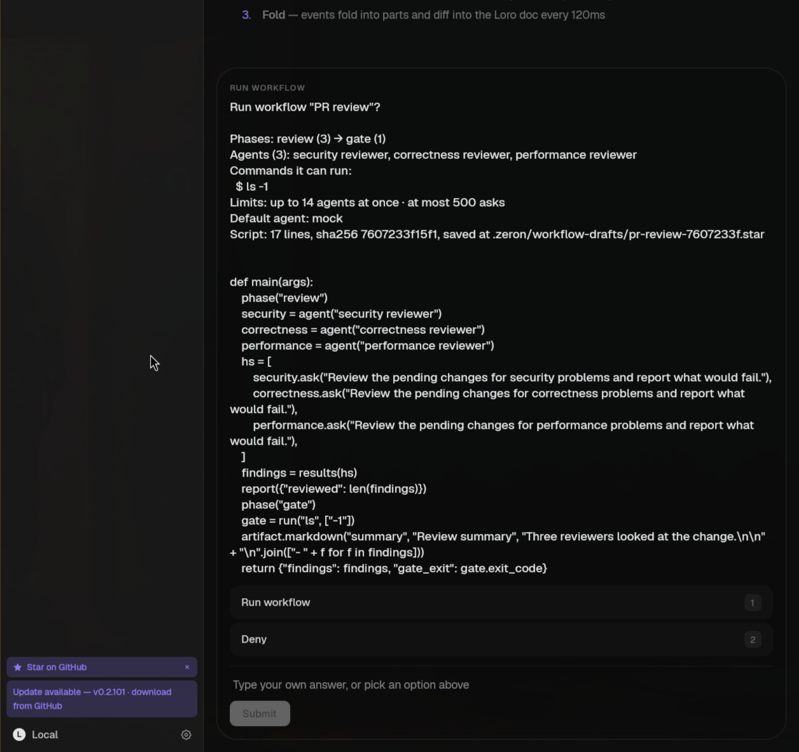
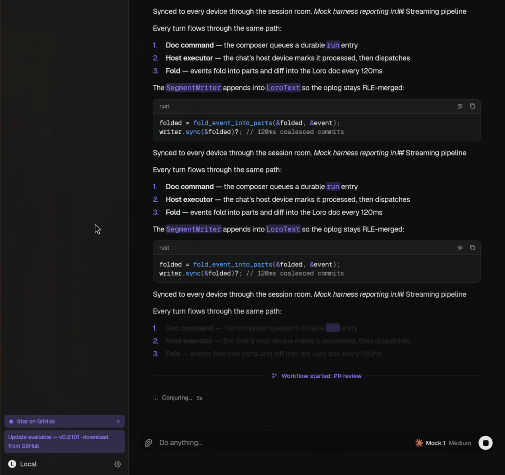
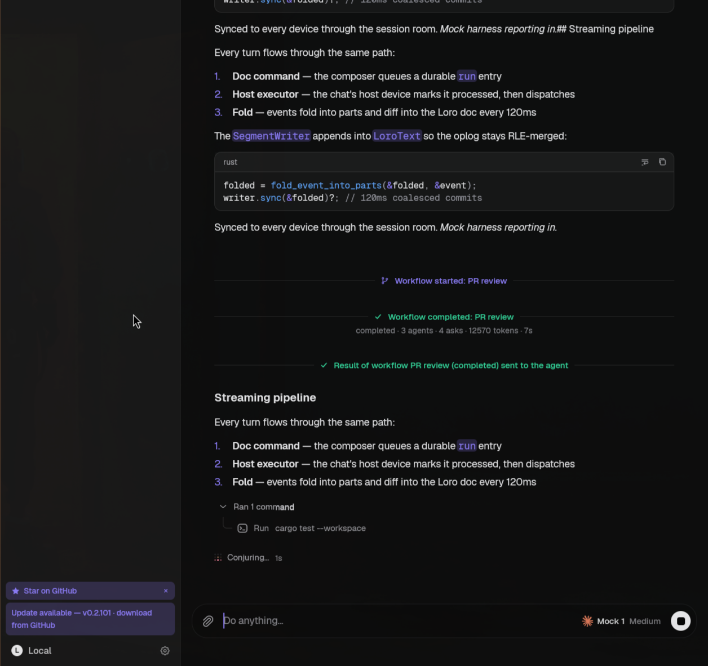
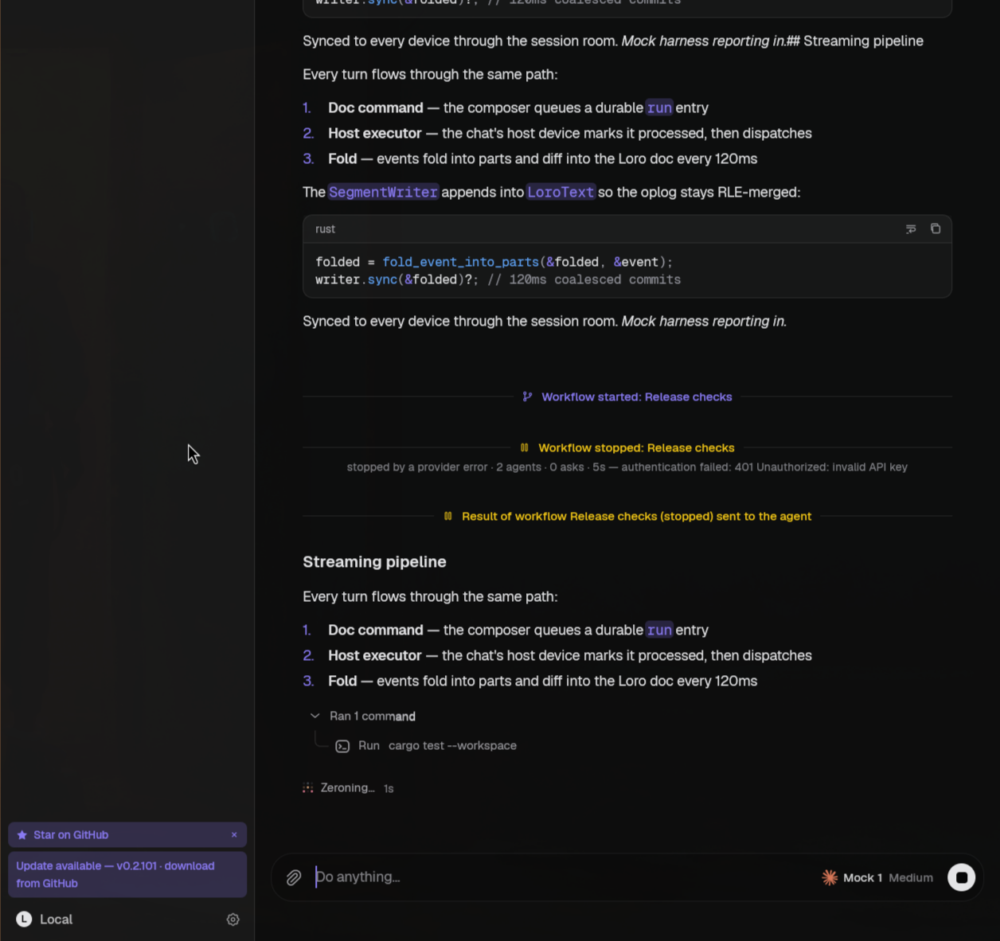

# Dynamic workflows

A **workflow** is a script the agent writes to orchestrate many child agent chats: phases,
parallel fan-out, typed results, shell gates, reports and artifacts. The user approves it, the
engine runs it in the background — journaled, resumable, throttled — and its result is delivered
to the parent chat as a message. The idea comes from ZCode's dynamic workflows (see
`THIRD_PARTY_NOTICES.md`); the differences are the language (Starlark instead of JavaScript, for
determinism and a pure-Rust, C-free build), actors that are persistent child chats on *any*
harness (a workflow may mix Claude Code and Codex), and that approval, results and questions ride
the machinery the app already has.

This page is the **engine**: the interpreter, the run model, the journal, the scheduler, the MCP
tools and the authoring guide. The desktop card, run pane, approval block, sidebar lines, result
row and the saved-workflow launcher are described in [`workflows-ui.md`](workflows-ui.md); mobile
consumes the same state and RPCs. Reusable workflows with arguments are
[their own section](#saved-workflows) below.

Screenshots (live app, mock harness with `ZERON_MOCK_WORKFLOW=1`; see "Demo" below). The approval
is the ordinary question panel — graph-free clients show exactly this text; the desktop renders
`UserInputQuestion.meta` as a structured block ([`workflows-ui.md`](workflows-ui.md)):



Lifecycle marker rows in the parent chat (the desktop now draws the live card instead — see
`workflows-ui.md`; these are what a client without it shows): started, then a run that completed,
with the machine message delivered to the agent as a compact row —




— and a run a provider error stopped (resumable, reason on the marker):



## Pieces

```
crates/proto      workflow.rs   state, events, deltas, graph, commands, origins (serde, no interpreter)
                  saved_workflow.rs   saved-workflow types · the argument contract (validate_args, parse_text, names)
crates/workflow   zeron-workflow  Starlark runtime · static analysis · host seam · reducer · saved-file format   (pure)
crates/engine     workflow/     service · run core (host + scheduler) · store/journal · world · projection
                  workflow/saved.rs, saved_ops.rs   saved files on disk · list/get/save/delete/history
                  ask.rs        the child-ask layer, extended for persistent actors + escalate
crates/doc        workflow_runs.rs   meta.workflowRuns in the chat's session doc
crates/mcp        workflows.rs  the tools · docs/workflow-guide.md (embedded)
```

`zeron-client`, `zeron-mobile`, `zeron-ui` and `zeron-doc` have no dependency on `zeron-workflow`:
they read `zeron_proto::WorkflowRunsState` and friends. The mobile core (`zeron-mobile`,
`zeron-client`, `zeron-doc`) links no interpreter at all; `zeron-ui` reaches it only through
`zeron-engine`, which the desktop app embeds for its in-process mode. `starlark` and `blake3`
(`features = ["pure"]`) are pure Rust, so aarch64 / musl / Android builds of `zeron-workflow` need no
C compiler (`cargo check -p zeron-workflow --target aarch64-unknown-linux-musl` is clean).

## The language

Scripts are Starlark (Meta's `starlark` crate, pinned `=0.14.2`): a deterministic Python dialect
with no `while`, no `try`, no classes, no imports, no recursion, no clock, no randomness and no
environment. `def`s, lambdas and f-strings (bare names only) work. `docs/workflow-guide.md` is the
full reference the agent reads (`workflow_guide`); in short:

| | |
| --- | --- |
| `def main(args)` | entry point; `args` is a frozen dict; the return value is the result |
| `phase("name")` | literal; **claims the rest of its block**; every phase must contain ≥ 1 `.ask`/`run` |
| `agent(name, persona, harness, model, reasoning)` | an actor = one persistent child chat, created at its first ask |
| `actor.ask(instructions, schema, read_only, timeout_s)` | dispatches at once, returns a handle; asks on one actor are FIFO and share context |
| `handle.result()` | blocks; `Result{ok, value, error, cached, tokens}`; failures are values |
| `wait_all(hs)`, `results(hs)` | join helpers |
| `schema.obj/str/int/num/bool/enum/list/opt/any` | JSON Schema builders |
| `run(cmd, args, timeout_s, cwd)` | `cmd` a string literal; no shell; non-zero exit is a value |
| `files.glob/read/grep`, `git.changed_files/diff/status/log` | read-only, capped (2000 entries / 256 KB: reject, never truncate silently), journaled |
| `pmap(fn, items)`, `parallel([fn…])` | thread fan-out over **top-level `def`s** (lambdas rejected) |
| `log`, `report(item, artifact_id)` | journaled; reports survive a failed run |
| `artifact.markdown/table/metrics/file(id, title, …)` | ids literal; ≤ 32 ids/run, ≤ 16 versions/id |

Charts and boards (ZCode's `artifact.chart/board`) are out of scope.

### Analysis

`zeron_workflow::analyze(path, src)` parses with the **same dialect the runtime uses** and returns
either a list of `path:line:col message` diagnostics (no run is created, no approval is asked) or
an `Analysis { graph, sites, warnings }`:

* **errors:** parse errors (with a hint for Python-isms: `while`, `try`, `import`, f-string
  attributes), a missing/ill-formed `main`, non-literal or misplaced `phase()`, a phase with no
  ask or run, a non-literal `run()` program, an interpreter/shell (`sh`, `bash`, `python`, `env`…)
  with computed arguments, non-literal artifact ids, recursion between defs, lambdas or
  non-top-level functions given to `pmap`/`parallel`, host calls at module level, names the
  language does not define (`time`, `open`, `getenv`…), scripts over 256 KB;
* **the `WorkflowGraph`** (`zeron_proto`): phases in source order, each with its ask sites and
  commands (reached lexically *and* through the top-level defs the phase calls), the actor
  declarations, every literal command with its literal arguments, and a `fan_out` flag for sites in
  loops, comprehensions or `pmap`ped defs. It is the approval payload and the card skeleton;
* **`CallSites`**: the runtime refuses a `run`/`phase`/`artifact.*` call from a site analysis did
  not see, so `r = run; r(cmd)` cannot launder a computed command past the approval.

### Determinism and site identity

Every host effect is journaled under `(site, ordinal)`:

* **site** = the call expression's source span, `l1:c1-l2:c2` (1-based, both ends: `h.ask(x)` and
  the `.result()` chained on it are different sites);
* **ordinal** = how many times that site already ran *in its scope* (iteration *n* of a loop);
* **scope** = empty on the main thread; inside a `pmap`/`parallel` worker, the call's own key plus
  the item index (`9:1-9:30#0[2]/3:5-3:20`), so thread timing never changes a key.

Everything else in the language is deterministic (ordered dicts, no hash randomisation, a single
evaluation thread, handles instead of completion-order callbacks), so re-running a script against
its journal reproduces its asks exactly. The analysis computes the same strings from the AST, so the
graph names the sites the journal will contain (tested).

### Limits

Script 256 KB · ask instructions 64 KB · `report` item 16 KB / 256 per run · artifacts 32 ids × 16
versions × 512 KB · tables 5000 rows × 32 columns · world reads 2000 entries / 256 KB per call ·
command output 128 KB per stream, 5 min default timeout, 4 commands at once · `pmap` 5000 items on
64 workers · interpreter: 50 M steps, 128 MB heap, 64-deep call stack, 60 s of interpreter time
*excluding time blocked on agents*, plus a cancel flag polled every 1000 steps (cancelling a script
stuck in a compute loop takes milliseconds). Native builtins are not preempted — the interpreter's
own documentation says it is "not secure against truly malicious code" — which is why the real
boundary is the host API (below), not the interpreter.

## Runs

```
                 start_workflow ─ analysis ─► diagnostics (no run)
                        │ ok
                  RunCreated (pending) ── approval ──► denied ─► stopped(denied)  [not resumable]
                        │ approved (or auto-approve)
                  RunLaunched (running) ── script runs; asks/commands scheduled ──────────────┐
                        │ script returns            │ stop / budget / provider error / restart │
                    completed                  stopped(user|budget|provider|interrupted)  ◄────┘
                    errored (script fail/limit)        └─► resume_workflow_run ─► new run (resumedFrom)
```

Statuses: `pending · running · completed · errored · stopped`; stop reasons `user · interrupted ·
provider · budget · denied`. A **resume starts a new run** (new id, `resumedFrom`) that replays
the old run's journal: asks whose `(site, ordinal)` and content digest match a journaled answer are
answered from it (`cached: true`, no child, no cost) — including answers that were failures the
script already saw — and everything else runs live. The new journal re-records the replayed
answers, so resumes chain. Resume refuses a script whose hash changed, different `args`, a run that
is not resumable, and a run already being resumed. The completed asks are not asked again; the
*child chats are*: a resumed run's actors start fresh chats (their earlier context is in the old
run's chats, readable, not continued).

### Actors and the ask layer

An actor is one child chat per `agent()` call, created lazily at its first ask. The extension of
PR2's ask layer (`crates/engine/src/ask.rs`):

* `AskSpec::persistent` — the child is **archived the moment it is created** (hidden from the
  sidebar yet readable by id and listed by `list_chats include_archived`; archive is the repo's
  convention for chats an agent made) and the ask never archives it;
* `AskSpec::reuse_child` — the next ask continues that chat: a new prompt in the same
  conversation, a fresh `submit_result` slot, a fresh ask id. The harness restarts with the stored
  session id to pick up the new ask's MCP server (its schema is per ask), so context carries over
  through the harness's own resume; usage is counted per ask from the journal baseline;
* `AskSpec::escalation` + `AskService::escalate` — the actor-only tool (below);
* `AskSpec::progress` — `Child`, `Executing`, `Repairing`, `Nudged`, `Waiting`, `Resumed`, and
  `Turn{turns, tool_calls, last_tool}` hooks the scheduler turns into node events;
* `AskSpec::workflow_actor` stamps `meta.workflowActor {runId, siteId, ordinal, name}` on the child
  so clients can tell it from a verifier and open it read-only. Children are titled
  `<run name> · <actor>`, one level under the parent chat.

`AskBackend` gained `answer_escalation`; `FakeAsk` gained child reuse and an `Escalate` reply, so
the whole scheduler is tested without chats.

### Scheduler

* **Per-actor FIFO:** an actor's asks queue in dispatch order and one pump runs them one at a time.
* **Admission:** a per-model gate (cap moved by the governor), then the run's global gate
  (`max_concurrency`, default `clamp(cores − 2, 1, 16)`, ≤ 32), then the ask runs. Commands use a
  separate gate of 4.
* **AIMD governor per model** (`governor.rs`, pure): a rate-limit error multiplies the cap by 0.75
  (never below 1) and honours `Retry-After` as a cooldown; four consecutive successes add one;
  five quiet minutes restore the ceiling.
* **Provider faults** (`faults.rs`, classified from the harness's error text, conservatively):
  rate limits and transient errors are redriven with backoff 2 s doubling to 60 s with ±25 %
  jitter (a longer `Retry-After` wins) and never reach the script; authentication, quota/billing
  and model-unavailable errors stop the run `stopped(provider)` — resumable — with the reason in
  `stop_detail`; after 30 consecutive redrives of one ask the provider is treated as down. Any
  other failure (invalid result after 3 repairs, no result after the nudge, timeout, a child that
  needed an approval nobody can give, an unavailable harness/model) rejects **only that ask**: a
  `Result` with `ok=False`.
* **Stall notice:** 20 minutes without a successful ask while work is pending raises `Stalled`
  (state `stalled: true`), lifted by the next success.
* **Budgets:** `max_asks` (default 500), `max_tokens`, `max_runtime_seconds` stop the run
  `stopped(budget)`; they apply per execution segment (a resume starts its counters over, token
  and time totals accumulate).
* **Harness/model selection:** per actor, else the run's, else the chat's. Names are validated
  against the installed/enabled harness list (and the model catalog when it can be listed) when the
  actor's first ask is admitted; a bad one fails that actor's asks with a clear error, never the
  run. Run-level defaults are validated at start.
* **Permissions:** a child inherits the parent's `auto_approve` and a sandbox capped to the
  parent's (PR2's rules). **Honest limit:** no harness enforces the sandbox level, so read-only is
  prompt-and-toolset, not enforced; and a child that parks on an approval fails its ask at once
  (`NeedsInput`) — run workflows from an auto-approve chat if the agents need to run tools.
* **Escalation:** an actor can call `escalate(question, context)` (≤ 3 per ask). It parks only
  that ask (`NodeWaiting`, a pending question in the state), queues a machine message into the
  parent chat telling it exactly which tool to call, and the parent answers with
  `resolve_workflow_question`; the answer is the tool result. The parked time does not count
  against the ask's timeout.
* **Isolation:** `agent(..., isolate="worktree")` is **not built.** The engine has git worktree
  creation for chats (`Repos::create_worktree`), but doing it right means lazily creating a
  worktree per actor, making its path reachable by the script (`run(cwd=…)` is confined to the
  project root), journaling it across resumes and cleaning it up — more than a small slice. Parallel
  writers share the workspace; the guide tells authors to give them disjoint files or serialize
  through one actor.

### Completion and the parent chat

When a run settles the engine queues **one machine-origin message** into the parent chat
(`MessageOrigin::Workflow`, queue row id `workflow-<run>-done`, so a restart or a second reconcile
can never queue it twice): run id and name, status, one summary line, the result (≤ 4000 chars,
marked truncated, with how to fetch the rest), the latest eight reports, up to eight artifacts, the
error / stop reason, and guidance ("relay the conclusion, the findings with their evidence, what
was verified versus judged, what was not covered"). Result and report text is untrusted data: it
sits in escaped `<workflow_result>` / `<workflow_reports>` tags. The message goes through the normal
queue, so it wakes an idle parent and never interrupts a running turn. Lifecycle **marker rows**
(`MessageOrigin::WorkflowEvent`: started, resumed, completed, errored, stopped, denied) are
system-role transcript entries; the desktop folds them into the run's card. A **goal** in the same chat treats a running workflow as background work and defers
verification until it settles.

## State, events and sync

The model is event-sourced. `zeron_proto::WorkflowEvent {runId, seq, at, type…}` — run created /
launched, phase entered, actor created / child, node queued / dispatched / executing / waiting /
repairing / nudged / progress / settled, report, artifact published, usage updated, escalation
raised / resolved, concurrency changed, stalled / unstalled, run settled — is journaled
(authoritative) and folded by the **pure reducer** `zeron_workflow::reduce(state, event) ->
Option<delta>`:

* idempotent by per-run monotone `seq` (a replay over a state that saw part of it changes nothing);
* derived values (an actor's status from its nodes, phase `observed/settled` counts,
  `phase_alongside` from overlap) are computed, not stored;
* bounded: ≤ 8 runs, ≤ 1024 actors and 1024 nodes per run, 64 reports, 32 artifacts, 32 questions,
  ≤ 6144 entries across all runs; finished entries are evicted first (settled nodes, completed
  actors, oldest reports, whole settled runs) and what cannot be listed is counted in
  `nodes_unlisted` / `actors_unlisted` with `truncated`; previews are ≤ 2 KB;
* the header only appears in a delta when something other than the sequence changed.

`zeron_proto::WorkflowRunsState { revision, runs[] }` (`WorkflowRun` = header + actors + nodes +
reports + artifacts + pendingQuestions + graph) is what clients render. `WorkflowRunsState::apply`
and `::diff` (in proto, because every consumer of a delta stream needs them) are idempotent and
inverse.

**Projection to the doc.** The state of a chat's runs lives in its session doc,
`meta.workflowRuns` — host-only writer, additive, serde-defaulted, ignored by older builds — as a
Loro map `runId → { "h": header JSON, "<entry key>": entry JSON }`, one short value per actor,
node, report, artifact, question (and one for the graph), plus `meta.workflowRev`. A change to one
node rewrites one ~250-byte value. The engine **coalesces**: deltas merge into a pending batch per
chat, flushed at most every 250 ms (lifecycle events flush at once). `WorkflowsUpdate` rides the
transcript watch (`TranscriptUpdate.workflows`): the whole state on the opening / reset frame, then
a delta per change computed against what *that subscription* last saw (read only when
`workflowRev` moved). **Cost** (`tests/workflows.rs::a_200_node_run_writes_a_bounded_amount_to_the_doc`, fake agents that
answer instantly, so the whole run takes about a second): a 200-node, 20-actor run produces 1805
events, **6 doc writes and ~107 KB of deltas in total** (about 530 bytes per node for its whole
life). A slower run writes at most one batch per 250 ms (≈ 4/s), each carrying only what changed in
that window, so the cost is bounded by the window, not by the event rate. Full results never enter
the doc.

## Journal and storage

Per run, under the device's store root (`workflows/<run id>/`, device-local, never synced):

```
meta.json          RunMeta: ids, script/args hashes, options, project root, draft path, status, delivered flag
script.star        the approved script (hash-pinned)
journal.jsonl      append-only JSONL, one record per line, flushed per record:
                     event      WorkflowEvent
                     askDone    key, content digest, ok, full value, error, tokens, child chat id
                     runDone    key, digest, exit code, stdout, stderr, flags
                     readDone   key, digest, full value
                     report     index, full item
                     log        line
                     result     main's full return value
artifacts/<id>/    index.json (versions) + v<N>.md|json|<ext>
```

A torn last line (crash mid-write) is ignored. `get_workflow_run` rebuilds a run that was evicted
from the doc by folding its journal. The script is also **drafted** to
`.zeron/workflow-drafts/<name>-<hash8>.star` in the project before approval so the user can read it
in their editor; add that folder to `.gitignore` (the engine never edits the user's `.gitignore`).
The data-dir copy is the authoritative one — the draft is a courtesy.

**Restart reconciliation** (`WorkflowService::reconcile`, run at engine assembly): a run recorded
`running` with no live executor is settled `stopped(interrupted)` — resumable — by appending a
`RunSettled` event to its journal and rewriting the doc entry; a run that settled but never
delivered its message delivers it now; a run that was still awaiting approval settles
`stopped(denied)`.

**Artifacts** are files in the run directory; the synced state carries summaries (id, kind, title,
version, content type, bytes, item count, `primary` = the one `report(…, artifact_id)` last named).
`WorkflowArtifactData {runId, artifactId}` lists versions; `WorkflowArtifactRead {runId, artifactId,
version?, offset?, limit?}` returns a page (≤ 1 MB, utf8 or base64). Ids and run ids are validated
to a safe alphabet before they touch a path, the file is resolved from the index (never from
caller text) and must canonicalize inside the run directory; `artifact.file` copies a project file
(≤ 512 KB) confined to the project root, symlinks included.

## Approval and MCP

`start_workflow` analyses the script (diagnostics → error, nothing created), drafts it, creates the
run `pending`, and — unless the chat is auto-approve — raises an **ordinary input question** on the
chat's live turn (`SessionsEngine::request_input`, the engine-side twin of the harness input
bridge): the same `InputRequested` event, `AwaitingInput` status and `respond_to_input` answer
every client already handles, so desktop and mobile can approve with no new UI. The question text
names the workflow, its phases with work counts, agents (with harness/model), every literal
command, the limits, the default agent, the script's size/hash/draft path and a 28-line excerpt;
options `Run workflow` / `Deny`. The structured payload — the whole `WorkflowGraph`,
`WorkflowApprovalMeta` — rides the question's additive `meta` field
(`{"kind": "workflowApproval", …}`, `UserInputQuestion.meta`, persisted in the doc part) for PR4's
dialog. The call returns the run id once approved; deny, an unanswered question (15 min) or a turn
that ended first return an error and settle the run `stopped(denied)`. **Honest limit:** the MCP
call blocks while the user decides, and some harnesses time out a tool call (Codex's default is
60 s); if the call times out the turn can end with the question unanswerable, and the run is
denied — answer promptly, or run the chat auto-approve. Resume needs the same approval when an
agent asks for it; from the command plane (a person clicking Resume) the click is the approval.

Tools and trust rules: `docs/mcp.md`. RPC methods (`zeron_rpc::methods`): `WorkflowStart`,
`WorkflowGet`, `WorkflowList`, `WorkflowStop`, `WorkflowResume`, `WorkflowAnswer`,
`WorkflowArtifactData`, `WorkflowArtifactRead`, and the stream `WatchWorkflowActivity` (every
hosted chat's runs as `WorkflowRunBrief`s, for the sidebar); ask side `AskEscalate`. Command plane:
`SessionCommandPayload::Workflow { command: WorkflowCommand::{Stop, Resume, Answer} }`, executed
by the chat's host (older hosts skip the unknown payload). Capability: `workflows-v1`.

## Saved workflows

A workflow worth running again is **saved**: a Starlark file with a frontmatter comment block that
names it, describes it and declares typed arguments. A saved workflow starts from the launcher
(Settings → Workflows, `/workflow` in a composer — [`workflows-ui.md`](workflows-ui.md)) or from an
agent (`list_saved_workflows`, `start_workflow {saved}`, `save_workflow`). Built-in examples ship
with the app.

### The file

```text
# zeron-workflow
# name: pr-review
# description: Review the pending changes with three reviewers and confirm findings
# when_to_use: When the user asks for a thorough multi-agent review
# args:
#   base: {type: string, default: "main", description: "Branch to diff against"}
#   deep: {type: bool, default: false}
#   ticket: {type: int, required: true}

def main(args):
    ...
```

Comments, so the file is a script as it stands (highlighted in an editor, analysed and run as is).
The grammar is deliberately small and strictly parsed by `zeron_workflow::saved` (`crates/workflow/src/saved.rs`):

* The block is the leading run of `#` lines and starts with exactly `# zeron-workflow`; it ends at
  the first line that is not a `#` comment (end it with a blank line — a plain comment right under
  it would be read as frontmatter, and the error says so).
* Top-level keys, plain text to the end of the line (no quoting, no continuation): `name`
  (optional; must equal the file name), `description` (required, ≤ 300 characters), `when_to_use`
  (≤ 600), `args`. Unknown or repeated keys are errors.
* Under `args:`, one argument per indented line: `name: {type: T, required: true, default: V,
  description: "…"}`, keys in any order and each at most once. `type` is a bare word — `string`,
  `int`, `number`, `bool` or `json`; `default` and `description` are JSON values (strings in double
  quotes); `required` is `true`/`false`. A required argument has no default; a default must have the
  argument's type; at most 32 arguments, names are identifiers.
* Every problem is reported with `path:line:col` and **all** of them at once, however hostile the
  input (tested: huge files, a 5000-deep JSON default, control characters, CRLF and a BOM, near-miss
  marks, duplicate keys, path-traversal names). Limits: file 256 KB, frontmatter 16 KB / 200 lines,
  a string argument or default 16 KB, json 16 KB, all of a run's arguments 64 KB.

Saving writes the block in a fixed key order, so saving twice writes the same bytes (no phantom diffs),
and the writer re-parses what it wrote and refuses a file it could not read back.

### Where they live and which one wins

| Scope | Folder | Visible in |
| --- | --- | --- |
| `project` | `<project>/.zeron/workflows/<name>.star` | that project (committed with it) |
| `global` | `$ZERON_WORKFLOWS_DIR`, else `~/.zeron/workflows/<name>.star` | every project on the device |
| `builtin` | compiled in (`crates/workflow/builtin/*.star`) | everywhere, read-only |

The global folder follows the repo's user-file convention — next to `~/.zeron/worktrees` (and, like
`ZERON_WORKTREES_DIR`, relocatable for tests), not under the data dir, because it is something people
edit and keep in dotfiles. The **name is the file stem** and a slug (`[a-z0-9][a-z0-9_-]{0,63}`, the
alphabet *is* the path-traversal defence; Windows device names are refused). A project's file
shadows a global one, which shadows a built-in. Every list says who wins: `shadowedBy` on the loser,
`shadows` on the winner.

**Rescan, not watch.** A listing reads two small folders (and each project's own), so every call
rescans and there is no cache to go stale, no watcher thread to keep alive on a mobile/Android
engine, and no platform differences in file notifications. Clients refresh when they show a list
(Settings reloads when it is shown again), after each save or delete, and on a Refresh button.

**Untrusted files.** A project's folder comes from whatever repository was cloned. The scan refuses a
`.zeron` or `workflows` that is a symlink and any file that is not a regular file inside the project,
reads at most 200 files of at most 256 KB, and a bad file never fails the listing — it is reported
(`invalid`, with the reason) and skipped. Descriptions are shown as data; `list_saved_workflows` tells
the agent so. Running a project workflow is still approval-gated like any script (below). A *global*
folder may be a symlink (a person's dotfiles), a project's may not.

### Arguments

`zeron_proto::validate_args(specs, provided)` is the one place the rules live (engine, launcher,
`/workflow`, mobile): unknown, missing and mistyped arguments are rejected with **every** problem in
one message (`unknown argument 'x' (declared: a, b)`, `missing required argument 'ticket'`,
`argument 'n': expected an int, got string "abc"`), defaults are filled, an optional argument with no
default is left out (the script reads it with `args.get`), `null` counts as "not given" for every type
but `json`. A workflow that declares nothing rejects any argument. `int` is a whole number within
±2^53, `number` any finite number. In the script `args` stays the frozen dict it always was.

The arguments are hashed with the script: a **resume** replays the run's stored copy of the whole
file (frontmatter included) with its stored arguments, so editing the file afterwards neither breaks
nor changes it; the existing checks (script hash, same `args`) are unchanged.

### Starting

`WorkflowStart` / `start_workflow` accept `saved: {name, scope?, args}` instead of `script` / `path`
(exactly one of the three). The engine resolves the name (project, then global, then built-in, or the
scope asked for), validates the arguments, and only then analyses the script and raises the approval —
a call that cannot run never interrupts the user. The run is named after the workflow, runs the file
as written (no draft copy: the file is its own draft) and records where it came from additively:
`WorkflowRunHeader.savedName` / `savedScope`, `WorkflowRunsState` as usual, `RunMeta.saved` in the
store. The approval question and `WorkflowApprovalMeta` additionally carry the saved name and scope
and the argument values (`Saved workflow: pr-review (project)`, `Arguments: base = "dev"`); the
script excerpt skips the frontmatter. Ad-hoc runs show their arguments too when they have any.

**Who approves.** An agent's `start_workflow {saved}` asks like any start (a question on the chat's
live turn, stock labels `Run workflow` / `Deny`). A *person's* click — the launcher, `/workflow`,
"Run again" — is the approval: no agent turn exists to carry a question, and the launcher shows what
the approval would (the graph summary, the commands, every argument value). The RPC flag is `byUser`
and the engine honours it **only together with `saved`** — never for a script, a path or a resume of an
agent's script — so an agent cannot launder an unreviewed script through it, and the MCP tool does not
even have the parameter.

### Saving

`save_workflow {name, description, when_to_use?, args?, scope, from_run | script}` (MCP) and
`WorkflowSavedSave` (RPC). Everything checkable is checked **before** anyone is asked: the name, the
frontmatter (rendered and re-parsed), the script's analysis, and — for `from_run` — that the run belongs
to the calling chat. Then the user is asked on the chat's live turn: *Save workflow "x" to this
project's workflows?* with the file, `This REPLACES the existing file` when it does, what it shadows
or is shadowed by, the description, arguments, a one-line graph summary and a script excerpt;
options `Save workflow` / `Deny` (stock labels, so any client that renders a question can answer).
Saving is **never auto-approved**, not even in an auto-approve chat: it leaves a lasting file that later
runs (and other chats) will trust. An approved save replaces an existing file only if the question said so.

The write is atomic and confined: the path is `<folder>/<validated name>.star` and nothing else; a
temp file in the same folder is written, synced and renamed into place (`persist_noclobber` when it
must not replace, so a file that appeared since the question wins); symlinks (the file, the folder,
`.zeron`) are refused; the project folder is canonicalised and must stay inside the project; no temp
files are left behind. If the script already carries frontmatter it is replaced by the arguments given
(or kept when `args` is omitted — a re-save of a saved workflow), and a run started with arguments
saved from the desktop keeps them as inferred defaults. A person's "Save as workflow…" dialog is its own
approval (`byUser`, with an explicit `overwrite` after a conflict prompt).

### Run history

Runs carry `savedName`/`savedScope` in their header; `WorkflowSavedRuns {name, scope, chatId|spaceId,
limit?}` lists a workflow's recent runs newest first (a project workflow's runs are that project's only),
and `WorkflowGet` returns the run's `args` and `saved` so "Run again" can start the same workflow with
the same values.

### RPC

All are served by the device that owns the folders and are `forwardable` (`targetDeviceId`), like the
rest of a chat's surface: a client addressing a chat's host lists **that host's** saved workflows.

| Method | Params → result |
| --- | --- |
| `WorkflowSavedList` | `{chatId? \| spaceId? \| all?}` → `{workflows[], invalid[], globalDir}` (`all`: every project of the device) |
| `WorkflowSavedGet` | `{name, scope?, chatId? \| spaceId?}` → the summary + `script`, `graph`, `diagnostics` |
| `WorkflowSavedSave` | `{chatId, name, description, whenToUse?, args?, scope, fromRun? \| script, byUser?, overwrite?}` → `{workflow, path, overwrote}` |
| `WorkflowSavedDelete` | `{name, scope, chatId? \| spaceId?}` → `{deleted}` (a person's action; there is no agent tool) |
| `WorkflowSavedRuns` | `{name, scope, chatId? \| spaceId?, limit?}` → run headers, newest first |
| `WorkflowStart` | gains `saved {name, scope?, args}` and `byUser` |

Capability: `workflows-saved-v1`. An older host answers `unknown method`; clients say so instead of failing.

### Built-in examples

`pr-review` (independent reviewers, a fresh agent tries to disprove every finding, a judge writes the
conclusion), `fix-until-green` (a deterministic cargo gate drives at most N fixer rounds, then a fresh
agent checks the diff did not cheat) and `repo-audit` (read-only: auditors share the files, every finding
is confirmed by a fresh agent, delivered as a report). They apply the authoring guide's patterns and run
with no arguments; `crates/workflow/tests/builtin.rs` runs each against the fake host, so they cannot
drift from the language.

## Security model

Scripts, ask results, reports and child output are **untrusted data**.

* **Hermetic interpreter.** No clock, randomness, environment, filesystem, network, `load`, `eval`,
  `exec`; `while` and recursion do not exist (and recursion is rejected statically). The only
  effects are the host API, each journaled.
* **No ambient authority.** The only way out is `Host`. `run()` takes a **literal program**
  (statically checked and re-checked at run time against the analysed call sites; shown to the user
  at approval, with literal arguments); no shell is ever involved; shells/interpreters need literal
  arguments; the working directory is canonicalized and must stay inside the project; the process
  group is killed on timeout or cancel; output is capped. World reads reject escapes, symlinks
  pointing out, over-cap results; git refs are validated so a ref can never be an option.
* **Approval** is required by default and cannot be skipped by the agent (only an auto-approve chat
  waives it). The approval shows what the script *can* do, not what it says it does. A person's
  launch of a *saved* workflow is its own approval (`byUser`, honoured only with `saved`); saving
  one always asks, even in an auto-approve chat.
* **Children never escalate their own permissions:** `auto_approve` inherited, sandbox capped to the
  parent's, a restricted MCP profile (`whoami`/`get_chat`/`read_chat`, `submit_result`, `escalate`
  — no `send_message`, `create_chat`, goals or workflows), one level of nesting.
* **Escalation limits:** ≤ 3 per ask, only while the ask runs, only `resolve_workflow_question` of
  the *owning chat's* run answers it, the notice sent to the parent escapes the question text.
* **Prompt injection:** result/report/question text is escaped inside tags; ask results are
  validated against a schema that cannot reference files or URLs (PR2).
* **Paths:** run ids, artifact ids and extensions come from a safe alphabet; artifact content is
  addressed through the index; project paths go through one `confine` helper (tested with `..`,
  absolute paths and symlinks).
* **Resource bounds** are in "Limits" and the scheduler: a script cannot oversubscribe the
  provider, flood the doc, or run forever; a stuck pure-compute script is cancelled in
  milliseconds.

## Failure modes

| What happens | Result |
| --- | --- |
| Script does not parse / violates a rule | `path:line:col message` lines; no run, no approval |
| Saved workflow: unknown / missing / mistyped arguments | one message listing every problem; no run, no approval |
| Saved file with bad frontmatter | listed under `invalid` with `file:line:col` reasons; asking for it by name says why |
| Save: bad name, broken script, run of another chat | rejected before the user is asked; nothing is written |
| User denies / no answer in 15 min / turn ended first | `stopped(denied)`, the start call errors |
| An ask's result is invalid after 3 repairs, or missing after the nudge | that ask: `Result{ok: False, error}` |
| An ask times out / its child needs an approval nobody can give | that ask fails likewise |
| Harness or model unavailable | that actor's asks fail with the reason |
| Rate limit / transient provider error | redriven with backoff; the cap shrinks (AIMD); invisible to the script |
| Auth / quota / model error | `stopped(provider)`, resumable, `stop_detail` says what |
| No success for 20 min with work pending | `stalled` notice |
| Budget reached | `stopped(budget)` |
| Script bug (`fail`, type error, refused host call, limit) | `errored` with `path:line:col` |
| User stops | asks cancelled and children interrupted; `stopped(user)`, resumable |
| Engine restarts mid-run | `stopped(interrupted)` on boot, resumable; result delivered once |
| Chat hosted on another device | that device runs it (RPC and the command plane address the host) |
| Host is an older build | `workflows-v1` capability absent; the command is skipped; MCP errors |

## Testing

```sh
cargo test -p zeron-proto workflow
cargo test -p zeron-doc workflow_runs
cargo test -p zeron-workflow                    # language, analysis, reducer, guide example
cargo clippy -p zeron-workflow --all-targets -- -D warnings
cargo test -p zeron-engine --lib workflow::     # faults, governor, store, world, prompts
cargo test -p zeron-engine --test workflows     # scheduler/journal/resume/approval/delivery against FakeAsk
cargo test -p zeron-engine --test workflow_e2e  # real child chats + the real approval question
cargo test -p zeron-engine --test ask_child     # persistent children + escalate
cargo test -p zeron-mcp
cargo test -p zeron-ui --lib goal_panel         # marker rows
cargo test -p zeron-workflow --test builtin     # the bundled workflows against the fake host
cargo test -p zeron-engine --test workflows_saved   # saved workflows: list, start with args, save, resume, history, RPC
cargo test -p zeron-ui --lib -- workflow::saved settings::workflows shell::saved_workflows
cargo check -p zeron-workflow --target aarch64-unknown-linux-musl   # no C compiler needed
```

The guide's worked example is extracted from `docs/workflow-guide.md` and executed against a fake
host (`crates/workflow/tests/guide.rs`), so the documentation cannot drift from the language.

### Demo

`ZERON_HARNESS=mock ZERON_MOCK_WORKFLOW=1` replaces the child agents with scripted ones (a few
seconds each, schema-valid sample answers, token counts; an agent whose name starts with `flaky`
fails authentication, which stops the run) so a workflow runs end to end without a model. Start one
from a chat's live turn with `start_workflow` (a `zeron mcp` process with `ZERON_CHAT_ID` set, or the
`WorkflowStart` RPC), then answer the approval question with `respond_to_input` — that is how the
screenshots were taken. Pace the parent's mock turn with `ZERON_MOCK_REPEAT` / `ZERON_MOCK_DELAY_MS`
so it is still running when the question is raised.

## Follow-ups

* Done in PR4 (`workflows-ui.md`): the workflow card, run pane, approval block, sidebar activity,
  result row. Done in PR6: saved workflows (above) and their launcher.
* Per-actor worktree isolation; charts/boards; a `Retry-After` header from the harness (today it is
  parsed from the error text); per-run permission narrowing for agents.
* A resumed run's actors start fresh chats; carrying a stopped actor's chat forward is possible
  (the old child id is in the journal) but changes what "replayed" means.
